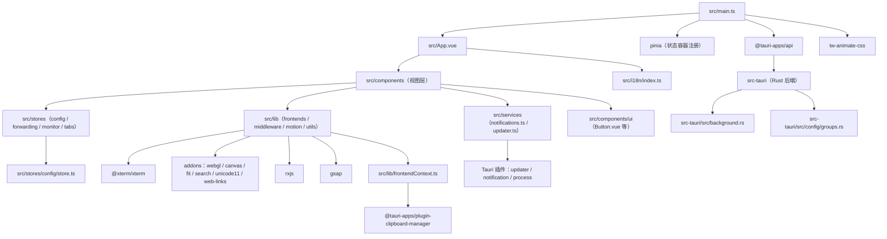

# scx-terminal 项目概述

Relevant source files

- cliff.toml
- scripts/gen-icon.ts
- src-tauri/Cargo.toml
- src-tauri/build.rs
- src-tauri/src/background.rs
- src-tauri/src/config/groups.rs
- src/components/settings/useConfirmAction.ts
- src/components/settings/useGroupNameDialog.ts
- src/components/split/splitTree.test.ts
- src/components/terminal/searchFocus.test.ts
- src/components/titlebar/tabGroupLayout.test.ts
- src/components/titlebar/tabStripLayout.test.ts
- src/i18n/index.ts
- src/lib/backgroundImage.test.ts
- src/lib/frontendContext.ts

> 本页锚点采用数据中给出的**完整相对路径**与**符号名**（源数据未提供行号，故不虚构 `file:line`）。所有事实声明均可在给定 JSON 数据中溯源。

## 一句话职责

scx-terminal 是一个基于 Tauri V2 + Rust 后端 + Vue 3 前端的跨平台终端应用，用 Web 技术栈重建传统终端的渲染与交互层（README 自述）。

## 项目定位

项目自述（readmeExcerpt）为「一个基于 **Tauri V2 + Rust + Vue 3 + shadcn-vue** 的跨平台终端应用」，由开源项目 [Tabby](https://github.com/Eugeny/tabby)（MIT License）改造而来，并重写了整体架构：后端由 Rust 承担 PTY 管理、配置持久化与 shell 探测；前端由 Vue 3 + Vite + Tailwind CSS 4 + shadcn-vue 构成，终端渲染使用 xterm.js 并优先 WebGL。面向的场景是 Windows / macOS 桌面端的本地终端使用，README 提供了 NSIS 安装包与 DMG 两种分发形态，数据目录位于 `%APPDATA%\com.scx.terminal\`（Windows）或 `~/Library/Application Support/com.scx.terminal/`（macOS）。本次扫描共识别 259 个文件，是一个前端为主体、带 Rust 原生后端的混合工程（projectType 标记为 frontend）。

## 语言分工

数据中 `languages` 列出 7 种语言，主要职责域划分如下（各语言的 exampleFiles 为扫描清单内的真实文件）：

| 语言 | 文件数 | 职责域 | 锚点（真实文件） |
| --- | --- | --- | --- |
| TypeScript | 137 | 前端逻辑主体：状态管理（stores）、终端前端抽象（lib/frontends）、中间件流处理、服务层（服务化调用 Tauri 插件）、构建脚本 | `scripts/gen-icon.ts`、`src/components/settings/useConfirmAction.ts`、`src/components/settings/useGroupNameDialog.ts` |
| Rust | 53 | 原生后端：Tauri 侧实现（如运行时后台逻辑与配置持久化模块） | `src-tauri/build.rs`、`src-tauri/src/background.rs`、`src-tauri/src/config/groups.rs` |
| Vue | 50 | 视图层：应用根组件与各功能面板（转发、监控、设置、SFTP 等） | `src/App.vue`、`src/components/forwarding/ForwardRuleFormDialog.vue`、`src/components/forwarding/ForwardingTabContent.vue` |
| CSS | 10 | 样式层：全局样式、配色变量与组件级样式 | `src/assets/styles/main.css`、`src/assets/styles/palette.css`、`src/components/forwarding/ForwardingTabContent.css` |
| TOML | 2 | 构建/发布配置（Rust 依赖清单、changelog 生成配置） | `cliff.toml`、`src-tauri/Cargo.toml` |
| HTML | 1 | 前端页面骨架 | 数据未提供该语言 exampleFiles（信息不足） |
| YAML | 1 | 配置文件 | 数据未提供该语言 exampleFiles（信息不足） |

前端职责由 TypeScript + Vue + CSS 共同承担（`src/App.vue` 中 import 了 `vue` 与 `vue-i18n`，见 depUsage），原生后端职责集中在 `src-tauri`，两域通过 `@tauri-apps/api` 及一组 Tauri 插件通信（锚点见「技术栈」章节）。

## 核心设计思路

**前后端职责切分以「原生能力下沉 Rust、交互与渲染留在 Web」为原则。** 按 README 自述，PTY 管理、配置持久化和 shell 探测由 Rust 完成，前端只做展示与交互；数据中也能看到 Rust 侧存在独立的配置模块 `src-tauri/src/config/groups.rs` 与运行时后台模块 `src-tauri/src/background.rs`，与前端 `src/stores/config/store.ts`（import `pinia`、`yaml`）形成配置双端配合。原生能力被拆成细粒度插件而非一次性大接口：剪贴板（`src/lib/frontendContext.ts`）、对话框（`src/components/settings/pages/AppearancePage.vue`、`src/components/settings/pages/BackupPage.vue`、`src/components/sftp/SftpBrowserPane.vue`）、通知（`src/services/notifications.ts`）、打开外部资源（`src/lib/frontends/xterm/support.ts` 等 4 处）、进程与更新（`src/services/updater.ts`），说明设计上倾向于「能力按场景暴露」。

**前端内部采用「前端引擎抽象 + 中间件 + 集中式 Store」的三层结构。** `src/lib/frontends/xterm/` 目录把 xterm 的渲染（`renderer.ts` 同时 import `@xterm/addon-webgl` 与 `@xterm/addon-canvas`）、尺寸适配（`resize.ts`）、搜索（`search.ts`）、行读取（`lines.ts`）、选项（`options.ts`）与终端主体（`frontend.ts`）拆分为独立模块，`src/lib/frontends/frontend.ts`、`src/lib/middleware/middleware.ts`、`src/lib/middleware/oscProcessing.ts` 则统一 import 了 `rxjs`，可见终端数据流以响应式流的方式在处理层流转（OSC 序列处理单独成模块）。状态则通过 pinia 集中在 `src/stores/config/store.ts`、`src/stores/forwarding.ts`、`src/stores/monitor.ts`、`src/stores/tabs.ts`，视图组件不各自持有跨页状态。

**技术选型围绕「终端渲染性能 + 桌面集成完整度」展开。** 渲染侧同时引入 WebGL（`@xterm/addon-webgl`）与 Canvas（`@xterm/addon-canvas`）两套渲染器，对应 README「WebGL 优先」的降级策略；字符宽度、链接识别、搜索、自适应等能力分别由 `@xterm/addon-unicode11`、`@xterm/addon-web-links`、`@xterm/addon-search`、`@xterm/addon-fit` 补齐（均在 `src/lib/frontends/xterm/frontend.ts` / `resize.ts` / `search.ts` 中被 import）。桌面集成侧由 Tauri 插件族覆盖更新、通知、剪贴板等；UI 侧用 reka-ui（`src/components/ui/Label.vue`、`Separator.vue`、`Slider.vue`、`Switch.vue`）+ Tailwind 体系，`src/lib/utils.ts` 通过 `clsx` + `tailwind-merge` 统一类名合并，`src/components/ui/Button.vue` 用 `class-variance-authority` 管理变体。

## 技术栈

下表用途陈述均锚定 depUsage 证据；`usageKind = import` 锚定其 importFiles，`usageKind = test` 锚定测试文件。

| 技术 | 用途（含证据锚点） |
| --- | --- |
| `vue` | 视图层运行时，被 60 处 import，如 `src/App.vue`、`src/components/forwarding/ForwardRuleFormDialog.vue` |
| `vue-i18n` | 国际化，被 39 处 import，如 `src/App.vue`、`src/components/palette/CommandPalette.vue` |
| `pinia` | 状态管理，被 `src/main.ts`、`src/stores/config/store.ts`、`src/stores/forwarding.ts`、`src/stores/monitor.ts`、`src/stores/tabs.ts` import |
| `@tauri-apps/api` | 前端调用 Tauri 原生能力的统一入口，被 25 处 import，如 `src/main.ts`、`src/components/settings/pages/AboutPage.vue`、`src/components/sftp/SftpTabContent.vue` |
| `@tauri-apps/plugin-clipboard-manager` | 剪贴板能力，import 于 `src/lib/frontendContext.ts` |
| `@tauri-apps/plugin-dialog` | 原生对话框，import 于 `src/components/settings/pages/AppearancePage.vue`、`src/components/settings/pages/BackupPage.vue`、`src/components/sftp/SftpBrowserPane.vue` |
| `@tauri-apps/plugin-notification` | 系统通知，import 于 `src/services/notifications.ts` |
| `@tauri-apps/plugin-opener` | 打开外部链接/文件，import 于 `src/components/settings/pages/AboutPage.vue`、`src/components/sftp/SftpBrowserPane.vue`、`src/components/sftp/TransferPopover.vue`、`src/lib/frontends/xterm/support.ts` |
| `@tauri-apps/plugin-process` | 进程控制（配合更新流程），import 于 `src/services/updater.ts` |
| `@tauri-apps/plugin-updater` | 应用更新，import 于 `src/components/settings/pages/AboutPage.vue`、`src/services/updater.ts` |
| `@xterm/xterm` | 终端核心，被 7 处 import，如 `src/lib/frontends/xterm/frontend.ts`、`renderer.ts`、`options.ts` |
| `@xterm/addon-webgl` | WebGL 渲染后端，import 于 `src/lib/frontends/xterm/renderer.ts` |
| `@xterm/addon-canvas` | Canvas 渲染后端（降级路径），import 于 `src/lib/frontends/xterm/renderer.ts` |
| `@xterm/addon-fit` | 终端尺寸自适应，import 于 `src/lib/frontends/xterm/frontend.ts`、`src/lib/frontends/xterm/resize.ts` |
| `@xterm/addon-search` | 终端内搜索，import 于 `src/lib/frontends/xterm/search.ts` |
| `@xterm/addon-unicode11` | Unicode11 宽度处理，import 于 `src/lib/frontends/xterm/frontend.ts` |
| `@xterm/addon-web-links` | 终端内链接识别，import 于 `src/lib/frontends/xterm/frontend.ts` |
| `rxjs` | 终端数据流/中间件处理，import 于 `src/lib/frontends/frontend.ts`、`src/lib/frontends/xterm/frontend.ts`、`src/lib/frontends/xterm/support.ts`、`src/lib/middleware/middleware.ts`、`src/lib/middleware/oscProcessing.ts` |
| `reka-ui` | 无样式 UI 原语，import 于 `src/components/ui/Label.vue`、`Separator.vue`、`Slider.vue`、`Switch.vue` |
| `class-variance-authority` | 组件变体定义，import 于 `src/components/ui/Button.vue` |
| `clsx` + `tailwind-merge` | 类名拼接与冲突合并，import 于 `src/lib/utils.ts` |
| `lucide-vue-next` | 图标库，被 28 处 import，如 `src/components/forwarding/ForwardingTabContent.vue`、`src/components/monitor/MonitorSidebar.vue` |
| `nanoid` | ID 生成，被 12 处 import，如 `src/components/settings/pages/KeysPage.vue`、`LocalProfilesPage.vue`、`QuickCommandsPage.vue`、`SshPage.vue`、`TabGroupsPage.vue` |
| `deep-equal` | 终端前端选项/数据的深比较，import 于 `src/lib/frontends/xterm/frontend.ts` |
| `gsap` | 动效，import 于 `src/lib/motion/index.ts` |
| `yaml` | 配置解析，import 于 `src/stores/config/store.ts` |
| `tailwindcss` | 样式框架，import 于 `src/assets/styles/main.css` |
| `tw-animate-css` | 动画样式集，import 于 `src/main.ts` |
| `vite` | 构建/开发服务器，import 于 `vite.config.ts` |
| `@vitejs/plugin-vue` | Vite 的 Vue 编译插件，import 于 `vite.config.ts` |
| `@tailwindcss/vite` | Tailwind 的 Vite 集成，import 于 `vite.config.ts` |
| `vitest` | 单元测试框架（usageKind = test），测试文件如 `src/components/split/splitTree.test.ts`、`src/components/terminal/searchFocus.test.ts`、`src/components/titlebar/tabGroupLayout.test.ts`、`src/components/titlebar/tabStripLayout.test.ts`、`src/lib/backgroundImage.test.ts` |

**选型合理性分析之一：终端渲染层选型高度专业化。** xterm 生态被完整引入而非自研渲染：核心 `@xterm/xterm` 配合两个渲染后端（WebGL/Canvas）与四个能力插件（fit/search/unicode11/web-links），证据是 `src/lib/frontends/xterm/renderer.ts` 同时 import 了 `@xterm/addon-webgl` 与 `@xterm/addon-canvas`，说明渲染后端被设计为可切换的；`resize.ts` 与 `search.ts` 把自适应与搜索各自隔离成模块，符合「一个 addon 一个职责」的组织方式，便于替换与按需启停。

**选型合理性分析之二：UI 与状态层贴近 shadcn-vue 体系。** reka-ui 提供 Label/Separator/Slider/Switch 等无样式原语，`class-variance-authority` + `clsx` + `tailwind-merge` 组合（分别锚定 `src/components/ui/Button.vue`、`src/lib/utils.ts`）构成变体与类名合并链路，`tw-animate-css` 与 `src/assets/styles/main.css` 承担动画与全局样式；状态统一由 pinia 承载（`src/main.ts` 即注册），保证跨面板（终端、转发、监控、配置）状态一致。桌面侧能力则全部走 Tauri 官方插件，而非自建 IPC，更新、通知、剪贴板等分别由 `src/services/updater.ts`、`src/services/notifications.ts`、`src/lib/frontendContext.ts` 单点接入，职责边界清晰。

## 项目结构

`sourceDirs` 为 `src` 与 `src-tauri`，对应 Web 前端与 Rust 后端两个源码域。依据数据中出现的真实路径，各自内部结构如下：

| 目录 | 职责 | 锚点示例 |
| --- | --- | --- |
| `src/` | Vue 前端源码域：根组件、状态、服务、终端前端抽象、国际化与样式 | `src/App.vue`、`src/main.ts` |
| `src/components/` | 视图组件层，按功能域再分层：设置、SFTP、转发、监控、命令面板、分屏、终端、标题栏、UI 原语 | `src/components/settings/pages/AboutPage.vue`、`src/components/sftp/SftpBrowserPane.vue`、`src/components/forwarding/ForwardingTabContent.vue`、`src/components/monitor/MonitorSidebar.vue`、`src/components/palette/CommandPalette.vue`、`src/components/split/splitTree.test.ts`、`src/components/terminal/searchFocus.test.ts`、`src/components/titlebar/tabGroupLayout.test.ts`、`src/components/ui/Button.vue` |
| `src/lib/` | 与框架无关的核心逻辑：终端前端抽象、中间件、会话、动效与通用工具 | `src/lib/frontends/frontend.ts`、`src/lib/frontends/xterm/frontend.ts`、`src/lib/middleware/middleware.ts`、`src/lib/middleware/oscProcessing.ts`、`src/lib/sessions/index.ts`、`src/lib/motion/index.ts`、`src/lib/utils.ts`、`src/lib/frontendContext.ts` |
| `src/stores/` | pinia 状态层，按领域拆分：配置、转发、监控、标签页 | `src/stores/config/store.ts`、`src/stores/config/index.ts`、`src/stores/forwarding.ts`、`src/stores/monitor.ts`、`src/stores/tabs.ts` |
| `src/services/` | 原生能力服务封装：通知与更新 | `src/services/notifications.ts`、`src/services/updater.ts` |
| `src/i18n/` | 国际化装配 | `src/i18n/index.ts` |
| `src/assets/styles/` | 全局样式与配色 | `src/assets/styles/main.css`、`src/assets/styles/palette.css` |
| `src-tauri/` | Rust 后端源码域：构建脚本、依赖清单与后端模块 | `src-tauri/build.rs`、`src-tauri/Cargo.toml`、`src-tauri/src/background.rs`、`src-tauri/src/config/groups.rs` |
| `scripts/` | 工程脚本（图标生成等） | `scripts/gen-icon.ts` |
| 根级配置 | 构建与发布配置 | `vite.config.ts`、`cliff.toml` |

目录间关系：`src/main.ts` 是前端装配起点，导入 `pinia`、`@tauri-apps/api` 与 `tw-animate-css`；`src/App.vue` 作为根视图消费 `vue` / `vue-i18n`；`src/components/**` 依赖 `src/stores/**`（pinia，见 `src/stores/*.ts` 的 import 证据）与 `src/lib/**`（终端前端、工具、动效）；`src/lib/frontends/xterm/**` 内部再拆分为渲染、尺寸、搜索、行、选项等子模块；`src/services/**` 与 `src/lib/frontendContext.ts` 是前端触达 Rust 插件能力的出口，最终由 `src-tauri/**` 承载。

## 入口文件

`entryFiles` 共 5 项，其装配关系如下：

| 入口 | 启动/装配职责 | 证据锚点 |
| --- | --- | --- |
| `src/main.ts` | 前端应用装配入口：注册 pinia、接入 `@tauri-apps/api`、引入动画样式，是 Vue 应用与 Tauri 运行时的接合点 | import `pinia`、`@tauri-apps/api`、`tw-animate-css`（depUsage） |
| `src/App.vue` | 根视图组件，承载整体布局与国际化上下文 | import `vue`、`vue-i18n`（depUsage） |
| `src/i18n/index.ts` | 国际化模块入口，向下为 39 处 `vue-i18n` 使用点提供多语言能力 | `src/i18n/index.ts`（entryFiles） |
| `src/lib/motion/index.ts` | 动效模块入口，统一封装 `gsap` 供视图层调用 | import `gsap`（depUsage） |
| `src/lib/sessions/index.ts` | 会话模块入口，对外提供会话相关能力聚合 | `src/lib/sessions/index.ts`（entryFiles） |
| `src/stores/config/index.ts` | 配置状态模块入口，配置域的统一出口（具体实现位于 `src/stores/config/store.ts`） | `src/stores/config/index.ts`、`src/stores/config/store.ts`（entryFiles / import `pinia`、`yaml`） |

启动链路可概括为：`src/main.ts` 引导 → `src/App.vue` 渲染根视图 → 组件树经 `src/stores/config/index.ts` 等状态入口加载配置、经 `src/i18n/index.ts` 加载语言、经 `src/lib/motion/index.ts` 加载动效，终端视图则由 `src/lib/frontends/xterm/frontend.ts` 承载 xterm 实例。

Rust 侧数据中出现的入口性文件为 `src-tauri/build.rs`（构建期脚本）与 `src-tauri/Cargo.toml`（依赖与包定义）；应用运行时入口未出现在 `entryFiles` 中（见「待确认」）。

## 核心组件

数据给出的 `topSymbols` 按复杂度排序，均为 function 类型，是工程内复杂度最集中的一段代码：

| 符号 | 类型 | 复杂度 |
| --- | --- | --- |
| `lock_conn` | function | 46 |
| `execute` | function | 43 |
| `load_internal` | function | 25 |
| `mark_initialized` | function | 24 |
| `push` | function | 20 |
| `new` | function | 20 |
| `temp_dir` | function | 13 |
| `session` | function | 9 |

从命名与复杂度分布看，这批符号构成后端的关键路径：`lock_conn`（46）与 `execute`（43）复杂度最高，是并发保护与执行逻辑的集中点，说明该工程把最重的分支判断放在了「连接加锁 + 执行」这一对操作上；紧随其后的 `load_internal`（25）与 `mark_initialized`（24）呈现「加载—标记初始化完成」的两段式模式，与 README 自述的「配置持久化」职责方向一致（`src-tauri/src/config/groups.rs` 是配置模块的真实文件锚点）；`push`（20）配合 README 提到的「PTY 背压队列」描述，指向入队写入路径，`temp_dir`（13）与 `session`（9）则为临时目录与会话相关操作。这些符号所属文件与调用边未包含在本次数据中，因此不做更进一步的模块归属推断。

## 模块依赖关系

下图的节点全部取自数据中出现的真实文件路径，边依据 depUsage 的 importFiles 证据绘制（同一依赖被多文件 import 时归并到相邻层）：

依赖方向可以概括为三条纵向链路：视图层（`src/components/**`）→ 状态与逻辑层（`src/stores/**`、`src/lib/**`）→ 原生能力层（`src/services/**`、`src/lib/frontendContext.ts`）→ 运行时（`@tauri-apps/api` 与插件）→ Rust 后端（`src-tauri/**`）。所有跨层调用都必须经由这条链路，`src/components/**` 不直接 import `@tauri-apps/plugin-*`（depUsage 中这些插件的 importFiles 均落在 `src/lib/`、`src/services/` 或设置页，未出现终端组件）。

### 调用关系

按 R2，静态可达性一律用表格而非时序图。本次数据未提供调用边（无「调用方→被调用方」结构），因此只能列出可确证的 import 依赖关系：

| 依赖方 | 被依赖方 | 证据锚点 |
| --- | --- | --- |
| `src/lib/frontends/xterm/frontend.ts` | `@xterm/xterm` | depUsage.importFiles |
| `src/lib/frontends/xterm/frontend.ts` | `@xterm/addon-fit`、`@xterm/addon-unicode11`、`@xterm/addon-web-links` | depUsage.importFiles |
| `src/lib/frontends/xterm/frontend.ts` | `rxjs`、`deep-equal` | depUsage.importFiles |
| `src/lib/frontends/xterm/renderer.ts` | `@xterm/addon-webgl`、`@xterm/addon-canvas`、`@xterm/xterm` | depUsage.importFiles |
| `src/lib/frontends/xterm/resize.ts` | `@xterm/addon-fit`、`@xterm/xterm` | depUsage.importFiles |
| `src/lib/frontends/xterm/search.ts` | `@xterm/addon-search` | depUsage.importFiles |
| `src/lib/frontends/xterm/lines.ts`、`src/lib/frontends/xterm/options.ts` | `@xterm/xterm` | depUsage.importFiles |
| `src/lib/frontends/xterm/support.ts` | `rxjs`、`@tauri-apps/plugin-opener` | depUsage.importFiles |
| `src/lib/middleware/middleware.ts`、`src/lib/middleware/oscProcessing.ts` | `rxjs` | depUsage.importFiles |
| `src/lib/utils.ts` | `clsx`、`tailwind-merge` | depUsage.importFiles |
| `src/lib/motion/index.ts` | `gsap` | depUsage.importFiles |
| `src/services/updater.ts` | `@tauri-apps/plugin-updater`、`@tauri-apps/plugin-process` | depUsage.importFiles |
| `src/services/notifications.ts` | `@tauri-apps/plugin-notification` | depUsage.importFiles |
| `src/lib/frontendContext.ts` | `@tauri-apps/plugin-clipboard-manager` | depUsage.importFiles |
| `src/stores/config/store.ts` | `pinia`、`yaml` | depUsage.importFiles |
| `src/components/ui/Button.vue` | `class-variance-authority` | depUsage.importFiles |

更细粒度的函数级调用链（如 `execute`、`push` 的调用方）在本次数据中缺失，见「待确认」。

## 配置与数据

配置能力横跨前后端两侧，证据如下：

| 侧 | 载体 | 说明与锚点 |
| --- | --- | --- |
| 前端状态 | `src/stores/config/store.ts` | import `pinia` 与 `yaml`，是以 store 形态承载配置并解析 YAML 的位置 |
| 前端状态入口 | `src/stores/config/index.ts` | 配置域对外出口，属 entryFiles |
| 后端持久化 | `src-tauri/src/config/groups.rs` | Rust 侧配置模块，对应 README 自述的「配置持久化」 |
| 后端运行时 | `src-tauri/src/background.rs` | Rust 侧后台逻辑模块 |
| 构建/包定义 | `src-tauri/Cargo.toml` | Rust 依赖与包元数据 |
| 发布配置 | `cliff.toml` | changelog 生成配置 |
| 构建配置 | `vite.config.ts` | import `vite`、`@vitejs/plugin-vue`、`@tailwindcss/vite` |

数据落盘位置按 README 自述为 `%APPDATA%\com.scx.terminal\`（Windows，含 `config.db` 与 `logs\`）与 `~/Library/Application Support/com.scx.terminal/`（macOS），该路径为仓库自述内容而非代码锚点，故标注来源为 readmeExcerpt。README 同时说明设置页「关于」提供数据目录一键打开与调试日志开关，对应组件锚点为 `src/components/settings/pages/AboutPage.vue`（import `@tauri-apps/api` 与 `@tauri-apps/plugin-opener`）。

## 构建与开发流程

README（readmeExcerpt）给出的命令与本次数据中的构建文件对应关系如下，命令本身来源为 README，配置文件来源为真实路径：

| 命令 | 作用 | 相关配置文件锚点 |
| --- | --- | --- |
| `bun install` | 安装前端依赖 | 依赖清单（`@tauri-apps/api`、`vue`、`pinia` 等，见技术栈表） |
| `bun run dev` | 仅启动前端 Vite 开发服务器 | `vite.config.ts` |
| `bun run tauri dev` | 启动完整桌面应用（开发模式） | `vite.config.ts`、`src-tauri/Cargo.toml` |
| `bun run tauri build` | 构建发布版安装包 | `src-tauri/Cargo.toml`、`cliff.toml` |
| `bun run lint` | oxlint 检查 | 数据未提供 oxlint 配置文件锚点 |
| `bun run test` | vitest 单元测试 | `vitest` 被 33 个测试文件 import，如 `src/components/split/splitTree.test.ts`、`src/components/terminal/searchFocus.test.ts`、`src/components/titlebar/tabGroupLayout.test.ts`、`src/components/titlebar/tabStripLayout.test.ts`、`src/lib/backgroundImage.test.ts` |

构建产物按 README 自述为 `src-tauri/target/release/bundle/macos/scx-terminal.app`（约 5MB），DMG 由 create-dmg 脚本生成，无 GUI 权限时可用 hdiutil 兜底 —— 该段为 readmeExcerpt 内容，无对应代码锚点。此外 `scripts/gen-icon.ts` 是仓库内真实存在的图标生成脚本，`src-tauri/build.rs` 为 Rust 构建期脚本。

## 测试现状

从 depUsage 中 `vitest` 的 importFiles 可确证工程存在成规模的单元测试，且测试集中在与布局/几何计算相关的纯逻辑上：

| 测试文件 | 被测领域（依据路径命名） |
| --- | --- |
| `src/components/split/splitTree.test.ts` | 分屏树 |
| `src/components/terminal/searchFocus.test.ts` | 终端搜索焦点 |
| `src/components/titlebar/tabGroupLayout.test.ts` | 标签分组布局 |
| `src/components/titlebar/tabStripLayout.test.ts` | 标签条布局 |
| `src/lib/backgroundImage.test.ts` | 背景图处理 |

`vitest` 共被 33 个 importCount 引用，说明测试覆盖面不止上表 5 个示例文件。测试文件按规则不计入项目功能描述。

## 待确认

1. **Rust 运行时入口缺失**：`entryFiles` 只列出 5 个前端入口，`languages[Rust].exampleFiles` 仅含 `src-tauri/build.rs`、`src-tauri/src/background.rs`、`src-tauri/src/config/groups.rs`，缺少 Tauri 应用主入口（如 `src-tauri/src/main.rs` 或 `lib.rs`）的证据，故本页未给出后端启动流程。
2. **符号归属与调用边缺失**：「核心组件」表中 8 个 `topSymbols` 未携带所属文件与调用方信息，`supplementalSymbols`（待确认） 为空，因此无法按 R2 产出函数级调用表，`lock_conn`/`execute` 等符号的模块归属未做推断。
3. **HTML 与 YAML 文件身份未知**：`languages` 中 HTML（1 个）与 YAML（1 个）的 `exampleFiles` 均为空数组，无法确认其属于入口页面还是 CI 配置，本页未对其职责下结论。
4. **配置模块双入口职责边界未定**：`src/stores/config/index.ts` 与 `src/stores/config/store.ts` 同时存在，但数据只显示后者 import `pinia`/`yaml`，前者仅出现在 `entryFiles`，二者分工缺少源码证据。
5. **文档目录内容为空**：`docsFiles` 为空数组，而 README 自述存在 `docs/` 设计文档（Tabby → Tauri 移植记录），二者不一致，本页无法列出文档清单。

## 延伸阅读

本次提供的数据中 `docsFiles` 为空数组，无任何文档文件路径可供列出。README（readmeExcerpt）自述存在 `docs/` 目录用于存放设计文档（Tabby → Tauri 移植记录），但该目录的具体文件清单在数据中缺失，属「待确认」第 5 项，故此处不列举条目。

仓库根级另有 `cliff.toml`（changelog 生成配置）与 `src-tauri/Cargo.toml`（Rust 包定义）可供直接查阅，二者路径来自 `languages[TOML].exampleFiles`。
## Related

- 同目录：[tech-stack.md](tech-stack.md) · [environment.md](environment.md)
- 总入口：[README](../README.md)
