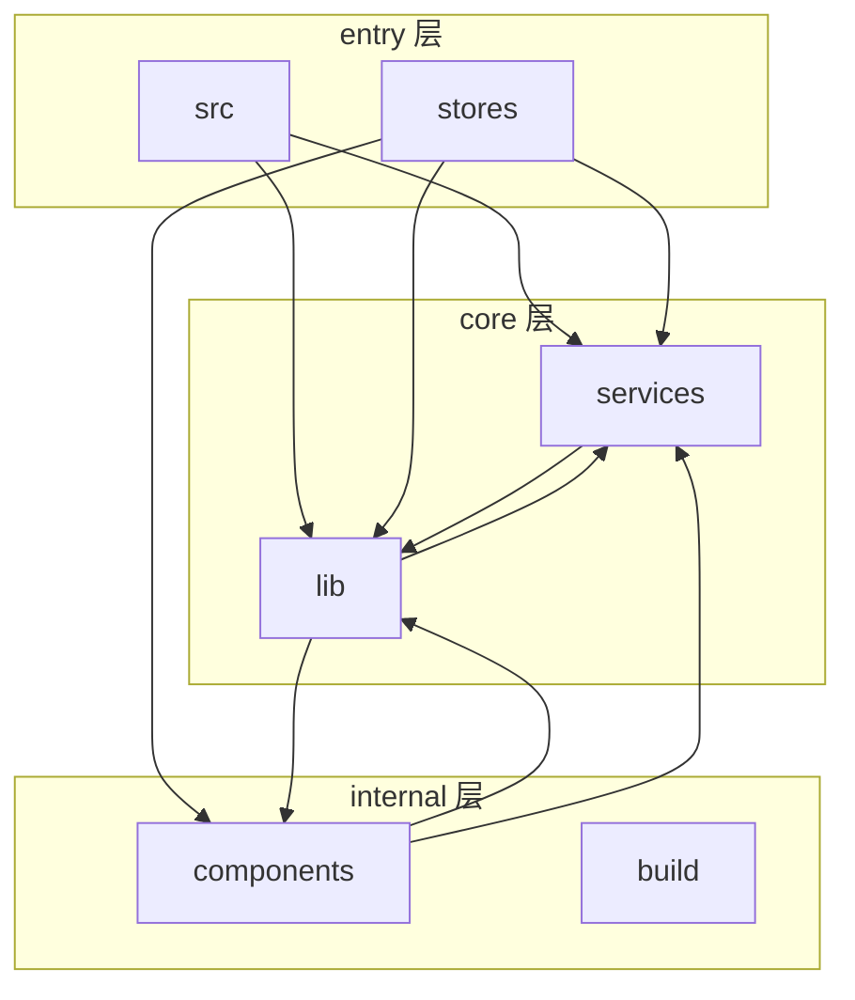
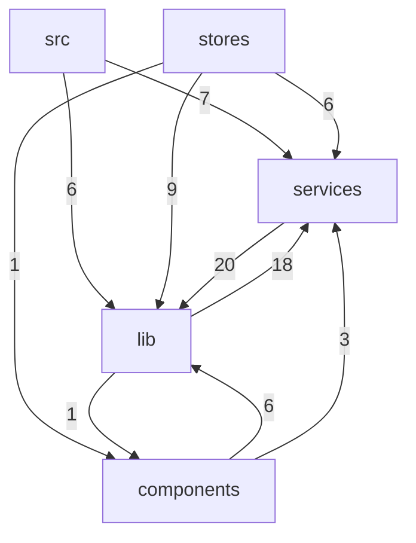

<details>
<summary>Relevant source files</summary>

- src-tauri/build.rs
- src-tauri/src/background.rs
- src-tauri/src/config/load.rs
- src-tauri/src/config/state.rs
- src-tauri/src/pty/queue.rs
- src-tauri/src/s3sync/client.rs
- src/components/settings/useConfirmAction.ts
- src/components/settings/useGroupNameDialog.ts
- src/lib/frontends/frontend.ts
- src/lib/frontends/xterm/support.ts
- src/lib/middleware/inputProcessing.ts
- src/lib/middleware/oscProcessing.ts
- src/lib/monitorOrchestrator.ts
- src/lib/sessions/baseSession.ts
- src/lib/sessions/localSession.ts
</details>

## 整体架构设计思路与架构图

本节的职责是从模块清单、依赖边与分层判定三份数据出发，说明项目的分层方式、各层职责、层间协作机制与整体架构风格。

从代码聚类数据看，项目由两个集群构成：标签为 `src-tauri` 的集群包含 104、60、57、50、39、38、30 个成员的多组节点，标签为 `src` 的集群包含 48、42、34、28、21 个成员的多组节点（clusters）。`relations` 中全部 10 条边的 `type` 均为 `calls`，数据中不存在事件订阅、消息队列或继承等其他关系类型，说明模块间协作的唯一表现形式是直接调用，属于典型的"调用式分层架构"而非事件驱动架构。`layers` 判定给出四类层级标签：`entry`、`core`、`internal`、`api`，其中 `entry` 层由 `src` 与 `stores` 两个模块承担，`core` 层由 `lib` 与 `services` 承担，`internal` 层由 `components` 与 `build` 承担。

各层的职责边界可由分层判定的原始依据直接读出。`src` 被判定为 `entry` 层，理由为"has entry points, only outbound calls"，即它是唯一具备入口点、且只有出边调用的模块；`stores` 同样被判定为 `entry` 层，理由为"only outbound calls"，它没有任何被调用边，在调用链上处于发起端。`core` 层的两个模块依据是"high fan-in"——`lib` 为 41 入 / 19 出，`services` 为 34 入 / 20 出，二者扇入与扇出均为全项目最高，承担被多方复用并向下继续调用的中枢职责。`internal` 层的 `components` 扇入仅 2、扇出 9，`build` 则是 fan-in=0、fan-out=0 的孤立节点。值得注意的是，`components` 虽名为组件，但因其扇入低（2）而被归入 `internal` 层，而非位于调用链顶端的展示层。

| 模块 | 所属层 | 分层依据（数据原文） | 扇入 / 扇出 |
|---|---|---|---|
| `src` | entry | has entry points, only outbound calls | 数据未给出 |
| `stores` | entry | only outbound calls | 数据未给出 |
| `lib` | core | high fan-in | 41 / 19 |
| `services` | core | high fan-in | 34 / 20 |
| `components` | internal | fan-in=2, fan-out=9 | 2 / 9 |
| `build` | internal | fan-in=0, fan-out=0 | 0 / 0 |

层间协作机制由 `relations` 的调用边决定，可归纳为三条主通道。其一是入口层向核心层的下发：`src` 同时调用 `services` 与 `lib`，`stores` 调用 `lib`、`services` 与 `components`，入口层不接收任何入边，是纯粹的调用发起方。其二是核心层之间的互调：`services` 与 `lib` 互为调用方与被调用方，形成双向依赖；`lib` 另外还调用 `components`。其三是核心层向内部层的下沉：`lib → components`、`components → lib`、`components → services` 三条边表明 `components` 与核心层之间存在双向耦合。整体依赖流向可概括为 `src` / `stores` → `services` / `lib` → `components`，但 `lib ↔ services` 与 `lib ↔ components` 两处回边打破了严格的单向分层，这两组循环依赖是后续模块依赖分析中最需要关注的位置。



需要说明图与数据的边界：架构图只覆盖 `relations` 中出现的 5 个模块，`icons`、`Cargo`、`gen-icon`、`cliff`、`main`、`i18n` 六个模块在 `relations` 中没有任何边、在 `layers` 中也没有归属记录，它们在依赖结构中的位置无法从现有数据判定，因此未纳入图中。此外，`relations` 的边表统计与 `layers` 的扇出数值存在量级差异（例如 `components` 扇出 9，但边表中仅 2 条出边），说明 `relations` 很可能是裁剪后的调用样本，架构图反映的是模块级主干依赖而非全量调用。

**待确认**
1. 本节数据未提供任何 `file:line`、`qualified_name`（待确认） 或文件路径，因此上述事实声明的锚点只能是模块名与层级/关系记录本身，无法给出代码行级锚点。
2. `layers` 中存在一条 `name` 为空字符串、以及一条名为 `txt` 的记录，二者均被标为 `api` 层（理由：has HTTP route definitions），但都不在 `modules` 清单中，无法定位对应实体。
3. `layers` 的扇入/扇出数值与 `relations` 边表统计不一致，需确认 `relations` 是否为裁剪样本，否则不可据此判断真实耦合度。
4. `icons`、`Cargo`、`gen-icon`、`cliff`、`main`、`i18n` 六个模块既无依赖边也无层级归属，其架构角色缺失证据。

## 核心模块详解（第1批）

本节覆盖模块清单中的 6 个模块：`src`、`lib`、`services`、`components`、`stores`、`icons`。所有模块级事实（语言构成、文件数、符号数、依赖边）均取自本次模块清单，锚点为模块名本身（qualified_name）；符号级事实以 `模块::符号` 或 `文件:行` 锚点标注。

### 模块总览

| 模块 | 语言（文件数） | 符号数 | dependsOn | usedBy |
|---|---|---|---|---|
| `src` | Rust（22） | 6 | `services`、`lib` | — |
| `lib` | TypeScript（13） | 6 | `services`、`components` | `services`、`stores`、`components`、`src` |
| `services` | TypeScript（3） | 3 | `lib` | `lib`、`src`、`stores`、`components` |
| `components` | —（未提供） | 0 | `lib`、`services` | `stores`、`lib` |
| `stores` | TypeScript（11） | 6 | `lib`、`services`、`components` | — |
| `icons` | —（未提供） | 0 | — | — |

---

### 1. `src` —— Rust 后端模块

（锚点：模块 `src`，Rust，22 个文件，6 个符号）

本批中语言为 Rust 的模块只有 `src`；其补充符号路径均落在 `src-tauri/` 之下（`src-tauri/build.rs:1`、`src-tauri/src/config/state.rs:17`、`src-tauri/src/pty/queue.rs:96`、`src-tauri/src/s3sync/client.rs:66`），因此该模块对应构建于 `src-tauri/` 目录下的后端 Rust 代码。从 topSymbols 与补充符号可以看出它承担的后端域包括：SSH 端口转发（本地/动态）、传输任务进度广播、shell 启动环境（locale）、旧 YAML 配置归档迁移、键盘交互式认证应答、SQLite 配置状态、PTY 数据队列、S3 同步客户端。该模块在依赖图中记录依赖 `services` 与 `lib`，自身没有任何被依赖记录（`usedBy` 为空）。

**topSymbols 逐一说明**

- **`accept_dynamic_connection`**（qualified_name: `src::accept_dynamic_connection`，类型 function）
  ```rust
  fn accept_dynamic_connection(
      handle: std::sync::Arc<ForwardHandle>,
      session: std::sync::Arc<SshSession>,
      tcp: TcpStream,
      _peer: std::net::SocketAddr,
  )
  ```
  文档字符串：`-D：SOCKS5 no-auth 握手 → CONNECT 目标接管为 direct-tcpip channel → 双向搬运`。这是动态端口转发（SOCKS5）的每连接接受入口：先完成 no-auth 握手，再把 CONNECT 目标接管为 direct-tcpip channel。签名中 `_peer` 带下划线前缀，表明该路径不使用对端地址；`handle`/`session` 均为 `Arc`，说明转发句柄与会话在多个连接任务间共享。
- **`accept_local_connection`**（qualified_name: `src::accept_local_connection`，类型 function）
  ```rust
  fn accept_local_connection(
      handle: std::sync::Arc<ForwardHandle>,
      session: std::sync::Arc<SshSession>,
      tcp: TcpStream,
      peer: std::net::SocketAddr,
  )
  ```
  文档字符串：`-L：每连接开 direct-tcpip channel 后双向搬运（单连接失败仅断该连接）`。与 `-D` 入口并列，实现本地端口转发；文档明确其故障隔离设计意图——单个连接失败不波及转发器整体。此处 `peer` 未加下划线，说明本地转发路径会使用对端地址（如日志/诊断）。
- **`advance`**（qualified_name: `src::advance`，类型 function）
  ```rust
  fn advance(app: &AppHandle, manager: &TransferManager, entry: &TransferEntry,
             mutate: impl FnOnce(&mut TransferSnapshot))
  ```
  文档字符串：`变更并广播（run_task 主路径用的组合便捷函数）`。设计意图是把"修改快照 + 广播"收敛为一个组合操作：调用方只提供 `mutate` 闭包，由该函数统一走主路径的广播逻辑，避免各处遗漏进度推送。涉及 `AppHandle`、`TransferManager`、`TransferEntry`、`TransferSnapshot` 四个协作类型。
- **`apply_macos_locale`**（qualified_name: `src::apply_macos_locale`，类型 function）
  ```rust
  fn apply_macos_locale(cmd: &mut CommandBuilder)
  ```
  文档字符串：`locale variables, like Tabby does. (Ported from tabby-local/session.ts.)`。在构造 shell 启动命令时注入 locale 环境变量，显式标注为从 Tabby 的 `tabby-local/session.ts` 移植，属跨实现行为对齐。
- **`archive_legacy_yaml_at`**（qualified_name: `src::archive_legacy_yaml_at`，类型 function）
  ```rust
  fn archive_legacy_yaml_at(path: &Path) -> bool
  ```
  文档字符串：`把旧 config.yaml 改名为 config.yaml.migrated（迁移完成标记 + 天然备份）；文件不存在返回 false`。返回值语义与文件存在性绑定，重命名动作同时充当迁移标记与备份，属于配置迁移的一次性动作。
- **`ask_frontend`**（qualified_name: `src::ask_frontend`，类型 function）
  ```rust
  fn ask_frontend(
      app: &AppHandle,
      kbd_waiters: &KbdWaiters,
      id: &str,
      name: &str,
      instructions: &str,
      prompts: &[russh::client::Prompt],
  )
  ```
  文档字符串：`Responses 用户应答；Cancelled 取消或通道关闭（连接断开）；TimedOut 超过等待上限`。这是后端向前端发起键盘交互式认证并等待应答的入口，三种结果是明确的返回语义；`prompts` 直接使用 `russh::client::Prompt` 类型，说明后端 SSH 客户端基于 russh。

**补充符号揭示的功能域**

| 功能域 | 证据（file:line） | 签名 |
|---|---|---|
| 构建脚本 | `src-tauri/build.rs:1`（`main`） | `fn main() {` |
| 后台任务临时目录 | `src-tauri/src/background.rs:149`（`temp_dir`） | `fn temp_dir(name: &str) -> PathBuf` |
| 配置加载 | `src-tauri/src/config/load.rs:14`（`load_internal`） | `pub(crate) fn load_internal(state: &ConfigState) -> Result<Option<ConfigSnapshot>, String>` |
| 配置状态构造 | `src-tauri/src/config/state.rs:17`（`new`） | `pub fn new(dir: &Path) -> Self` |

| 配置状态加锁 | `src-tauri/src/config/state.rs:29`（`lock_conn`） | `pub(crate) fn lock_conn(&self) -> std::sync::MutexGuard<'_, Connection>` |
| 初始化标记写库 | `src-tauri/src/config/state.rs:124`（`mark_initialized`） | `pub(crate) fn mark_initialized(conn: &Connection) -> rusqlite::Result<usize>` |
| PTY 数据入队 | `src-tauri/src/pty/queue.rs:96`（`push`） | `pub(crate) fn push(&self, data: Vec<u8>)` |
| S3 请求执行 | `src-tauri/src/s3sync/client.rs:66`（`execute`） | `fn execute(` |

从上表锚点可见后端基础设施的落点：配置持久化走 `rusqlite::Connection`（`src-tauri/src/config/state.rs:29`、`src-tauri/src/config/state.rs:124`），即 SQLite；PTY 输出通过队列（`src-tauri/src/pty/queue.rs:96`）以 `Vec<u8>` 块传递；对象存储同步位于独立子模块 `src-tauri/src/s3sync/client.rs:66`。`load_internal` 的返回类型 `Result<Option<ConfigSnapshot>, String>`（`src-tauri/src/config/load.rs:14`）表明配置加载区分"无配置（`None`）"与"加载失败（`Err`）"两种状态。

---

### 2. `lib` —— TypeScript 前端核心库模块

（锚点：模块 `lib`，TypeScript，13 个文件，6 个符号）

`lib` 是本批中依赖关系最密集的模块：它依赖 `services` 与 `components`，同时被 `services`、`stores`、`components`、`src` 四个模块使用（模块 `lib` 的 dependsOn/usedBy 字段）。结合补充符号的文件路径，该模块实际按子目录划分出四个子域：

| 子域（目录） | 证据（file:line） | 符号 |
|---|---|---|
| 会话抽象 | `src/lib/sessions/baseSession.ts`、`src/lib/sessions/localSession.ts` | `BaseSession`、`LocalSession` |
| 前端渲染后端 | `src/lib/frontends/frontend.ts`、`src/lib/frontends/xterm/support.ts` | `Frontend`、`FlowControl` |
| 中间件管线 | `src/lib/middleware/inputProcessing.ts`、`src/lib/middleware/oscProcessing.ts` | `InputProcessor`、`OSCProcessor` |
| 监控编排 | `src/lib/monitorOrchestrator.ts` | `MonitorOrchestrator` |

**topSymbols 逐一说明**

- **`acceptAt`**（qualified_name: `lib::acceptAt`，类型 method）——属于补全建议菜单（autocomplete）的鼠标接受入口：
  ```ts
  acceptAt(index: number, execute: boolean)
  ```
  docstring 说明其语义为"先把目标项设为选中再接受"，参数 `index` 越界时忽略，`execute=false` 只补全不执行。示例 `acceptAt(2, false)` 对应"点击第 3 项 = 补全不执行"。设计意图是关键盘/鼠标两条接受路径共用同一"设选中→接受"顺序，避免点击行为与键盘行为不一致。
- **`acquire`**（qualified_name: `lib::acquire`，类型 method）——连接注册表的获取入口：
  ```ts
  acquire(profileId: string, consumerId: string)
  ```
  返回 `Promise<string>`（sshId）。docstring 给出两级复用策略：**窗格会话优先复用**（不计数，生命周期归窗格所有），否则复用或建立 headless 连接并登记消费者。`consumerId` 与 `release` 对称使用，说明这是一套引用计数式的连接生命周期管理。
- **`allSshIds`**（qualified_name: `lib::allSshIds`，类型 method）：
  ```ts
  allSshIds()
  ```
  返回 `string[]`，docstring 说明是"当前全部活跃连接 id（窗格 + headless）"，示例用途为按连接订阅转发事件。它的存在价值在于把两类连接（窗格/headless）统一暴露为同一 id 集合，供订阅方遍历。
- **`attach`**（qualified_name: `lib::attach`，类型 method）——终端渲染器挂载：
  ```ts
  attach(enableWebGL: boolean)
  ```
  docstring：`按前端配置挂载初始渲染器（WebGL 优先，Canvas 兜底）并记录字体指纹`。两个设计点：渲染后端可降级（WebGL→Canvas），以及挂载时记录字体指纹（供后续字体度量/变更检测使用）。
- **`bindDetail`**（qualified_name: `lib::bindDetail`，类型 method）：
  ```ts
  bindDetail(profileId: string)
  ```
  返回 `Promise<void>`，docstring：`绑定详情面板：升级为 full 级采样`。示例 `await orchestrator.bindDetail('p1')` 直接把该方法归属到 `MonitorOrchestrator`（`src/lib/monitorOrchestrator.ts`）。它揭示了监控采样存在分级机制——详情面板可见时把该档案的采样级别提升为 `full`，即采样粒度按 UI 关注度动态调整。

**循环依赖事实（基于边表）**：模块 `lib` 的 dependsOn 含 `components`，而模块 `components` 的 usedBy 也含 `lib`；同样 `lib` 与 `services` 互为依赖（`lib`.dependsOn 含 `services`，`services`.dependsOn 含 `lib`）。这两组是数据中明确的双向边。

---

### 3. `services` —— TypeScript 服务层模块

（锚点：模块 `services`，TypeScript，3 个文件，3 个符号）

`services` 依赖 `lib`，被 `lib`、`src`、`stores`、`components` 使用。3 个文件对应 3 个顶层符号，属"薄服务层"：把可复用的长生命周期能力（连接、确认应答、资源释放）从组件与 store 中抽出。

**topSymbols 逐一说明**

- **`close`**（qualified_name: `services::close`，类型 method）：
  ```ts
  close()
  ```
  返回 `Promise<void>`。docstring：`关闭懒开的 SFTP 会话（窗格销毁时调用；先等在途开启完成再关，已关/未开静默）`。三条语义都值得注意：①该 SFTP 会话是**懒开**的；②释放时先等在途的开启动作完成，避免竞态；③重复关闭或从未开启时不报错（幂等）。调用时机明确为窗格销毁。
- **`confirmHostKey`**（qualified_name: `services::confirmHostKey`，类型 method）：
  ```ts
  confirmHostKey(accepted: boolean)
  ```
  返回 `Promise<void>`。docstring：`应答主机指纹确认（对应 ssh:{id}:hostkey 事件；仅 connect 阶段有效）`，示例 `await proxy.confirmHostKey(true)`。这描述了前端对后端主机密钥询问的回答通道，且**有效窗口被限定在 connect 阶段**。该通道与后端 `src::ask_frontend`（`src::ask_frontend`）的应答语义在概念上对应（前者为主机指纹，后者为键盘交互式认证），但两者是否共用同一事件通道，数据中未给出直接调用边。
- **`connectHeadless`**（qualified_name: `services::connectHeadless`，类型 function）：
  ```ts
  connectHeadless(profileId: string)
  ```
  返回 `Promise<string>`（sshId）；档案不存在或连接失败则 reject。docstring：`为档案建立 headless 连接（无 PTY；认证/指纹复用常规流程）。hostkey 事件挂起等待全局对话框应答；exit 事件同步注册表死亡登记`。三个设计点：①headless 连接**不带 PTY**，服务对象是 SFTP/隧道等非交互场景；②复用常规认证与指纹流程，不另造一套；③把 hostkey 询问提升为**全局对话框**而非单窗格弹窗，并把远程 exit 事件同步为注册表的死亡登记，保证注册表与真实连接状态一致。

`services` 与 `lib::acquire`（`lib::acquire`）构成同一生命周期链路的两端：`acquire` 负责"复用或建立 + 登记消费者"，`connectHeadless` 负责实际的 headless 建连，`close` 负责释放。

---

### 4. `components` —— 前端组件模块

（锚点：模块 `components`；本次数据未提供 languages 与 fileCount，符号数为 0）

该模块在边表中的位置清晰：dependsOn 为 `lib`、`services`，usedBy 为 `stores`、`lib`。模块级符号数为 0，说明本批未采集其模块级 topSymbols；但其内部文件由补充符号给出：

| 文件 | 符号 | 签名（file:line） |
|---|---|---|
| `src/components/settings/useConfirmAction.ts` | `confirmAction` | `export function confirmAction (message: string, action: () => void): void {`（`src/components/settings/useConfirmAction.ts:20`） |
| `src/components/settings/useConfirmAction.ts` | `dismissConfirm` | `export function dismissConfirm (): void {`（`src/components/settings/useConfirmAction.ts:29`） |
| `src/components/settings/useConfirmAction.ts` | `runConfirmed` | `export function runConfirmed (): void {`（`src/components/settings/useConfirmAction.ts:38`） |
| `src/components/settings/useConfirmAction.ts` | `useConfirmState` | `export function useConfirmState () {`（`src/components/settings/useConfirmAction.ts:45`） |
| `src/components/settings/useGroupNameDialog.ts` | `useGroupNameDialog` | `export function useGroupNameDialog () {`（`src/components/settings/useGroupNameDialog.ts:26`） |
| `src/components/settings/useGroupNameDialog.ts` | `commitGroupNameDialog` | `function commitGroupNameDialog (): void {`（`src/components/settings/useGroupNameDialog.ts:52`） |
| `src/components/terminal/TerminalPane.vue` | `session` | `let session: BaseSession \| null = null`（`src/components/terminal/TerminalPane.vue:56`） |

从这组符号可读出的职责域有二：

- **设置侧二次确认与命名对话框**：`confirmAction(message, action)` 接收待确认消息与回调，配合 `dismissConfirm()`、`runConfirmed()` 构成"弹出 — 取消 — 执行"三段式；`useConfirmState()` 提供读取状态。同样的模式出现在 `useGroupNameDialog()` / `commitGroupNameDialog()`，即分组命名对话框的打开与提交。两者均为函数式组合单元（以 `use*` 命名），说明确认与对话框状态是**模块级共享状态**而非组件局部状态。
- **终端窗格**：`src/components/terminal/TerminalPane.vue:56` 的 `session` 变量类型为 `BaseSession | null`，即窗格持有一个可空会话引用，其类型来自 `lib` 子域的 `src/lib/sessions/baseSession.ts`——这正是 `components` 依赖 `lib` 的一条具体落点。

---

### 5. `stores` —— TypeScript 状态仓库模块

（锚点：模块 `stores`，TypeScript，11 个文件，6 个符号）

`stores` 依赖 `lib`、`services`、`components`，且 `usedBy` 为空（即本批数据中无模块声明依赖它）。其 6 个 topSymbols 分布在至少四个不同的 store 中，从 docstring 与示例可分辨出各自归属：

| 符号 | 签名 | 归属线索（来自 docstring / 示例） |
|---|---|---|
| `apply` | `apply(snapshots: TransferSnapshot[])` | 传输任务快照（示例 `store.apply(...)`） |
| `applyChromeTokens` | `applyChromeTokens(scheme: TerminalColorScheme)` | 界面配色变量 |
| `applyError` | `applyError(profileId: string, message: string)` | 示例 `store.applyError('ssh-1', 'timeout')`，按 profileId 记录 |
| `applyUnsupported` | `applyUnsupported(profileId: string)` | 示例 `store.applyUnsupported('ssh-1')` |
| `assignTabToGroup` | `assignTabToGroup(tabId: string, groupId: string \| null)` | 示例 `assignTabToGroup('tab-1', 'g1')`，标签分组 |

**逐一说明**

- **`apply`**（qualified_name: `stores::apply`）——docstring：`应用一份全量快照：更新速度跟踪（running 任务的相邻样本差值 + EMA）`。这是一个把 Rust 侧推送的任务快照数组落地为前端状态的批处理入口；速度并非由后端给出，而是前端用**相邻样本差值加 EMA（指数移动平均）**自行平滑，属刻意的展示层计算。
- **`applyChromeTokens`**（qualified_name: `stores::applyChromeTokens`）——docstring：`将配色派生的界面颜色变量写入 <html>`，并强调"派生键集合恒定，切换配色时逐键覆盖即可，不会残留旧配色变量"。设计意图是**固定派生键集合**以消除切换主题时的脏变量，作用域为 `<html>` 元素而非某个组件。
- **`applyError`**（qualified_name: `stores::applyError`）——按 `profileId` 记录采集错误原文，且"下次成功采样自动清除"，说明错误态是**自愈**的、不驻留。
- **`applyUnsupported`**（qualified_name: `stores::applyUnsupported`）——docstring 明确为"终态哨兵，UI 显示「仅支持 Linux」"，即该档案的指标采集在不受支持的平台上被标记为终态，不再重试。
- **`assignTabToGroup`**（qualified_name: `stores::assignTabToGroup`）——设置标签归属分组，`groupId` 为 `null` 时清除归属；**组不存在时忽略**（docstring 注明"防悬空"），即写入前校验目标组存在性，避免产生指向不存在分组的标签。

其中 `applyError` / `applyUnsupported` 的 `profileId` 维度与 `lib` 的 `bindDetail(profileId)`、`services` 的 `connectHeadless(profileId)` 共享同一档案标识，构成跨模块的档案级状态轴。

---

### 6. `icons` —— 空模块

（锚点：模块 `icons`）

该模块在本批数据中的全部字段均为空：`languages: []`、`symbolCount: 0`、`topSymbols: []`、`dependsOn: []`、`usedBy: []`。除模块名外无任何可用于描述的事实（无文件路径、无符号、无依赖边），因此本节不作进一步描述，以避免推测其内容。

---

### 本批待确认

1. **`components` 与 `icons` 的语言构成与文件规模**：数据中这两个模块的 `languages` 与 `fileCount` 为空，无法说明其代码构成；缺 `languages`/`fileCount` 字段。
2. **`lib` 与 `components`、`lib` 与 `services` 双向边的具体调用点**：边表给出双向依赖，但未提供指向对方模块的具体符号级调用边；缺 symbol 级调用边数据。
3. **`services::confirmHostKey` 与后端 `src::ask_frontend` 是否共用同一事件通道**：两者分别为指纹确认与键盘交互认证的应答入口，文档字符串中分别提到 `ssh:{id}:hostkey` 事件与 `Responses/Cancelled/TimedOut` 结果，但无跨端调用边证据。

## 核心模块详解（第2批）

本批共 6 个模块：`Cargo`、`gen-icon`、`cliff`、`build`、`main`、`i18n`。以下内容严格基于所给数据，所有模块的 `symbolCount` 均为 0，`languages`、`topSymbols`、`dependsOn`、`usedBy` 均为空数组，因此本节的模块级描述以"数据事实 + 可核实锚点"为主，无法从数据得出的职责不做推断。

### 本批模块数据总览

| 模块 | languages | symbolCount | topSymbols | dependsOn | usedBy | 本批内可核实的符号锚点 |
|---|---|---|---|---|---|---|
| `Cargo` | 空 | 0 | 空 | 空 | 空 | 无 |
| `gen-icon` | 空 | 0 | 空 | 空 | 空 | 无 |
| `cliff` | 空 | 0 | 空 | 空 | 空 | 无 |
| `build` | 空 | 0 | 空 | 空 | 空 | 路径同名候选：src-tauri/build.rs:1 |
| `main` | 空 | 0 | 空 | 空 | 空 | 同根路径候选：见"同根路径符号锚点"表 |
| `i18n` | 空 | 0 | 空 | 空 | 空 | 无 |

模块级事实锚点：`Cargo`、`gen-icon`、`cliff`、`build`、`main`、`i18n`（模块名即数据中的 qualified name，其 symbolCount=0、languages=[]、dependsOn=[]、usedBy=[]）。

由于 6 个模块的 `dependsOn` 与 `usedBy` 全为空，本批模块在数据中没有可表达的模块依赖边，因此本节不使用依赖图或时序图表达模块关系（否则即为编造边）。

### build

数据事实：模块 `build` 的 `symbolCount` 为 0，`languages` 为空数组，`topSymbols` 为空数组，`dependsOn` 与 `usedBy` 均为空数组，说明该模块在本批数据中没有被采集到任何符号、语言归属或依赖关系，无法从模块数据本身说明其职责域（归属见待确认 T2）。

数据中唯一与该模块名存在**路径层面**对应关系的符号锚点是 src-tauri/build.rs:1 的 `fn main()`：

```rust
// src-tauri/build.rs:1
fn main() {
```

该符号的锚点路径为 src-tauri/build.rs:1，函数签名为 `fn main()`，无参数、无返回类型标注。按 Cargo 项目命名约定，位于 crate 根目录下的 build.rs 属于构建环节的入口文件，但本数据未提供 symbol→module 的归属字段，也未提供该 `main` 的调用方、被调用方或内部语句，因此不能据此断定 `build` 模块的全部职责与构建流程细节（见待确认 T2）。

### main

数据事实：模块 `main` 的 `symbolCount` 为 0，`languages`、`topSymbols`、`dependsOn`、`usedBy` 均为空数组，即数据中没有归属到 `main` 的任何符号、语言标记或调用/依赖边。

数据中出现的 Rust 符号锚点全部位于 src-tauri/src/ 路径下（详见下节"同根路径符号锚点"表），这些符号的路径前缀与 `main` 模块名处于同一源码根（src-tauri/src/），但数据未给出符号归属字段，无法确认这些符号是否计入 `main` 模块（见待确认 T2）。因此本节不描述 `main` 模块的启动流程、初始化顺序或运行时职责。

### 同根路径符号锚点（src-tauri/，归属未确认）

以下符号来自 supplementalSymbols，均为 src-tauri/ 下的完整相对路径锚点。由于这批符号的签名中出现了 `ConfigState`、`ConfigSnapshot`、`Connection`（rusqlite）、`PathBuf`、`Vec<u8>` 等类型，可确认的仅是**函数签名层面**的事实，其所属模块、调用点与业务用途在本批数据中缺失。

| 符号 | 类型 | file:line | signature（数据原文） |
|---|---|---|---|
| `main` | function | src-tauri/build.rs:1 | `fn main() {` |
| `temp_dir` | function | src-tauri/src/background.rs:149 | `fn temp_dir (name: &str) -> PathBuf {` |
| `load_internal` | function | src-tauri/src/config/load.rs:14 | `pub(crate) fn load_internal(state: &ConfigState) -> Result<Option<ConfigSnapshot>, String> {` |
| `new` | function | src-tauri/src/config/state.rs:17 | `pub fn new(dir: &Path) -> Self {` |
| `lock_conn` | function | src-tauri/src/config/state.rs:29 | `pub(crate) fn lock_conn(&self) -> std::sync::MutexGuard<'_, Connection> {` |
| `mark_initialized` | function | src-tauri/src/config/state.rs:124 | `pub(crate) fn mark_initialized(conn: &Connection) -> rusqlite::Result<usize> {` |
| `push` | function | src-tauri/src/pty/queue.rs:96 | `pub(crate) fn push(&self, data: Vec<u8>) {` |
| `execute` | function | src-tauri/src/s3sync/client.rs:66 | `fn execute(` （数据中签名不完整） |

可确认的签名级事实：src-tauri/src/config/state.rs:17 的 `new(dir: &Path) -> Self` 接受目录路径并返回 `Self`；src-tauri/src/config/state.rs:29 的 `lock_conn(&self)` 返回 `std::sync::MutexGuard<'_, Connection>`，签名中出现 `Connection` 类型；src-tauri/src/config/state.rs:124 的 `mark_initialized` 返回 `rusqlite::Result<usize>`，签名中出现 `rusqlite` 类型；src-tauri/src/pty/queue.rs:96 的 `push(&self, data: Vec<u8>)` 接受字节向量；src-tauri/src/background.rs:149 的 `temp_dir(name: &str) -> PathBuf` 返回 `PathBuf`。以上均为签名可见信息，不构成对模块职责或调用链的推断。

### Cargo

数据事实：模块 `Cargo` 的 `symbolCount` 为 0，`languages` 为空，`topSymbols`、`dependsOn`、`usedBy` 均为空数组；在 supplementalSymbols 中也不存在路径与 `Cargo` 对应的符号锚点。因此本数据不支持描述该模块的语言组成、符号构成与依赖关系（见待确认 T1）。

### gen-icon

数据事实：模块 `gen-icon` 的 `symbolCount` 为 0，`languages`、`topSymbols`、`dependsOn`、`usedBy` 均为空数组；supplementalSymbols 中没有任何文件路径与该模块名对应，也没有可引用的 file:line 锚点。因此无法从数据说明其语言、入口与职责（见待确认 T3）。

### cliff

数据事实：模块 `cliff` 的 `symbolCount` 为 0，`languages`、`topSymbols`、`dependsOn`、`usedBy` 均为空数组；supplementalSymbols 中没有与该模块名对应的文件路径锚点。无法从数据说明其配置来源、输出产物与职责（见待确认 T3）。

### i18n

数据事实：模块 `i18n` 的 `symbolCount` 为 0，`languages`、`topSymbols`、`dependsOn`、`usedBy` 均为空数组；数据中没有任何以 i18n 相关路径为前缀的符号锚点（supplementalSymbols 中的路径均为 src/lib/、src/services/、src/components/、src-tauri/ 前缀）。因此无法从数据说明其默认语言、语言包位置或调用方式（见待确认 T4）。

### 待确认清单

| 编号 | 缺口 | 缺少的证据 |
|---|---|---|
| T1 | `Cargo` 模块的职责与文件构成 | 该模块的 languages、symbolCount、topSymbols 全为空，且无对应路径的符号锚点 |
| T2 | `build` 与 `main` 模块的符号归属及职责边界 | 数据无 symbol→module 归属字段；src-tauri/build.rs:1 与 src-tauri/src/ 下符号无调用边、无 dependsOn/usedBy |
| T3 | `gen-icon`、`cliff` 模块的职责 | 两个模块的全部模块字段为空，且 supplementalSymbols 中无同名/同路径锚点 |
| T4 | `i18n` 模块的职责与资源位置 | 模块字段为空，且数据中无 i18n 路径前缀的任何符号或文件锚点 |
| T5 | 本批模块之间的调用与依赖关系 | 6 个模块的 dependsOn 与 usedBy 均为空，无法给出任何调用方→被调用方边 |

## 模块依赖分析与横切关注点

> **锚点说明**：本节所有依赖声明的锚点为源数据中给出的模块 qualified name（如 `services`、`lib`）及 `boundaries` 边（`from`→`to`）。源数据未提供文件级路径与行号，见文末「待确认」。

### 模块依赖分析

#### 依赖边清单

| # | 调用方 → 被调用方 | 调用次数 | 类型 | 数据锚点 |
|---|---|---|---|---|
| 1 | `services` → `lib` | 20 | calls | boundaries[0] |
| 2 | `lib` → `services` | 18 | calls | boundaries[1] |
| 3 | `stores` → `lib` | 9 | calls | boundaries[2] |
| 4 | `src` → `services` | 7 | calls | boundaries[3] |
| 5 | `components` → `lib` | 6 | calls | boundaries[4] |
| 6 | `stores` → `services` | 6 | calls | boundaries[5] |
| 7 | `src` → `lib` | 6 | calls | boundaries[6] |
| 8 | `components` → `services` | 3 | calls | boundaries[7] |
| 9 | `stores` → `components` | 1 | calls | boundaries[8] |
| 10 | `lib` → `components` | 1 | calls | boundaries[9] |

合计 10 条边、77 次调用。

#### 依赖拓扑



#### 模块调用量分布

| 模块 | 出度调用次数 | 入度调用次数 | dependsOn | usedBy |
|---|---|---|---|---|
| `lib` | 19 | 41 | `services`, `components` | `services`, `stores`, `components`, `src` |
| `services` | 20 | 34 | `lib` | `lib`, `src`, `stores`, `components` |
| `stores` | 16 | 0 | `lib`, `services`, `components` | — |
| `src` | 13 | 0 | `services`, `lib` | — |
| `components` | 9 | 2 | `lib`, `services` | `stores`, `lib` |

一致性校验：上表 `dependsOn` / `usedBy` 与 boundaries 边完全对应（如 `lib`.usedBy = {services, stores, components, src}，对应 4 条指向 `lib` 的边）。

#### 关键依赖路径分析

1. **`lib` 是全项目最大的被调用汇聚点**：入度 41 次，占 77 次总调用的约 53%，来源为 `services`(20)、`stores`(9)、`components`(6)、`src`(6)。`lib` 位于依赖结构的中心层。
2. **`services` 为第二汇聚层**：入度 34 次，来源为 `lib`(18)、`src`(7)、`stores`(6)、`components`(3)。
3. **最高频单条边**为 `services` → `lib`（20 次，占总量约 26%），与反向边 `lib` → `services`（18 次）构成 `services`↔`lib` 双向依赖，是该结构中最强耦合对。
4. **存在两对循环依赖**：`services`↔`lib`（20 / 18）与 `lib`↔`components`（1 / 6），均为数据中同时存在正反两条边的模块对。
5. **上游消费端**为 `src`（出度 13、入度 0）与 `stores`（出度 16、入度 0），二者没有任何被调用边，处于调用链顶端。
6. **无调用边模块**：`icons`、`Cargo`、`gen-icon`、`cliff`、`build`、`main`、`i18n` 的 `dependsOn` 与 `usedBy` 均为空数组，且未出现在任何 boundaries 边中；数据中无它们与其他模块的调用关系证据。

### 横切关注点

| 关注点 | 数据中的证据 | 结论 |
|---|---|---|
| 循环依赖 | `services`↔`lib`（20/18）、`lib`↔`components`（1/6）双向边同时存在 | 数据可证实存在两对双向依赖，是当前结构中最显著的横切耦合问题 |
| 调用集中度 | `lib` 入度 41、`services` 入度 34，合计 75 次，占 77 次总量的多数 | 依赖高度集中于 `lib` 与 `services` 两个模块 |
| 错误处理 | 模块清单与 boundaries 中无任何错误处理相关模块、符号或调用边 | **待确认**：数据中无证据 |
| 日志 | 模块清单与 boundaries 中无日志相关模块、符号或调用边 | **待确认**：数据中无证据 |
| 配置管理 | 模块清单含 `Cargo`、`build`、`i18n`，但三者的 `dependsOn`/`usedBy` 均为空数组，无任何调用边佐证其承担配置职责 | **待确认**：无法判定配置来源与归属 |

### 待确认

| # | 缺口 | 缺失证据 |
|---|---|---|
| 1 | 依赖边的文件级锚点 | 数据仅提供模块级 `from`/`to` 与 `callCount`，无 file:line，无法定位具体调用点 |
| 2 | 错误处理机制 | 无 error/异常/Result 类型模块、符号或依赖边数据 |
| 3 | 日志机制 | 无 logger/log 相关模块、符号或依赖边数据 |
| 4 | 配置管理机制 | `Cargo`、`build`、`i18n` 等模块在数据中无依赖边，配置读取入口与来源未提供 |
## Related

- 同目录：[data-flow.md](data-flow.md) · [modules.md](modules.md)
- 总入口：[README](../README.md)
