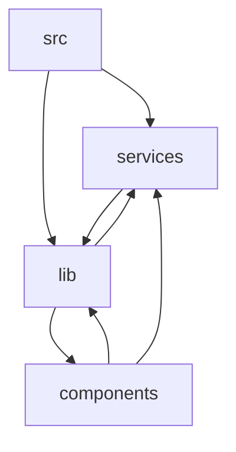

<details>
<summary>Relevant source files</summary>

- src-tauri/src/background.rs
- src-tauri/src/config/legacy.rs
- src-tauri/src/config/state.rs
- src-tauri/src/debug_log.rs
- src-tauri/src/forward/loops.rs
- src-tauri/src/forward/mod.rs
- src-tauri/src/history.rs
- src-tauri/src/monitor/parse.rs
- src-tauri/src/pty/mod.rs
- src-tauri/src/pty/queue.rs
- src-tauri/src/s3sync/client.rs
- src-tauri/src/s3sync/signing.rs
- src-tauri/src/secrets/keys.rs
- src-tauri/src/secrets/mod.rs
- src-tauri/src/sftp.rs
</details>

## 组织方式概述

本页基于所提供的模块清单（`src`、`lib`、`services`、`components`、`stores`、`icons`、`Cargo`、`gen-icon`、`cliff`、`build`、`main`、`i18n`，共 12 个模块）描述项目的模块划分与规模分布。需注意：本次数据仅提供模块名、文件数与符号数，未提供文件路径、行号、依赖边或调用边，因此本页以模块名作为事实锚点，不对模块内部的目录层级与相互关系作断言（见文末「待确认」）。

### 模块清单与规模

| 模块 | 文件数 | 符号数 |
| --- | --- | --- |
| `src` | 37 | 10 |
| `lib` | 9 | 10 |
| `stores` | 4 | 8 |
| `services` | 3 | 3 |
| `components` | 1 | 1 |
| `icons` | 0 | 0 |
| `Cargo` | 0 | 0 |
| `gen-icon` | 0 | 0 |
| `cliff` | 0 | 0 |
| `build` | 0 | 0 |
| `main` | 0 | 0 |
| `i18n` | 0 | 0 |

### 规模分布要点

- 有文件与符号记录的核心模块共 5 个：`src`、`lib`、`stores`、`services`、`components`，合计 54 个文件、32 个符号（数据来源：上述模块清单的 fileCount 与 symbolCount 字段）。
- `src` 是文件数最多的模块（37 个文件），但其符号数（10）低于 `lib` 的符号数（10，文件数 9）；即文件数与符号数在 `src` 与 `lib` 之间并不成比例。
- `lib` 与 `src` 的符号数并列最高（各 10 个），两者合计占 5 个核心模块符号总数的 62.5%（20/32）。
- `stores`（4 文件 / 8 符号）与 `services`（3 文件 / 3 符号）规模相当，`components` 规模最小（1 文件 / 1 符号）。
- 其余 7 个模块（`icons`、`Cargo`、`gen-icon`、`cliff`、`build`、`main`、`i18n`）的文件数与符号数均为 0，在本次数据中不承载可统计的源码文件与符号。

### 组织方式小结

从模块命名与规模分布看，项目采用按职责切分的模块化组织：以 `src` 作为文件数量最集中的主体模块，`lib` 作为符号密度较高（9 文件承载 10 个符号）的支撑模块，`stores`、`services`、`components` 作为三个体量较小的独立模块并列存在。模块之间的大小差异明显（从 1 文件到 37 文件），呈现"少数大模块 + 多个小模块"的分布形态。以上判断仅限模块清单中的名称与规模字段，模块间的依赖方向、调用链路与各模块的实际职责需由后续「模块详解」节及代码级锚点补全。

### 待确认

- 模块的目录归属与层级关系：数据未给出路径前缀（如 `src`、`lib` 是否为顶层目录，`stores`/`services`/`components`/`icons`/`i18n` 是否位于 `src` 之下），因此无法给出模块树形结构图。
- 文件数与符号数为 0 的 7 个模块（`icons`、`Cargo`、`gen-icon`、`cliff`、`build`、`main`、`i18n`）的实际内容与角色：数据未提供其包含的文件或符号，无法区分是空目录、配置入口还是构建脚本，需补充文件清单证据。
- 模块间的依赖与调用关系：数据未提供 import、依赖或调用边，故本页不给出模块依赖图（graph TD）与调用关系表，避免无锚点推断。

## 模块详解（第1批）

本批覆盖 4 个模块：`src`、`lib`、`services`、`components`。按数据给出的模块顺序依次展开。

---

### 1. src 模块

#### 职责

`src` 是本批中体量最大的模块，语言统计为 **Rust 19 个文件 + TS 18 个文件**。本批列出的 10 个代表文件显示其职责覆盖两类后端/前端状态承载：

- Rust 侧状态类型：配置库状态（`src-tauri/src/config/state.rs::ConfigState`）、调试日志状态（`src-tauri/src/debug_log.rs::DebugLogState`）、端口转发句柄（`src-tauri/src/forward/mod.rs::ForwardHandle`、`src-tauri/src/forward/mod.rs::RemoteChannel`）、历史状态（`src-tauri/src/history.rs::HistoryState`）、SSH 认证（`src-tauri/src/ssh/auth.rs`）、密钥加载（`src-tauri/src/secrets/keys.rs`）、监控解析（`src-tauri/src/monitor/parse.rs`）、传输计划（`src-tauri/src/transfers/mod.rs`）。
- TS 侧：本批列出 `src/lib/frontends/xterm/keyboard.ts::HotkeyTarget`（热键状态机接口）。

#### 多语言职责域

| 语言 | 文件数 | 本批可见路径前缀 | 职责域（基于本批文件路径与符号） |
| --- | --- | --- | --- |
| rust | 19 | `src-tauri/src/...` | 承载 `config`、`debug_log`、`forward`、`history`、`ssh`、`secrets`、`monitor`、`transfers` 等子目录下的状态结构与句柄类型 |
| ts | 18 | `src/lib/...` | 承载前端侧的终端前端接口等定义，本批可见为 `frontends/xterm/keyboard.ts` |

#### 设计意图

基于模块依赖数据，`src` 的 `dependsOn` 为 `["services", "lib"]`，`usedBy` 为空数组。即：在依赖方向上，`src` 依赖 `services` 与 `lib`，数据中未记录任何模块依赖 `src`。其文件同时分布在 `src-tauri/src/`（Rust 后端）与 `src/lib/`（TS 前端）之下，说明该模块是跨前后端的顶层聚合单元。

#### 交互方式

| 方向 | 对方模块 | 数据依据 |
| --- | --- | --- |
| 依赖 | `services` | `src.dependsOn` 包含 `services` |
| 依赖 | `lib` | `src.dependsOn` 包含 `lib` |
| 被依赖 | 无 | `src.usedBy` 为空数组 |

模块级依赖关系图（节点均取自本批模块名）：



> 说明：`lib ⇄ services` 在数据中互为依赖（`lib.dependsOn` 含 `services`，`services.dependsOn` 含 `lib`），为双向依赖。

#### 文件结构

| 文件名 | 关键符号 | 说明 |
| --- | --- | --- |
| `src-tauri/src/config/state.rs` | `ConfigState(function)` | 配置库状态，docstring 为「配置库状态：app_data_dir/config.db 的单连接（WAL）」 |
| `src-tauri/src/debug_log.rs` | `DebugLogState(function)`、`append(method)`、`append_raw(method)` | 调试日志状态，docstring 为「调试日志状态：enabled 标志 + 日志文件路径 + 写入互斥锁」；`append`/`append_raw` 为写入方法 |
| `src-tauri/src/forward/mod.rs` | `ForwardHandle(function)`、`RemoteChannel(function)` | 转发运行态与入站 channel 类型 |
| `src-tauri/src/history.rs` | `HistoryState(function)` | 历史状态类型（数据未提供 docstring） |
| `src/lib/frontends/xterm/keyboard.ts` | `HotkeyTarget(interface)` | 热键状态机接口，docstring 为「热键状态机接口（结构兼容 services/hotkeys 的 HotkeysManager）」 |
| `src-tauri/src/ssh/auth.rs` | `KbdFrontendReply(function)`、`TryAuth(function)`、`ask_frontend(function)`、`authenticate(function)` | SSH 认证相关符号集合 |
| `src-tauri/src/ssh/mod.rs` | `KbdWaiters(function)` | SSH 模块内符号（数据未提供 docstring） |
| `src-tauri/src/secrets/keys.rs` | `LoadedKey(function)`、`algorithm_label(function)` | 密钥加载与算法标签相关符号 |
| `src-tauri/src/monitor/parse.rs` | `ParseOutcome(function)` | 监控输出解析结果类型 |
| `src-tauri/src/transfers/mod.rs` | `PlanItem(function)`、`PumpError(function)`、`TransferEntry(function)`、`advance(function)`、`base_name(function)` | 传输计划项、数据泵错误、传输条目及 `advance`/`base_name` 方法 |

#### 核心符号

| 符号 | 类型 | 用途（基于 docstring / signature） |
| --- | --- | --- |
| `src-tauri/src/config/state.rs::ConfigState` | function | 配置库状态：`app_data_dir/config.db` 的单连接（WAL）。 |
| `src-tauri/src/debug_log.rs::DebugLogState` | function | 调试日志状态：`enabled` 标志 + 日志文件路径 + 写入互斥锁。 |
| `src-tauri/src/debug_log.rs::append` | method | 签名 `(&self, message: &str)`；数据未提供 docstring。 |
| `src-tauri/src/debug_log.rs::append_raw` | method | 签名 `(&self, message: &str)`；数据未提供 docstring。 |
| `src-tauri/src/forward/mod.rs::ForwardHandle` | function | 一条转发：运行态 + 关停信号 + 受管任务句柄（监督任务与数据泵，停止时统一 abort）。 |
| `src-tauri/src/forward/mod.rs::RemoteChannel` | function | `-R` 入站 forwarded-tcpip channel（channel 与 open 应答句柄成对投递）。 |

---

### 2. lib 模块


`lib` 为纯 TS 模块（`fileCount: 9`），是前端能力层：提供热键状态机接口、监控编排、命令建议控制、SSH 连接登记、OSC 处理中间件、xterm 前端（渲染器/前端/搜索）、SFTP 窗格辅助等。


`lib` 的 `dependsOn` 为 `["services", "components"]`，`usedBy` 为 `["services", "stores", "components", "src"]`——在数据中它是被依赖面最广的模块，被 `services`、`components`、`src`（本批）以及 `stores`（非本批）使用，同时自身又依赖 `services` 与 `components`。从文件路径看，其内容集中在 `src/lib/` 下，是前端可复用逻辑的集中地。


| 方向 | 对方模块 | 数据依据 |
| --- | --- | --- |
| 依赖 | `services` | `lib.dependsOn` 包含 `services` |
| 依赖 | `components` | `lib.dependsOn` 包含 `components` |
| 被依赖 | `services` | `lib.usedBy` 包含 `services` |
| 被依赖 | `stores` | `lib.usedBy` 包含 `stores`（该模块不在本批） |
| 被依赖 | `components` | `lib.usedBy` 包含 `components` |
| 被依赖 | `src` | `lib.usedBy` 包含 `src` |

符号层面的跨模块契约：`src/lib/frontends/xterm/keyboard.ts::HotkeyTarget` 的 docstring 明确「结构兼容 `services/hotkeys` 的 `HotkeysManager`」，即该接口与 `src/services/hotkeys.ts` 中的实现存在结构兼容约定。


| 文件名 | 关键符号 | 说明 |
| --- | --- | --- |
| `src/lib/frontends/xterm/keyboard.ts` | `HotkeyTarget(interface)` | 热键状态机接口（结构兼容 `services/hotkeys` 的 `HotkeysManager`） |
| `src/lib/monitorOrchestrator.ts` | `RetryState(interface)`、`bindDetail(method)` | 重连挂起态接口与详情绑定方法 |
| `src/lib/suggestions/controller.ts` | `acceptAt(method)`、`acceptSelected(method)` | 建议条目接受入口 |
| `src/lib/sshConnectionRegistry.ts` | `acquire(method)`、`allSshIds(method)` | 连接获取与 sshId 枚举 |
| `src/lib/middleware/oscProcessing.ts` | `asciiSlice(function)` | OSC 处理中间件的 ASCII 切片函数 |
| `src/lib/frontends/xterm/renderer.ts` | `attach(method)` | xterm 渲染器挂载方法 |
| `src/lib/frontends/xterm/frontend.ts` | `attach(method)` | xterm 前端挂载方法 |
| `src/lib/frontends/xterm/search.ts` | `attach(method)` | xterm 搜索挂载方法 |
| `src/lib/sftpPane.ts` | `breadcrumbSegments(function)` | SFTP 窗格面包屑分段函数 |


| 符号 | 类型 | 用途（基于 docstring / signature） |
| --- | --- | --- |
| `src/lib/frontends/xterm/keyboard.ts::HotkeyTarget` | interface | 热键状态机接口（结构兼容 `services/hotkeys` 的 `HotkeysManager`）。 |
| `src/lib/monitorOrchestrator.ts::RetryState` | interface | 重连挂起态。 |
| `src/lib/monitorOrchestrator.ts::bindDetail` | method | 签名 `(profileId: string)`；docstring：绑定详情面板，升级为 full 级采样，返回 `Promise<void>`，示例 `await orchestrator.bindDetail('p1')`。 |
| `src/lib/suggestions/controller.ts::acceptAt` | method | 签名 `(index: number, execute: boolean)`；docstring：鼠标点击菜单条目的接受入口，先把目标项设为选中再接受；`index` 越界时忽略；`execute` 表示是否补换行立即执行（`false` 只补全不执行）。 |
| `src/lib/suggestions/controller.ts::acceptSelected` | method | 签名 `(execute: boolean)`；数据未提供 docstring。 |
| `src/lib/sshConnectionRegistry.ts::acquire` | method | 签名 `(profileId: string, consumerId: string)`；docstring：获取该档案的连接——窗格会话优先复用（不计数，生命周期归窗格），否则复用/建立 headless 连接并登记消费者，返回 `Promise<string>` sshId。 |

---

### 3. services 模块


`services` 为纯 TS 模块（`fileCount: 3`），本批可见三个服务文件，暴露 `ackData(method)`（SSH 与 PTY 各一处）与 `addPressedKey(method)`（热键）。


`services` 位于前端能力层与底层实现之间：其 `dependsOn` 为 `["lib"]`，`usedBy` 为 `["lib", "src", "stores", "components"]`。它与 `lib` 构成双向依赖（`services → lib` 且 `lib → services`），在数据中同时被 `src`、`components`（本批）与 `stores`（非本批）使用。


| 方向 | 对方模块 | 数据依据 |
| --- | --- | --- |
| 依赖 | `lib` | `services.dependsOn` 包含 `lib` |
| 被依赖 | `lib` | `services.usedBy` 包含 `lib` |
| 被依赖 | `src` | `services.usedBy` 包含 `src` |
| 被依赖 | `stores` | `services.usedBy` 包含 `stores`（该模块不在本批） |
| 被依赖 | `components` | `services.usedBy` 包含 `components` |


| 文件名 | 关键符号 | 说明 |
| --- | --- | --- |
| `src/services/ssh.ts` | `ackData(method)` | SSH 服务中的 `ackData(length: number)` |
| `src/services/pty.ts` | `ackData(method)` | PTY 服务中的 `ackData(length: number)` |
| `src/services/hotkeys.ts` | `addPressedKey(method)` | 热键服务中的按键登记方法 |


| 符号 | 类型 | 用途（基于 docstring / signature） |
| --- | --- | --- |
| `src/services/ssh.ts::ackData` | method | 签名 `(length: number)`；数据未提供 docstring。 |
| `src/services/pty.ts::ackData` | method | 签名 `(length: number)`；数据未提供 docstring。 |
| `src/services/hotkeys.ts::addPressedKey` | method | 签名 `(keyName: string, event: KeyEventData)`；数据未提供 docstring。 |

---

### 4. components 模块


`components` 为纯 TS 模块（`fileCount: 1`），本批仅含 `src/components/titlebar/tabGroupLayout.ts`，其中 `activeAfterCollapse` 负责在分组折叠后计算激活项。


`components` 在数据中依赖 `lib` 与 `services`，并被 `stores` 与 `lib` 使用——即 UI 组件层的布局计算既消费能力层，也被状态层与能力层反向引用。


| 方向 | 对方模块 | 数据依据 |
| --- | --- | --- |
| 依赖 | `lib` | `components.dependsOn` 包含 `lib` |
| 依赖 | `services` | `components.dependsOn` 包含 `services` |
| 被依赖 | `stores` | `components.usedBy` 包含 `stores`（该模块不在本批） |
| 被依赖 | `lib` | `components.usedBy` 包含 `lib` |


| 文件名 | 关键符号 | 说明 |
| --- | --- | --- |
| `src/components/titlebar/tabGroupLayout.ts` | `activeAfterCollapse(function)` | 标题栏标签分组布局计算函数 |


| 符号 | 类型 | 用途（基于 docstring / signature） |
| --- | --- | --- |
| `src/components/titlebar/tabGroupLayout.ts::activeAfterCollapse` | function | 签名 `(tabs: Tab[], groups: TabGroup[], activeId: string \| null, collapsingGroupId: string)`；数据未提供 docstring，依据参数可知其输入为标签集合、分组集合、当前激活 id 与正在折叠的分组 id。 |

---


| 缺口 | 缺什么证据 |
| --- | --- |
| `src` 模块的驱动入口 | `src.usedBy` 为空数组，数据未给出除 `services`、`lib` 外还有谁触发该模块（如应用入口），无法确认其在运行时的被调用路径。 |
| `src`/`lib` 之间 `keyboard.ts` 的归属 | `src/lib/frontends/xterm/keyboard.ts` 同时出现在 `src` 与 `lib` 两个模块的 `files` 中，数据未说明其实际归属或共用方式。 |

## 模块详解（第2批）

本批共 4 个模块：`stores` 有完整符号数据；`icons`、`Cargo`、`gen-icon` 在本次数据中文件、语言、符号、依赖均为空集，仅能给出其存在性。

### stores

**职责**

前端全局状态层（Pinia/类 store 语义），承载四类运行时状态：传输任务的展示派生速度、标签页激活与分组归属、监控档案的采样结果与错误状态、窗口 chrome 主题令牌。语言域单一：仅 TypeScript（4 个文件，`ts` × 4），即全部为前端渲染层状态，无后端/Rust 侧代码参与。

**设计意图**

该模块把"Rust 推送的原始数据"转换成"UI 可直接消费的派生态"：

- `SpeedTracker` 的注释明确其定位为「每任务速度跟踪态（**展示派生，不入持久化**）」（`src/stores/transfers.ts`），说明速度不是后端权威数据，而是前端由相邻样本差值 + EMA 平滑计算出的展示值——这样避免了把高频采样持久化，也解释了为什么它放在 stores 而不是 service 层。
- `src/stores/monitor.ts` 中 `applyUnsupported` 的注释称其为「**终态哨兵**，UI 显示「仅支持 Linux」」，说明监控状态机用一个显式终态值表达"平台不支持"，而非用错误态或空值代替，便于 UI 直接分支渲染。

**交互方式**

模块级依赖（数据中的 dependsOn 为聚合结果，未附带 file:line 边）：

| 方向 | 模块 | 说明 |
| --- | --- | --- |
| 依赖 | `lib` | stores 引用的底层工具/类型库 |
| 依赖 | `services` | 数据来源层（Rust 推送/服务封装） |
| 依赖 | `components` | 数据中记录了 stores → components 的依赖边 |
| 被依赖 | 无（usedBy 为空） | 数据中未记录任何反向依赖 |

`usedBy` 为空，说明本次数据未采集到消费这些 store 的调用方；`stores → components` 这条边的具体用途在本批数据中缺乏调用点佐证。

**文件结构**

| 文件名 | 关键符号 | 职责 |
| --- | --- | --- |
| `src/stores/transfers.ts` | `SpeedTracker`(interface)、`apply`(function) | 传输任务快照的速度跟踪与派生速度状态 |
| `src/stores/tabs.ts` | `activate`(function)、`assignTabToGroup`(function) | 标签页激活态与标签→分组的归属关系维护 |
| `src/stores/monitor.ts` | `apply`(function)、`applyError`(function)、`applyUnsupported`(function) | 监控档案采样结果写入、采集错误记录、不支持平台标记 |
| `src/stores/theme.ts` | `applyChromeTokens`(function) | 将 chrome 主题令牌应用到 store |

**核心符号**

- `SpeedTracker`（interface）——「每任务速度跟踪态（展示派生，不入持久化）」，为每个传输任务保存速度计算所需的展示侧状态。
- `apply`（function，`src/stores/transfers.ts`）——应用一份全量快照：更新速度跟踪（running 任务的相邻样本差值 + EMA）。签名：

```ts
apply(snapshots: TransferSnapshot[])
```

- `activate`（function，`src/stores/tabs.ts`）——按 id 激活标签页。签名：

```ts
activate(id: string)
```

- `assignTabToGroup`（function，`src/stores/tabs.ts`）——设置标签归属分组；`groupId` 为 `null` 时清除归属，**组不存在时忽略（防悬空）**。签名：

```ts
assignTabToGroup(tabId: string, groupId: string | null)
```

- `applyError`（function，`src/stores/monitor.ts`）——记录采集错误（保留原始文本；**下次成功采样自动清除**）。签名：

```ts
applyError(profileId: string, message: string)
```

- `applyUnsupported`（function，`src/stores/monitor.ts`）——标记平台不支持（终态哨兵，UI 显示「仅支持 Linux」）。签名：

```ts
applyUnsupported(profileId: string)
```

- `apply`（function，`src/stores/monitor.ts`）——与 `transfers.ts` 同名，位于监控模块；本批 topSymbols 仅提供了 `transfers.ts` 版本的 docstring，该版本的参数与语义**信息不足**。
- `applyChromeTokens`（function，`src/stores/theme.ts`）——被列入文件符号表，但本批数据未给出其 docstring 与签名，仅能确认其存在于主题 store 中。

### icons

本批数据中该模块的 `files`、`languages`、`topSymbols`、`fileSymbols`、`dependsOn`、`usedBy` 全部为空数组。除模块名外无可描述内容——**待确认**：缺该模块的源文件清单与符号列表，无法判断其是图标资源目录、图标组件库还是构建产物。

### Cargo

本批数据中该模块的 `files`、`languages`、`topSymbols`、`fileSymbols`、`dependsOn`、`usedBy` 全部为空数组——**待确认**：缺 `Cargo.toml` 路径、依赖表与 feature 信息，无法描述 Rust 侧的 crate 依赖与构建配置。

### gen-icon

本批数据中该模块的 `files`、`languages`、`topSymbols`、`fileSymbols`、`dependsOn`、`usedBy` 全部为空数组——**待确认**：缺脚本入口与调用点证据，无法确认其是图标生成脚本、CLI 还是构建钩子。

**本批小结（仅基于数据）**：本批唯一有符号证据的模块是 `stores`，其四个文件分别对应传输、标签、监控、主题四类前端状态；其余三个模块（`icons`、`Cargo`、`gen-icon`）在当前数据中为空壳条目，需要补充源文件与符号数据后才能评估。

## 模块详解（第3批）

本批数据包含 4 个模块条目：`cliff`、`build`、`main`、`i18n`。这 4 个条目在本批 JSON 中均为空壳记录：`files`、`languages`、`topSymbols`、`fileSymbols`、`dependsOn`、`usedBy` 全部为空数组，`supplementalSymbols` 亦为空。因此本节无法按「职责 / 设计意图 / 交互方式 / 文件结构 / 核心符号」的既定结构展开实质内容——任何展开都将是编造。

### 本批模块数据完整度总览

| 模块名 | files | languages | topSymbols | fileSymbols | dependsOn | usedBy |
|---|---|---|---|---|---|---|
| cliff | 空 | 空 | 空 | 空 | 空 | 空 |
| build | 空 | 空 | 空 | 空 | 空 | 空 |
| main | 空 | 空 | 空 | 空 | 空 | 空 |
| i18n | 空 | 空 | 空 | 空 | 空 | 空 |

上表逐列来源于本批 JSON 中各模块对象的实际字段值（均为 `[]`），无任何文件路径或符号锚点可供引用，故本页不产出任何带 `file:line` / qualified_name 的事实声明。

### cliff

- 职责：信息不足。
- 设计意图：信息不足。
- 交互方式：`dependsOn` 与 `usedBy` 均为空，无调用关系数据，信息不足。
- 文件结构：`files` 为空，无可列出的文件与关键符号。
- 核心符号：`topSymbols` 为空，无可说明的符号。

待确认：该模块的文件清单、语言构成与导出符号在本批数据中完全缺失，需补齐 `files` / `languages` / `topSymbols` 后方可描述。

### build

- 职责：信息不足。
- 设计意图：信息不足。
- 交互方式：`dependsOn` 与 `usedBy` 均为空，无调用关系数据，信息不足。
- 文件结构：`files` 为空，无可列出的文件与关键符号。
- 核心符号：`topSymbols` 为空，无可说明的符号。

待确认：该模块的文件清单、语言构成与导出符号在本批数据中完全缺失，需补齐 `files` / `languages` / `topSymbols` 后方可描述。

### main

- 职责：信息不足。
- 设计意图：信息不足。
- 交互方式：`dependsOn` 与 `usedBy` 均为空，无调用关系数据，信息不足。
- 文件结构：`files` 为空，无可列出的文件与关键符号。
- 核心符号：`topSymbols` 为空，无可说明的符号。

待确认：该模块的文件清单、语言构成与导出符号在本批数据中完全缺失，需补齐 `files` / `languages` / `topSymbols` 后方可描述。

### i18n

- 职责：信息不足。
- 设计意图：信息不足。
- 交互方式：`dependsOn` 与 `usedBy` 均为空，无调用关系数据，信息不足。
- 文件结构：`files` 为空，无可列出的文件与关键符号。
- 核心符号：`topSymbols` 为空，无可说明的符号。

待确认：该模块的文件清单、语言构成与导出符号在本批数据中完全缺失，需补齐 `files` / `languages` / `topSymbols` 后方可描述。

### 本批小节说明

- 本批 4 个模块在数据中仅存在名称，不存在任何可锚定的文件、符号或依赖边；按锚点强制要求（无 `file:line` 或 qualified_name 不得声明），本节不输出职责推断、架构角色推断或 Mermaid 图。
- 多语言职责域说明：4 个模块的 `languages` 字段均为空，无法区分各语言职责域，故不输出该项；非单一语言的分工描述需待 `languages` 字段补齐。
- 待确认合计 4 处，均为同一类缺口（文件清单 / 语言构成 / 导出符号缺失），集中于上表与各模块条目的「待确认」行。
## Related

- 同目录：[architecture.md](architecture.md) · [data-flow.md](data-flow.md)
- 总入口：[README](../README.md)
