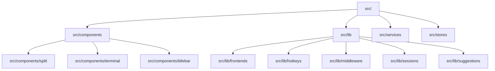

# 测试体系

本页基于测试探测结果（framework / configPath / testDirs / fixturesDir / coverageThreshold / runCommand 六个字段）整理，说明本项目使用的测试框架、测试目录分布与运行方式。

> 锚点说明：本次探测结果仅提供目录级路径，未提供文件级路径与行号。因此下文锚点统一使用探测结果中给出的完整相对路径（目录级）。数据中不存在 file:line 级锚点，故不编造具体文件名与行号。

## 测试体系概览

| 事实项 | 取值 | 锚点 / 来源 |
|---|---|---|
| 测试框架 | `vitest` | 探测结果 `framework` 字段 |
| 运行命令 | `vitest run` | 探测结果 `runCommand` 字段 |
| 配置文件 | 未检测到（`configPath` 为 null） | 探测结果 `configPath` 字段 |
| 夹具目录 | 未检测到（`fixturesDir` 为 null） | 探测结果 `fixturesDir` 字段 |
| 覆盖率阈值 | 未检测到（`coverageThreshold` 为 null） | 探测结果 `coverageThreshold` 字段 |
| 测试目录数量 | 11 个 | 探测结果 `testDirs` 字段 |
| 测试目录根位置 | 全部位于 `src/` 之下 | 探测结果 `testDirs` 字段 |

### 测试目录分布

全部 11 个测试目录及其锚点：

| # | 测试目录（锚点） | 所在层 |
|---|---|---|
| 1 | `src/components/split` | 组件层 |
| 2 | `src/components/terminal` | 组件层 |
| 3 | `src/components/titlebar` | 组件层 |
| 4 | `src/lib` | 库层（顶层） |
| 5 | `src/lib/frontends` | 库层（子域） |
| 6 | `src/lib/hotkeys` | 库层（子域） |
| 7 | `src/lib/middleware` | 库层（子域） |
| 8 | `src/lib/sessions` | 库层（子域） |
| 9 | `src/lib/suggestions` | 库层（子域） |
| 10 | `src/services` | 服务层 |
| 11 | `src/stores` | 状态层 |

### 目录层级关系



图中节点均为探测结果 `testDirs` 中给出的真实目录路径，未引入数据之外的结构。

## 运行方式

### 全量运行

```bash
vitest run
```

- **来源**：探测结果 `runCommand` 字段给出的值即为 `vitest run`。
- **行为**：`run` 子命令执行一次性全量测试，跑完即退出，不进入 watch 监听状态。这是 vitest 的通用运行模式。
- **预期产出**：终端打印本轮各测试文件的通过/失败结果与汇总统计。探测结果未提供用例数量、通过率或耗时数据，本页不做任何数字预测。

### 命令相关缺口

探测结果未提供任何自定义运行脚本（例如 `package.json` 中的 `test` 脚本映射）、未提供 `configPath`，因此无法确认 `vitest run` 是否携带额外参数或环境变量。若需在 CI 或本地复用该命令，以 `vitest run` 作为基准命令即可，其余参数需另行确认。

## 测试策略解读

从目录分布看，本项目的测试采用**与源码同层、按模块就近组织**的方式：11 个测试目录全部位于 `src/` 之下，并与源码模块目录同名（`src/components/*`、`src/lib/*`、`src/services`、`src/stores`），不存在独立于源码树的顶层 `tests/` 目录。这种布局意味着测试文件与其被测代码物理相邻，读者沿源码目录即可定位对应测试，无需额外的路径映射。

覆盖重点集中在三个层面：**组件层**限定为 3 个具体组件目录（`src/components/split`、`src/components/terminal`、`src/components/titlebar`），说明组件测试并非全组件铺开，而是有选择地落在少数几个组件上；**库层**粒度最细，除 `src/lib` 顶层外还向下拆分出 5 个子域（`frontends`、`hotkeys`、`middleware`、`sessions`、`suggestions`），是测试目录数量最多的区域，反映该区域被按职责切分为多个可独立验证的单元；**服务与状态层**各占 1 个目录（`src/services`、`src/stores`），以整目录为单位组织测试，未进一步细分。上述判断仅基于目录结构本身，各目录内部的具体测试内容、用例数量与断言范围，探测结果未提供。

## 缺口汇总

探测结果中 `configPath`、`fixturesDir`、`coverageThreshold` 三项均为 null，即未检测到 vitest 配置文件、共享夹具目录与覆盖率阈值设置；本页因此无法说明测试环境配置来源（如运行环境、别名、setup 文件）、测试数据复用方式与覆盖率门槛要求。此外，探测结果停留在目录级，未提供任何测试文件路径、用例名称或调用关系，故本页不含调用关系表与用例清单。
## Related

- 同目录：[onboarding.md](onboarding.md) · [troubleshooting.md](troubleshooting.md)
- 总入口：[README](../README.md)
