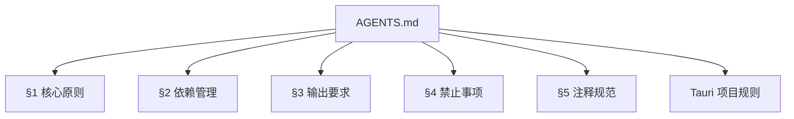
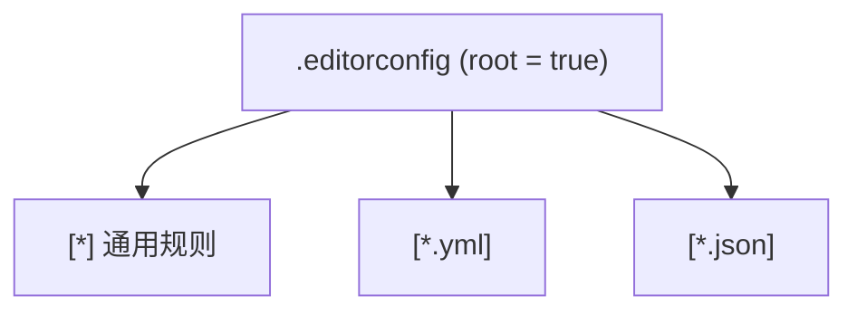
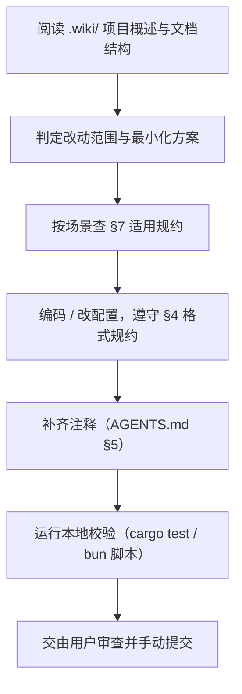

# 项目规约（工具链 / AI 协作 / 命名与结构）

<details>
<summary>Relevant source files</summary>

- .oxlintrc.json
</details>

本页汇总本项目**已明确定义的约束性规约**：工具链（Linter / EditorConfig）、AI 协作规则（AGENTS.md 提炼）、以及由此可确定的命名与目录结构约定；供新成员与 AI 编码代理在改码前快速对齐。

## 0. 规约来源与证据边界

| 规约载体 | 数据来源字段 | 本页可用事实 | 锚点 |
|---|---|---|---|
| AGENTS.md | `agentsMd` | AI 协作规则、依赖管理、注释规范、Tauri 项目规则 | `AGENTS.md` |
| oxlint 配置 | `linterConfig` | Linter 已启用；配置文件路径 `.oxlintrc.json` | `.oxlintrc.json` |
| EditorConfig | `editorConfig` | 根级编辑器格式统一配置及其全部键值 | `.editorconfig`（`root = true`） |

> 说明：本页仅依据上述三类载体撰写。仓库源码文件清单、依赖清单（`package.json` / `Cargo.toml` 内容）未在数据中提供，因此涉及"实际已存在哪些模块"的问题不在本页断言范围内。

规约载体之间的关系（节点均来自数据中真实存在的文件/章节名）：





---

## 1. 工具链规约

### 1.1 配置状态总览

| 工具类别 | 是否启用 | 配置文件 | 证据锚点 |
|---|---|---|---|
| Linter | 已启用（`hasLinter: true`） | `.oxlintrc.json` | `.oxlintrc.json` |
| EditorConfig | 已启用（`hasEditorConfig: true`） | `.editorconfig`（根配置，`root = true`） | `.editorconfig` |

Linter 与 EditorConfig 两项均已配置，属于项目**已确立的工具链约束**，新成员与 AI 提交代码前无需再行确认其存在性。

### 1.2 EditorConfig 原文

`.editorconfig` 完整内容如下（字段 `editorConfig` 原样）：

```ini
root = true

[*]
charset = utf-8
insert_final_newline = true
indent_style = space
indent_size = 4
end_of_line = lf
trim_trailing_whitespace = true

[*.yml]
indent_size = 2

[*.json]
indent_size = 2
```

### 1.3 EditorConfig 规则逐项解读

| 作用域 | 键 | 取值 | 对编码行为的约束 |
|---|---|---|---|
| `[*]` | `charset` | `utf-8` | 所有文件统一 UTF-8 编码 |
| `[*]` | `insert_final_newline`（待确认） | `true` | 文件末尾必须保留换行 |
| `[*]` | `indent_style`（待确认） | `space` | 一律使用空格缩进，禁止 Tab |
| `[*]` | `indent_size`（待确认） | `4` | 默认缩进宽度 4 |
| `[*]` | `end_of_line`（待确认） | `lf` | 换行符统一 LF（禁止 CRLF） |
| `[*]` | `trim_trailing_whitespace`（待确认） | `true` | 自动清除行尾空白 |
| `[*.yml]` | `indent_size`（待确认） | `2` | YAML 文件缩进覆盖为 2 |
| `[*.json]` | `indent_size`（待确认） | `2` | JSON 文件缩进覆盖为 2 |
| 全局 | `root` | `true` | 该文件为配置根，不再向上级目录查找 |

要点：**通用缩进为 4 空格，但 `.yml` 与 `.json` 例外为 2 空格**；行尾空白与换行符由编辑器层面强制统一。

### 1.4 Linter 信息缺口

| 项目 | 状态 |
|---|---|
| Linter 是否启用 | 已启用（`hasLinter: true`） |
| 配置文件路径 | `.oxlintrc.json` |
| 具体规则集 / 插件 / 忽略配置 | 信息不足——数据仅提供配置文件名，未提供规则条目 |

即：**"用什么工具、配置在哪个文件"已确定；"启用/禁用了哪些规则"无法从现有数据得出**，需查阅 `.oxlintrc.json` 文件本体。

---

## 2. AI 协作规约（AGENTS.md 提炼）

以下为 `AGENTS.md` 中规则要点的主题化提炼（非原文照搬）。

### 2.1 核心工作原则

| # | 规约要点 | 锚点 |
|---|---|---|
| 1 | **先了解项目再动手**：执行任务或改码前，若需了解项目，必须先阅读 `.wiki/` 中的项目概述与文档结构，掌握架构与设计原则后再修改，避免基于猜测改动 | `AGENTS.md §1.0` |
| 2 | **保持现有功能完整性**：除非用户明确要求，不得修改现有功能行为、配置、接口、环境变量结构、目录结构、脚手架流程；保持原有构建流程与运行方式 | `AGENTS.md §1.1` |
| 3 | **最小化修改**：只做必要改动，避免影响不相关模块；新增逻辑必须最小化修改范围，避免连锁兼容问题 | `AGENTS.md §1.2` |
| 4 | **代码风格统一**：遵循项目现有代码风格与命名规范；文件名统一使用 kebab-case 或遵循项目现有约定；保持文件与目录结构一致性 | `AGENTS.md §1.3` |

### 2.2 依赖管理规约

| # | 规约要点 | 锚点 |
|---|---|---|
| 1 | 禁止降级依赖版本；仅当用户明确允许、或为修复冲突且经用户允许时才可降版 | `AGENTS.md §2.1` |
| 2 | 不得移除现有依赖，除非用户明确要求，或确认冗余且经用户允许 | `AGENTS.md §2.2` |
| 3 | 新增依赖遵循**最新兼容版本策略（semver `^`）**，并评估兼容性 | `AGENTS.md §2.3` |
| 4 | 修改依赖配置前必须先确认项目类型与构建体系 | `AGENTS.md §2.4` |

### 2.3 输出与交付规约

| # | 规约要点 | 锚点 |
|---|---|---|
| 1 | 优先输出代码与必要的命令步骤 | `AGENTS.md §3.1` |
| 2 | 必要时说明修改原因，避免冗余解释性文本 | `AGENTS.md §3.2` |
| 3 | **不得擅自生成总结文档、README 或说明文档**（除非用户明确要求） | `AGENTS.md §3.3` |

### 2.4 全局禁止事项

| # | 禁止行为 | 锚点 |
|---|---|---|
| 1 | 自动执行 `git commit`、`git push` 等提交操作（改码后由用户审查并手动提交） | `AGENTS.md §4` |
| 2 | 擅自重构项目一级目录结构（如 `src`、`public`、`dist`、`apps` 等） | `AGENTS.md §4` |
| 3 | 改变 lint / build 行为导致结果不同 | `AGENTS.md §4` |
| 4 | 将项目改为其他框架或运行环境 | `AGENTS.md §4` |
| 5 | 删除现有功能 | `AGENTS.md §4` |
| 6 | 擅自改变基础配置文件（如 tsconfig / vite / webpack / `Cargo.toml` / pom.xml） | `AGENTS.md §4` |
| 7 | 插入当前环境无法使用的 API（例如浏览器项目引入 `fs` / `path` 等 node-only API） | `AGENTS.md §4` |
| 8 | Superpowers spec/plan 文件错放：spec 与 plan 只能存放于 `docs/superpowers/specs/` 与 `docs/superpowers/plans/`；禁止从 `.gitignore` 删除 `docs/superpowers` 条目；禁止放入任何其他目录 | `AGENTS.md §4` |

### 2.5 注释规范

**强制要求（5 条）**：

| # | 要求 | 锚点 |
|---|---|---|
| 1 | 每个文件必须有 `@description` 文件头注释（中文） | `AGENTS.md §5` |
| 2 | 每个函数必须有 `@description` 注释 | `AGENTS.md §5` |
| 3 | 有参数的函数必须有 `@param` 注释 | `AGENTS.md §5` |
| 4 | 有返回值的函数必须有 `@returns` 注释 | `AGENTS.md §5` |
| 5 | 核心函数（命名策略、类型清理、生成器、解析器、转换器等）需要 `@example` 标签 | `AGENTS.md §5` |

**格式示例（源：`AGENTS.md §5`）**：

```typescript
/**
 * @description 从 Apifox 平台获取 OpenAPI 数据
 * @param config API 配置对象
 * @returns Promise<ApiData> API 数据
 *
 * @example const data = await fetchApifoxData({ source: '...', token: '...' });
 *
 */
```

**按语言的落地差异**：

| 语言 | 采用的注释风格 | 锚点 |
|---|---|---|
| TypeScript / JavaScript | JSDoc 风格（`/** ... */`） | `AGENTS.md §5` |
| Java | Javadoc 风格（`/** ... */`），遵循 Java 既有规范 | `AGENTS.md §5` |
| Rust | `///` 文档注释，遵循 rustdoc 规范（`# Arguments` / `# Returns` / `# Examples` 段） | `AGENTS.md §5` |

各语言按各自规范实现上述 5 条要求的内容，**不强制使用完全相同的标签名**（`AGENTS.md §5`）。

---

## 3. Tauri 项目规约（AGENTS.md「Tauri 项目规则」）

`AGENTS.md` 明确本项目为 Tauri 项目：同时包含前端（JS/TS）与后端（Rust），**两套依赖体系独立维护**（`AGENTS.md §Tauri 项目规则`）。

### 3.1 包管理与运行时

| # | 规约要点 | 锚点 |
|---|---|---|
| 1 | **前端必须使用 `bun`**，Rust 后端使用 `cargo`，不得混用 | `AGENTS.md §Tauri/包管理与运行时` |
| 2 | **Bun 版本要求 1.4+**；前端包管理与构建工具链统一使用 Bun 运行时，锁定文件为 `bun.lock` | `AGENTS.md §Tauri/包管理与运行时` |
| 3 | Rust edition 必须与 `src-tauri/Cargo.toml` 中声明的版本一致（通常为 2021） | `AGENTS.md §Tauri/包管理与运行时` |

### 3.2 项目结构约定

遵循 Tauri 标准结构，不得擅自调整（`AGENTS.md §Tauri/项目结构约定`）：

| 路径 | 约定职责 |
|---|---|
| `src/` 或前端根目录 | 前端代码（Vue/React/Svelte，遵循项目现状） |
| `src-tauri/src/main.rs` | Rust 入口 |
| `src-tauri/src/lib.rs` | 应用逻辑（如使用 lib 结构） |
| `src-tauri/Cargo.toml` | Rust 依赖 |
| `src-tauri/tauri.conf.json` | Tauri 配置（**含 security 字段**） |
| `src-tauri/icons/` | 应用图标 |
| `src-tauri/capabilities/` | 权限配置（Tauri v2） |

### 3.3 构建与测试命令

| 命令 | 用途 | 锚点 |
|---|---|---|
| `bun install` | 安装前端依赖 | `AGENTS.md §Tauri/构建与测试命令` |
| `bun run app:dev` | 开发模式（同时启动前端与 Rust，等价 `tauri dev`） | `AGENTS.md §Tauri/构建与测试命令` |
| `bun run app:build` | 生产打包（等价 `tauri build`） | `AGENTS.md §Tauri/构建与测试命令` |
| `bun run dev` | 仅启动前端（用于纯前端调试） | `AGENTS.md §Tauri/构建与测试命令` |
| `cargo test --manifest-path src-tauri/Cargo.toml` | Rust 测试 | `AGENTS.md §Tauri/构建与测试命令` |

### 3.4 依赖与配置规则

| # | 规约要点 | 锚点 |
|---|---|---|
| 1 | `tauri.conf.json` 的 security 相关字段必须保留（CSP、allowlist、capabilities 等），不得删除或弱化 | `AGENTS.md §Tauri/依赖与配置规则` |
| 2 | 前后端通过 Tauri IPC（`invoke` / `#[tauri::command]`）通信，命令必须在 `invoke_handler` 中注册 | `AGENTS.md §Tauri/依赖与配置规则` |
| 3 | Rust 依赖遵循 cargo semver，不得降级 | `AGENTS.md §Tauri/依赖与配置规则` |
| 4 | 前端依赖遵循 bun 规范（新增依赖用 `bun add`），版本策略仍为 semver `^` | `AGENTS.md §Tauri/依赖与配置规则` |
| 5 | `tauri.conf.json` 修改必须采取**合并策略**，不得重写整个文件 | `AGENTS.md §Tauri/依赖与配置规则` |
| 6 | Tauri v2 权限必须在 `capabilities/` 下显式声明，不得通过 wildcard 放开 | `AGENTS.md §Tauri/依赖与配置规则` |

### 3.5 Tauri 专属禁止事项

| # | 禁止行为 | 锚点 |
|---|---|---|
| 1 | 删除 `tauri.conf.json` 中的 security / CSP / capabilities 字段 | `AGENTS.md §Tauri/禁止事项` |
| 2 | 在前端代码中直接调用 Rust crate（必须通过 IPC） | `AGENTS.md §Tauri/禁止事项` |
| 3 | 改变 Rust 后端 edition 版本（如从 2021 改为 2018） | `AGENTS.md §Tauri/禁止事项` |
| 4 | 擅自升级 Tauri 主版本（v1 ↔ v2 不兼容，迁移需用户明确批准） | `AGENTS.md §Tauri/禁止事项` |
| 5 | 破坏 `invoke_handler` 与前端 `invoke` 调用的对应关系 | `AGENTS.md §Tauri/禁止事项` |

---

## 4. 命名与结构规约

以下条目**仅来自 AGENTS.md 与工具链配置可确定的内容**：

### 4.1 命名规约

| 对象 | 规约 | 依据锚点 |
|---|---|---|
| 文件名 | 统一使用 kebab-case，或遵循项目现有约定 | `AGENTS.md §1.3` |
| 注释标签 | 文件/函数 `@description`；参数 `@param`；返回值 `@returns`；核心函数 `@example`（各语言按自身规范等价实现） | `AGENTS.md §5` |
| Rust 文档段 | 使用 rustdoc 的 `# Arguments` / `# Returns` / `# Examples` 段名 | `AGENTS.md §5` |

### 4.2 代码格式规约

| 项目 | 取值 | 依据锚点 |
|---|---|---|
| 缩进风格 | 空格（禁止 Tab） | `.editorconfig` `[*] indent_style = space` |
| 通用缩进宽度 | 4 | `.editorconfig` `[*] indent_size = 4` |
| YAML 缩进宽度 | 2 | `.editorconfig` `[*.yml] indent_size = 2` |
| JSON 缩进宽度 | 2 | `.editorconfig` `[*.json] indent_size = 2` |
| 字符编码 | UTF-8 | `.editorconfig` `[*] charset = utf-8` |
| 换行符 | LF | `.editorconfig` `[*] end_of_line = lf` |
| 文件末尾 | 必须有换行 | `.editorconfig` `[*] insert_final_newline = true` |
| 行尾空白 | 必须去除 | `.editorconfig` `[*] trim_trailing_whitespace = true` |

### 4.3 结构规约

| 项目 | 规约 | 依据锚点 |
|---|---|---|
| 一级目录 | 不得擅自重构（`src`、`public`、`dist`、`apps` 等） | `AGENTS.md §4` |
| 目录层级一致性 | 保持文件与目录结构一致，不擅自调整 | `AGENTS.md §1.3`、`AGENTS.md §1.1` |
| Rust 侧结构 | 遵循 Tauri 标准结构（`src/main.rs`、`src/lib.rs`、`Cargo.toml`、`tauri.conf.json`、`icons/`、`capabilities/`） | `AGENTS.md §Tauri/项目结构约定` |
| spec / plan 文档目录 | 仅允许 `docs/superpowers/specs/` 与 `docs/superpowers/plans/`；`.gitignore` 中 `docs/superpowers` 条目不得删除 | `AGENTS.md §4` |
| 基础配置文件 | tsconfig / vite / webpack / `Cargo.toml` / pom.xml 不得擅自改动 | `AGENTS.md §4` |

---

## 5. 改动前检查清单（由上述规约汇总）

1. 是否已阅读 `.wiki/` 中的项目概述与文档结构（`AGENTS.md §1.0`）。
2. 改动是否最小化、是否触及不相关模块（`AGENTS.md §1.2`）。
3. 是否新增/升级依赖；新增是否使用 semver `^`、是否降级或移除既有依赖（`AGENTS.md §2.1`–`§2.3`）。
4. 是否改动 lint / build 行为（`AGENTS.md §4` 明令禁止）。
5. 是否触及 `tauri.conf.json` 的 security / CSP / capabilities 或采用合并策略修改（`AGENTS.md §Tauri/依赖与配置规则`、`§Tauri/禁止事项`）。
6. IPC 命令是否同步注册到 `invoke_handler`（`AGENTS.md §Tauri/依赖与配置规则`、`§Tauri/禁止事项`）。
7. 缩进/编码/换行是否符合 `.editorconfig`（4 空格、UTF-8、LF、末尾换行、去行尾空白；JSON/YAML 为 2 空格）。
8. 注释是否满足 5 条强制要求（`AGENTS.md §5`）。
9. 是否擅自执行 `git commit` / `git push`（禁止，`AGENTS.md §4`）。

---

## 6. 待确认

| # | 缺口 | 缺失的证据 |
|---|---|---|
| 1 | `.oxlintrc.json` 的具体规则集与忽略项 | 数据仅给出配置文件名，未给出规则内容，无法判断哪些 lint 规则处于启用/关闭状态 |
| 2 | 仓库实际文件结构是否与 AGENTS.md 的结构约定完全一致 | 未提供仓库文件清单，`src-tauri/src/main.rs` 等路径为 AGENTS.md 的约定描述，未经实际文件核验 |
| 3 | 前端框架选型（Vue / React / Svelte） | AGENTS.md 表述为"遵循项目现状"，未指明具体框架；数据中无 `package.json` 等佐证 |

## 7. 任务场景 → 适用规约对照

以下按**改动类型**索引规约，便于 AI 代理在动手前直接定位约束（同一场景可能命中多条，需全部满足）。

| 任务场景 | 必须遵守的规约 | 依据锚点 |
|---|---|---|
| 新增前端依赖 | 用 `bun add`；版本策略为 semver `^`；先确认项目类型与构建体系 | `AGENTS.md §Tauri/依赖与配置规则`、`AGENTS.md §2.4` |
| 新增 Rust 依赖 | 遵循 cargo semver，不得降级 | `AGENTS.md §Tauri/依赖与配置规则` |
| 调整既有依赖版本 | 禁止降级；仅用户明确允许或为修冲突且经允许才可降 | `AGENTS.md §2.1` |
| 删除某个依赖 | 禁止，除非用户明确要求，或确认冗余且经用户允许 | `AGENTS.md §2.2` |
| 修改 `src-tauri/tauri.conf.json` | 采用**合并策略**，不得重写整文件；security / CSP / capabilities 字段必须保留、不得弱化 | `AGENTS.md §Tauri/依赖与配置规则`、`§Tauri/禁止事项` |
| 新增前后端通信能力 | 走 Tauri IPC（前端 `invoke` / 后端 `#[tauri::command]`），命令必须在 `invoke_handler` 注册，保持两侧对应关系 | `AGENTS.md §Tauri/依赖与配置规则`、`§Tauri/禁止事项` |
| 需要访问后端能力的前端代码 | 不得直接调用 Rust crate，必须经 IPC | `AGENTS.md §Tauri/禁止事项` |
| Tauri v2 权限新增 | 在 `src-tauri/capabilities/` 下**显式声明**，不得用 wildcard 放开 | `AGENTS.md §Tauri/依赖与配置规则` |
| 新增 `.ts` / `.js` 文件 | 文件头 `@description`（中文）；函数 `@description`；有参数 `@param`；有返回值 `@returns`；核心函数补 `@example` | `AGENTS.md §5` |
| 新增 Rust 文件 | 用 `///` 文档注释，遵循 rustdoc（`# Arguments` / `# Returns` / `# Examples`），等价实现 5 条注释要求；不得改 edition（如 2021 → 2018） | `AGENTS.md §5`、`§Tauri/禁止事项` |
| 新增 Java 文件 | 用 Javadoc 风格（`/** ... */`），遵循 Java 既有规范 | `AGENTS.md §5` |
| 创建 spec / plan 文档 | 只能放在 `docs/superpowers/specs/` 与 `docs/superpowers/plans/`；不得删除 `.gitignore` 中 `docs/superpowers` 条目 | `AGENTS.md §4` |
| 想生成 README / 总结文档 | 不得擅自生成，除非用户明确要求 | `AGENTS.md §3.3` |
| 想调整 `src` / `public` / `dist` / `apps` 等一级目录 | 禁止擅自重构 | `AGENTS.md §4` |
| 想改 tsconfig / vite / webpack / `Cargo.toml` / pom.xml | 基础配置文件不得擅自改变 | `AGENTS.md §4` |
| 改完代码准备收尾 | 不得自动 `git commit` / `git push`，交由用户审查并手动提交 | `AGENTS.md §4` |
| 提交格式化结果 | 4 空格缩进（`.yml` / `.json` 为 2 空格）、UTF-8、LF、末尾换行、无行尾空白 | `.editorconfig` 各键 |

---

## 8. 工具链命令与格式速查

### 8.1 命令速查

| 场景 | 命令 | 依据锚点 |
|---|---|---|
| 安装前端依赖 | `bun install` | `AGENTS.md §Tauri/构建与测试命令` |
| 全栈开发模式 | `bun run app:dev`（等价 `tauri dev`） | `AGENTS.md §Tauri/构建与测试命令` |
| 生产打包 | `bun run app:build`（等价 `tauri build`） | `AGENTS.md §Tauri/构建与测试命令` |
| 纯前端调试 | `bun run dev` | `AGENTS.md §Tauri/构建与测试命令` |
| Rust 测试 | `cargo test --manifest-path src-tauri/Cargo.toml` | `AGENTS.md §Tauri/构建与测试命令` |
| 新增前端包 | `bun add <pkg>` | `AGENTS.md §Tauri/依赖与配置规则` |

### 8.2 格式参数速查（以 `.editorconfig` 为唯一依据）

| 目标文件类型 | 缩进 | 编码 | 换行 | 末尾换行 | 行尾空白 |
|---|---|---|---|---|---|
| 通用（`[*]`） | 空格 × 4 | UTF-8 | LF | 保留 | 去除 |
| `*.yml` | 空格 × 2 | UTF-8 | LF | 保留 | 去除 |
| `*.json` | 空格 × 2 | UTF-8 | LF | 保留 | 去除 |

### 8.3 工具链禁止项（源自 AGENTS.md）

| # | 禁止行为 | 依据锚点 |
|---|---|---|
| 1 | 改变 lint / build 行为导致结果不同 | `AGENTS.md §4` |
| 2 | 将项目改为其他框架或运行环境 | `AGENTS.md §4` |
| 3 | 插入当前环境无法使用的 API（如浏览器项目引入 `fs` / `path` 等 node-only API） | `AGENTS.md §4` |
| 4 | 擅自升级 Tauri 主版本（v1 ↔ v2 不兼容，迁移需用户明确批准） | `AGENTS.md §Tauri/禁止事项` |

---

## 9. 规约执行路径（建议顺序）



节点标签均对应 AGENTS.md 明文要求：`.wiki/` 阅读要求见 `AGENTS.md §1.0`；最小化修改见 `AGENTS.md §1.2`；注释要求见 `AGENTS.md §5`；Rust 测试命令见 `AGENTS.md §Tauri/构建与测试命令`；"由用户审查并手动提交"见 `AGENTS.md §4`。

---

## 10. 信息不足说明

以下方面在现有数据中无对应字段，本页不做断言，需查阅对应文件本体：

| 方面 | 缺什么 |
|---|---|
| Lint 规则明细 | 仅有 `.oxlintrc.json` 路径，无规则条目内容 |
| 前端框架与前端依赖清单 | `agentsMd` 表述为"遵循项目现状"，未指明框架；数据无 `package.json` |
| Rust 依赖与 edition 实际值 | `agentsMd` 表述"通常为 2021"，需以 `src-tauri/Cargo.toml` 实际声明为准 |
| 仓库实际目录与文件是否与约定一致 | 数据无仓库文件清单，AGENTS.md 中的路径属**约定描述**而非核验结果 |
## Related

- 同目录：[constraints.md](constraints.md)
- 总入口：[README](../README.md)
