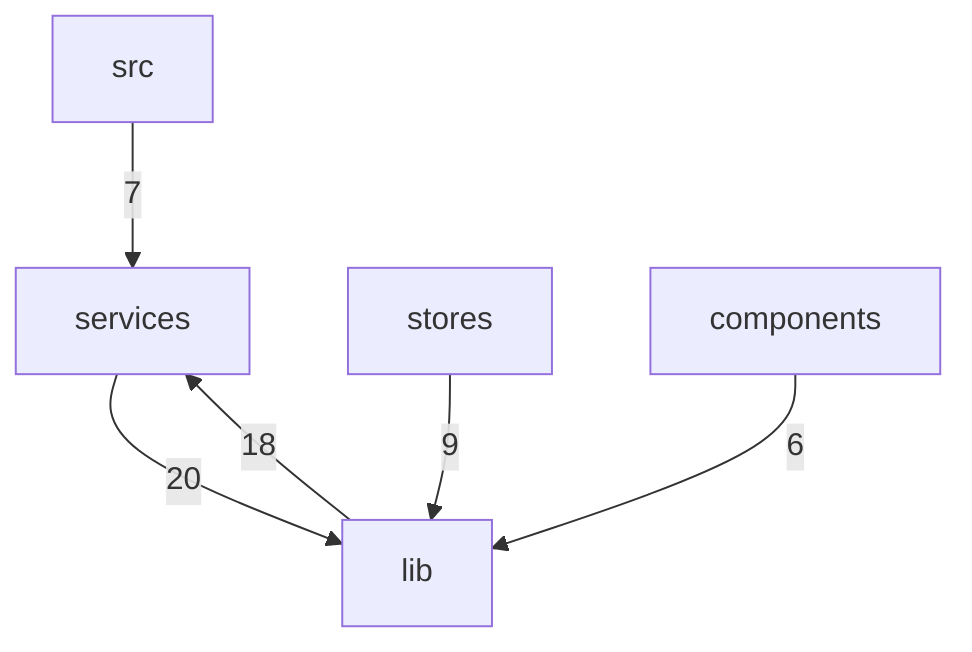

# frontends · middleware · services 跨模块协作

<details>
<summary>Relevant source files</summary>

- src/lib/frontends/xterm/renderer.ts
- src/lib/frontends/xterm/resize.ts
- src/lib/frontends/xterm/support.ts
- src/lib/middleware/inputProcessing.ts
- src/lib/middleware/middleware.ts
- src/lib/middleware/oscProcessing.ts
- src/lib/sessions/localSession.ts
- src/lib/sessions/sshSession.ts
- src/lib/suggestions/promptTracker.ts
- src/services/hotkeys.ts
- src/services/pathCompletion.ts
- src/services/sshConnections.ts
</details>

本页描述一个横跨 `src/lib/frontends/xterm`、`src/lib/middleware`、`src/lib/suggestions`、`src/lib/sessions` 与 `src/services` 五个分层的协作面：终端前端（渲染、尺寸、输入/OSC 处理）如何与中间件链、提示符/建议追踪、会话层以及 SSH / 热键 / 路径补全等服务侧能力对接。之所以单独成页，是因为固定文档通常按目录切分，而本主题的关键契约（例如「buffer 读取接口由 xterm 前端实现、被提示符追踪器消费」）恰好落在目录边界之间——`src/lib/suggestions/promptTracker.ts:152` 与 `src/lib/frontends/xterm/renderer.ts:37` 分属不同模块却共享同一根数据通道，边界统计中 `services → lib` 20 次与 `lib → services` 18 次的双向高频调用也表明这一协作面是仓库中耦合最密集的区域之一。

---

## 职责与范围

主题收录 12 个文件，按分层归属与分工如下（锚点为本次主题数据中实际出现的符号位置；标「—」者本次数据未提供符号级锚点）：

| 文件 | 分层归属 | 数据中可引用的锚点 | 在主题中的可见分工 |
| --- | --- | --- | --- |
| `src/lib/frontends/xterm/renderer.ts` | lib/frontends | `src/lib/frontends/xterm/renderer.ts:37`、`:104`、`:116` | 按配置挂载初始渲染器（WebGL 优先、Canvas 兜底）并记录字体指纹；内部含 WebGL 挂载与恢复路径 |
| `src/lib/frontends/xterm/resize.ts` | lib/frontends | `src/lib/frontends/xterm/resize.ts:52` | 尺寸相关挂起资源的清理（定时器 / 帧请求） |
| `src/lib/frontends/xterm/support.ts` | lib/frontends | — | 待确认（见末尾） |
| `src/lib/middleware/middleware.ts` | lib/middleware | `src/lib/middleware/middleware.ts:10`、`:25` | 会话中间件 `SessionMiddleware` 的组合与关闭链 |
| `src/lib/middleware/oscProcessing.ts` | lib/middleware | — | 待确认（见末尾） |
| `src/lib/middleware/inputProcessing.ts` | lib/middleware | — | 待确认（见末尾） |
| `src/lib/suggestions/promptTracker.ts` | lib/suggestions | `src/lib/suggestions/promptTracker.ts:152`、`:265`、`:66`、`:82` | 缓冲区读取、静默检测与命令采集 |
| `src/lib/sessions/sshSession.ts` | lib/sessions | — | 待确认（见末尾） |
| `src/lib/sessions/localSession.ts` | lib/sessions | — | 待确认（见末尾） |
| `src/services/sshConnections.ts` | services | `src/services/sshConnections.ts:33`、`:48`、`:137`、`:152` | headless 连接建立/断开、镜像刷新、键盘挂起应答 |
| `src/services/hotkeys.ts` | services | `src/services/hotkeys.ts:36` | 热键启用计数与钳制 |
| `src/services/pathCompletion.ts` | services | `src/services/pathCompletion.ts:96` | 懒开 SFTP 会话的关闭 |

从分工看，本主题可粗分为三个协作带（**推断**：基于上表的目录归属与符号 docstring）：

- **终端前端带**：`renderer.ts` + `resize.ts`（+ `support.ts`），负责渲染挂载与资源回收；
- **中间件带**：`middleware.ts` + `oscProcessing.ts` + `inputProcessing.ts`，负责会话中间件的组装与字节流处理；
- **服务带**：`sshConnections.ts` + `hotkeys.ts` + `pathCompletion.ts`，对外提供连接、热键与补全能力；
- **横切带**：`promptTracker.ts`（建议/提示符）与 `lib/sessions/*`，作为前两者之间的数据中介。

---

## 关键符号

### `attach`（`src/lib/frontends/xterm/renderer.ts:37`）

```ts
attach(enableWebGL: boolean)
```

按前端配置挂载初始渲染器，引擎选择策略是 **WebGL 优先、Canvas 兜底**，并在挂载时记录字体指纹（`src/lib/frontends/xterm/renderer.ts:37`）。数据中该方法的唯一出边是 `attach → attachWebGL`，位置在 `src/lib/frontends/xterm/renderer.ts:116`，说明 `attach` 是渲染器挂载的对外入口，真正的 WebGL 装配被下沉到 `attachWebGL`。

在主题中的角色：它是「前端带」的启动点——`attach` 之前，同一文件中的恢复路径（`attachWebGL → recover`，`src/lib/frontends/xterm/renderer.ts:104`）负责应对 WebGL 上下文丢失后的重建，二者共同构成渲染层的挂载 + 弹性恢复闭环（**推断**：`recover` 由 `attachWebGL` 调用，符合上下文丢失回调的常见挂载形态）。

### `connectHeadless`（`src/services/sshConnections.ts:48`）

```ts
connectHeadless(profileId: string): Promise<string>
```

为指定档案建立 headless 连接（**无 PTY**），认证/指纹复用常规流程；`hostkey` 事件会挂起并等待全局对话框应答，`exit` 事件同步注册表死亡登记；返回 `sshId`，档案不存在或连接失败则 reject（`src/services/sshConnections.ts:48`）。复杂度为 8，是主题内复杂度最高的符号，符合其承担多路事件编排的定位。

在主题中的角色：它是服务侧向「会话/前端」暴露的连接原语。数据中的出边有三条：`connectHeadless → refreshMirror`（`src/services/sshConnections.ts:152`）、`connectHeadless → pendingKbdResolver`（`src/services/sshConnections.ts:33`），以及一条与自身同名的边（`src/services/sshConnections.ts:48`）。后两条边说明该函数把「键盘应答挂起」与「镜像刷新」作为连接建立流程的内联步骤，而不是留给调用方串联。

### `constructor`（`src/lib/suggestions/promptTracker.ts:152`）

```ts
constructor(
    private host: PromptTrackerHost,
    private onSilence?: () => void,
    options?: { silenceMs?: number, maxPromptJump?: number },
)
```

构造参数即本主题最重要的**跨模块契约**：`host` 是 buffer 读取接口，docstring 明确「由 xterm 前端实现」；`onSilence` 是输出静默回调，作为建议评估的触发点；`options` 暴露 `silenceMs`（静默窗口）与 `maxPromptJump`（学习跳变上限）（`src/lib/suggestions/promptTracker.ts:152`）。

在主题中的角色：该构造函数把 `lib/frontends/xterm` 与 `lib/suggestions` 通过一个接口（`PromptTrackerHost`）解耦——前端只负责提供缓冲区读取，追踪器只负责推断提示符与静默时机。这是 `lib` 内部少见的显式依赖倒置点，也是理解本主题「为什么要把 frontends 与 suggestions 放在同一协作面」的关键。

### `collectCommand`（`src/lib/suggestions/promptTracker.ts:265`）

```ts
collectCommand()
```

在回车时刻采集命令：取光标行，并向上合并以 `\` 结尾的续行，剥掉提示符后单行化（`src/lib/suggestions/promptTracker.ts:265`）。复杂度 4，出边两条：`collectCommand → stripPrompt`（`src/lib/suggestions/promptTracker.ts:66`）与 `collectCommand → mergeContinuationLines`（`src/lib/suggestions/promptTracker.ts:82`），正好对应 docstring 中「剥提示符」与「合并续行」两个阶段，且顺序为先去提示符判断、再合并（**推断**：由出边书写顺序与 docstring 的「光标行 + 向上合并……剥提示符后单行化」共同提示）。

在主题中的角色：它是「前端字节流 → 结构化命令字符串」的转换出口，其产物即为建议系统的输入侧数据。

### `close`（`src/services/pathCompletion.ts:96`）

```ts
close(): Promise<void>
```

关闭懒开的 SFTP 会话：窗格销毁时调用，**先等在途开启完成再关闭**；对已关闭或从未开启的情况静默返回（`src/services/pathCompletion.ts:96`）。复杂度 1，说明等待/幂等语义被封装在下层而非此处展开。

在主题中的角色：它是「服务带」对前端生命周期的响应点——前端销毁窗格 → 触发会话级清理（**推断**：由 docstring 中「窗格销毁时调用」这一触发条件推得）。其「先等在途开启完成再关」的语义，是本主题中显式存在等待/释放顺序约束的少数位置之一。

### `dispose`（`src/lib/frontends/xterm/resize.ts:52`）

```ts
dispose()
```

清空挂起的定时器与帧请求，docstring 注明在 `detach` 时调用（`src/lib/frontends/xterm/resize.ts:52`）。复杂度 2，对应两个清理动作（定时器 + 帧请求）。

在主题中的角色：与 `pathCompletion.close` 构成同构的生命周期收尾模式——前端拆除时既要释放渲染侧挂起资源（`resize.ts:52`），也要释放服务侧懒开会话（`pathCompletion.ts:96`）。二者没有直接调用边，属于**推断**出的对称约定。

### `enable`（`src/services/hotkeys.ts:36`）

```ts
enable()
```

计数恢复，并**向下钳制到 0**：docstring 说明目的是防止不对称的 `enable` 调用把计数打成负数、导致热键被永久禁用（`src/services/hotkeys.ts:36`）。复杂度 0，是纯状态更新。

在主题中的角色：它是服务侧对「多层嵌套启用」这一协作模式的防御性实现。虽无调用边入数据，但 docstring 中的「不对称的 enable 调用」暗示存在多处启用/禁用配对点（**推断**）。

### 边表中出现但未列入符号清单的协作者

| 符号 | 锚点 | 在边中的角色 |
| --- | --- | --- |
| `attachWebGL` | `src/lib/frontends/xterm/renderer.ts:116` | 被 `attach` 调用；又调用 `recover`（`:104`） |
| `recover` | `src/lib/frontends/xterm/renderer.ts:104` | 被 `attachWebGL` 调用 |
| `refreshMirror` | `src/services/sshConnections.ts:152` | 被 `acquireConnection` 与 `connectHeadless` 共同调用 |
| `pendingKbdResolver` | `src/services/sshConnections.ts:33` | 被 `connectHeadless` 调用，对应「hostkey 挂起等待应答」 |
| `SessionMiddleware` | `src/lib/middleware/middleware.ts:10` | 被 `constructor` 构造，是中间件带的装配点 |
| `stripPrompt` / `mergeContinuationLines` | `src/lib/suggestions/promptTracker.ts:66` / `:82` | 被 `collectCommand` 调用 |
| `acquireConnection` | `src/services/sshConnections.ts:152` | 调用 `refreshMirror` |
| `disconnectHeadless` | `src/services/sshConnections.ts:137` | 与自身同名的调用边 |

---

## 协作方式

### 数据中的调用边（全部为文件内调用）

本次主题提供的 11 条边（其中 `close → close @ src/lib/middleware/middleware.ts:25` 重复出现 2 次，去重后为 10 条）**全部落在同一个文件内**，即数据中没有出现跨文件调用边。这一点本身是本协作面的重要事实：跨文件耦合只能通过边界统计与 docstring 契约推断，而非直接调用边。

| 子系统 | 调用方 | 被调用方 | 位置 |
| --- | --- | --- | --- |
| 渲染挂载 | `attach` | `attachWebGL` | `src/lib/frontends/xterm/renderer.ts:116` |
| 渲染恢复 | `attachWebGL` | `recover` | `src/lib/frontends/xterm/renderer.ts:104` |
| 命令采集 | `collectCommand` | `stripPrompt` | `src/lib/suggestions/promptTracker.ts:66` |
| 命令采集 | `collectCommand` | `mergeContinuationLines` | `src/lib/suggestions/promptTracker.ts:82` |
| SSH 连接 | `connectHeadless` | `refreshMirror` | `src/services/sshConnections.ts:152` |
| SSH 连接 | `connectHeadless` | `pendingKbdResolver` | `src/services/sshConnections.ts:33` |
| SSH 连接 | `acquireConnection` | `refreshMirror` | `src/services/sshConnections.ts:152` |
| SSH 断开 | `disconnectHeadless` | `disconnectHeadless` | `src/services/sshConnections.ts:137` |
| SSH 连接 | `connectHeadless` | `connectHeadless` | `src/services/sshConnections.ts:48` |
| 中间件装配 | `constructor` | `SessionMiddleware` | `src/lib/middleware/middleware.ts:10` |
| 中间件关闭 | `close` | `close` | `src/lib/middleware/middleware.ts:25` |

三条自环式边（`connectHeadless → connectHeadless` @ `:48`、`disconnectHeadless → disconnectHeadless` @ `:137`、`close → close` @ `middleware.ts:25`）在数据中表现为调用方与被调用方同名。数据未提供区分信息，无法判断是递归调用、同名不同作用域符号还是采集口径导致；**此处不作推断**。

### 跨文件协作的可见证据

由于调用边不跨文件，跨文件配合只能从边界统计与符号契约读取：

| 协作关系 | 证据 | 说明 |
| --- | --- | --- |
| `lib/frontends/xterm` → `lib/suggestions` | `src/lib/suggestions/promptTracker.ts:152` docstring「host buffer 读取接口（由 xterm 前端实现）」 | 接口实现方向为「前端实现、追踪器消费」，是本主题唯一的显式跨模块契约 |
| `services` ↔ `lib` | boundaries：`services → lib` 20 次、`lib → services` 18 次 | 双向高频，且几乎对称 |
| `stores` → `lib` | boundaries：9 次 | 状态层依赖 `lib` |
| `src` → `services` | boundaries：7 次 | 应用入口层依赖服务层 |
| `components` → `lib` | boundaries：6 次 | 组件层依赖 `lib` |
| `services` 内部镜像刷新 | `src/services/sshConnections.ts:152`（`acquireConnection` 与 `connectHeadless` 共用） | 两种连接获取路径汇聚到同一刷新函数 |
| `lib/middleware` 与前端输入/Osc | `src/lib/middleware/inputProcessing.ts`、`src/lib/middleware/oscProcessing.ts` 与 `src/lib/frontends/xterm/*` 同属本主题文件集，但无符号/边证据 | 关联方式待确认 |

---

## 跨模块边界

主题的对外耦合点按调用次数排序（数据来源：`boundaries` 字段，模块级聚合，无 `file:line` 粒度）：

| 方向 | 调用次数 | 修改代价评估 |
| --- | --- | --- |
| `services` → `lib` | 20 | 最高。任何 `lib` 侧公共契约调整都会波及服务层的 20 处调用 |
| `lib` → `services` | 18 | 高，且与上一行方向相反，形成双向依赖 |
| `stores` → `lib` | 9 | 中。状态层通过 9 处调用绑定到 `lib` |
| `src` → `services` | 7 | 中。入口层对服务层的依赖相对集中 |
| `components` → `lib` | 6 | 中低。组件层对 `lib` 的调用较少 |



**耦合点解读（推断）**：`services ↔ lib` 的双向依赖是本主题的核心风险面。其具体表现之一可在 `src/lib/suggestions/promptTracker.ts:152` 看到——追踪器依赖前端实现的 `PromptTrackerHost`，而前端（`lib` 内）又需要服务侧提供连接（`services`）才能产生字节流。因此修改 `PromptTrackerHost` 接口的代价不止一处：它同时位于「契约实现点」（`src/lib/frontends/xterm/renderer.ts:37` 所在的 xterm 前端）与「契约消费点」（`src/lib/suggestions/promptTracker.ts:152`）两侧。

**生命周期耦合点**：`src/lib/frontends/xterm/resize.ts:52`（detach 时清定时器/帧请求）与 `src/services/pathCompletion.ts:96`（窗格销毁时关 SFTP）共享同一触发时机（窗格销毁/detach），但无调用边连接，属于时序上必须成对、结构上互相独立的边界。

---

## 设计动机（推断）

以下均为基于符号命名、docstring 与边分布的**推断**，非数据直接陈述：

1. **分层但非严格单向**。目录结构（`lib/frontends` → `lib/middleware` → `lib/suggestions` → `lib/sessions` / `services`）暗示了自上而下的分层意图，但 `services ↔ lib` 的 20/18 双向调用说明实际架构是双向的。推测原因：服务层需要 `lib` 提供的会话/中间件抽象，而 `lib` 层需要服务层提供 IO 原语（SSH、SFTP、热键）。

2. **接口倒置优先于直接依赖**。`promptTracker` 的构造函数接收 `host: PromptTrackerHost` 而非直接导入 xterm 实例（`src/lib/suggestions/promptTracker.ts:152`），说明作者有意让建议系统不感知终端实现，便于在 headless 场景（参见 `src/services/sshConnections.ts:48` 的「无 PTY」连接）中复用同一追踪器。

3. **弹性与幂等是被显式设计的**。三处符号的 docstring 都围绕「异常/边界情形」而非主流程展开：WebGL 失败走 Canvas（`src/lib/frontends/xterm/renderer.ts:37`）、`attachWebGL` 后接 `recover`（`src/lib/frontends/xterm/renderer.ts:104`）、`enable` 向下钳制到 0 防永久禁用（`src/services/hotkeys.ts:36`）、`close` 对已关/未开静默（`src/services/pathCompletion.ts:96`）。推测本项目把「降级可用」当作硬性要求。

4. **资源收尾成对出现**。`dispose`（`src/lib/frontends/xterm/resize.ts:52`）与 `close`（`src/services/pathCompletion.ts:96`）分别覆盖前端资源与服务资源，且都被描述为在拆卸时机调用。推测存在一个统一的 detach/销毁路径负责按顺序触发二者——但该路径未出现在本次数据中（见待确认）。

5. **等待语义集中在少数位置**。数据中仅两处显式涉及等待：`close` 的「先等在途开启完成再关」（`src/services/pathCompletion.ts:96`）与 `connectHeadless` 的 hostkey 挂起（`src/services/sshConnections.ts:48` → `pendingKbdResolver` @ `src/services/sshConnections.ts:33`）。推测等待被刻意收敛到服务层，前端只做无阻塞渲染。

---

## 待确认

| 缺口 | 缺什么证据 | 影响 |
| --- | --- | --- |
| `src/lib/frontends/xterm/support.ts`、`src/lib/middleware/oscProcessing.ts`、`src/lib/middleware/inputProcessing.ts` 的具体职责 | 本次数据未提供这三个文件的任何符号、签名或 docstring | 无法确认「中间件带」与「终端前端带」之间除目录归属外是否存在实际协作 |
| `src/lib/sessions/sshSession.ts` 与 `src/lib/sessions/localSession.ts` 在协作面中的位置 | 本次数据未提供这两个文件的符号或调用边；`services/sshConnections.ts` 的 `connectHeadless`（`src/services/sshConnections.ts:48`）虽返回 `sshId`，但无证据表明其与 `sshSession.ts` 关联 | 会话层与 headless 连接之间是「同一体系」还是「并行两套」无法判定 |
| 统一的 detach / 销毁路径 | `dispose`（`src/lib/frontends/xterm/resize.ts:52`）与 `close`（`src/services/pathCompletion.ts:96`）各自声明调用时机，但数据中无调用方指向二者 | 无法确认资源收尾的触发顺序与责任主体 |
| `services ↔ lib` 双向 20/18 次调用的具体分布 | `boundaries` 仅有模块级聚合计数，无 `file:line` 粒度 | 无法定位这 38 次调用的热点文件，修改影响面只能定性 |
| 三条同名自环边（`src/services/sshConnections.ts:48`、`:137`、`src/lib/middleware/middleware.ts:25`）的性质 | 数据未提供调用方与被调用方的区分信息（递归 / 同名不同作用域 / 采集口径） | 无法判断这些位置是否存在递归或幂等重入语义 |
## Related

- 总入口：[README](../README.md)
