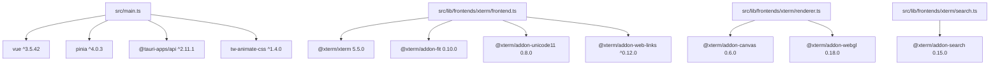

# 技术栈

Relevant source files

- package.json
- src/lib/frontendContext.ts
- src/lib/frontends/frontend.ts
- src/lib/frontends/xterm/frontend.ts
- src/lib/frontends/xterm/lines.ts
- src/lib/frontends/xterm/options.ts
- src/lib/frontends/xterm/renderer.ts
- src/lib/frontends/xterm/resize.ts
- src/lib/frontends/xterm/search.ts
- src/lib/frontends/xterm/support.ts
- src/lib/middleware/middleware.ts
- src/lib/middleware/oscProcessing.ts
- src/lib/motion/index.ts
- src/lib/utils.ts
- src/main.ts

本页基于依赖分析数据（coreDeps / devDeps / testDeps / unusedDeps / rustDeps / runtime / buildTool / packageManager / intent）整理，说明项目的技术选型全貌、依赖职责与协作关系。数据未提供源码行号，因此下文锚点以完整相对路径或数据字段名呈现，不编造行号。

项目采用 **ESM 运行时**，构建工具为 **Vite**，包管理器为 **Bun**。前端以 **Vue 3** 为视图层，**Pinia** 管理状态，**vue-i18n** 提供国际化；终端仿真基于 **xterm** 及其插件；桌面能力通过 **@tauri-apps/api** 与一组 **Tauri 插件**桥接；Rust 侧使用 **tauri**、**portable-pty**、**russh**、**russh-sftp**、**aes-gcm** 等 crate 提供系统级终端、SSH/SFTP、加密与窗口效果能力。

## 技术选型速查

| 维度 | 选型 | 锚点/证据 |
| --- | --- | --- |
| 运行时 | ESM | 数据字段 `runtime=ESM` |
| 构建工具 | Vite | `vite.config.ts` 导入 `vite`；数据字段 `buildTool=vite` |
| 包管理器 | Bun | 数据字段 `packageManager=bun` |
| 核心框架 | Vue 3 (^3.5.42) | `src/App.vue`、`src/main.ts` |
| 桌面框架 | Tauri 2 (@tauri-apps/api ^2.11.1) | `src/main.ts` |
| 终端仿真 | @xterm/xterm 5.5.0 | `src/lib/frontends/xterm/frontend.ts` |
| 状态管理 | Pinia ^4.0.3 | `src/main.ts`、`src/stores/config/store.ts` |
| 样式方案 | Tailwind CSS v4 (^4.3.3) | `src/assets/styles/main.css` |
| 测试框架 | Vitest ^5.0.0 | `src/components/settings/groupDragSort.test.ts` |

> 图仅展示数据中明确存在的 import 边，不表达运行时调用顺序。

## 核心依赖

### 桌面框架与 Tauri 插件

| 依赖 | 版本 | 首个 import 点 |
| --- | --- | --- |
| @tauri-apps/api | ^2.11.1 | `src/main.ts` |
| @tauri-apps/plugin-clipboard-manager | ^2.3.3 | `src/lib/frontendContext.ts` |
| @tauri-apps/plugin-dialog | ^2.7.3 | `src/components/settings/pages/AppearancePage.vue` |
| @tauri-apps/plugin-notification | ^2.4.0 | `src/services/notifications.ts` |
| @tauri-apps/plugin-opener | ^2.5.5 | `src/components/settings/pages/AboutPage.vue` |
| @tauri-apps/plugin-process | ^2.3.1 | `src/services/updater.ts` |
| @tauri-apps/plugin-updater | ^2.11.0 | `src/components/settings/pages/AboutPage.vue` |

这组依赖构成前端与 Tauri 宿主的桥接层。`@tauri-apps/api` 在 `src/main.ts` 中导入，说明应用启动阶段即接入 Tauri 运行时；各插件分别对应剪贴板（`src/lib/frontendContext.ts`）、文件/消息对话框（`src/components/settings/pages/AppearancePage.vue`、`src/components/settings/pages/BackupPage.vue`、`src/components/sftp/SftpBrowserPane.vue`）、系统通知（`src/services/notifications.ts`）、打开外部链接或文件（`src/components/settings/pages/AboutPage.vue`、`src/components/sftp/SftpBrowserPane.vue`、`src/components/sftp/TransferPopover.vue`、`src/lib/frontends/xterm/support.ts`）、进程控制与自动更新（`src/services/updater.ts`、`src/components/settings/pages/AboutPage.vue`）。这些 import 点集中在设置页、SFTP 组件、通知服务与更新服务，表明桌面集成能力按业务模块分散使用。

### 终端渲染（xterm 及插件）

| 依赖 | 版本 | 首个 import 点 |
| --- | --- | --- |
| @xterm/xterm | 5.5.0 | `src/lib/frontends/xterm/frontend.ts` |
| @xterm/addon-canvas | 0.6.0 | `src/lib/frontends/xterm/renderer.ts` |
| @xterm/addon-fit | 0.10.0 | `src/lib/frontends/xterm/frontend.ts` |
| @xterm/addon-search | 0.15.0 | `src/lib/frontends/xterm/search.ts` |
| @xterm/addon-unicode11 | 0.8.0 | `src/lib/frontends/xterm/frontend.ts` |
| @xterm/addon-web-links | ^0.12.0 | `src/lib/frontends/xterm/frontend.ts` |
| @xterm/addon-webgl | 0.18.0 | `src/lib/frontends/xterm/renderer.ts` |

`@xterm/xterm` 是终端仿真的核心，在 `src/lib/frontends/xterm/frontend.ts`、`src/lib/frontends/xterm/lines.ts`、`src/lib/frontends/xterm/options.ts`、`src/lib/frontends/xterm/renderer.ts`、`src/lib/frontends/xterm/resize.ts` 中均有导入，说明终端前端按职责拆分为前端门面、行处理、选项、渲染器与尺寸调整等模块。渲染相关插件分工明确：`@xterm/addon-canvas` 与 `@xterm/addon-webgl` 同在 `src/lib/frontends/xterm/renderer.ts` 导入，支持画布/WebGL 两种渲染路径；`@xterm/addon-fit` 在 `src/lib/frontends/xterm/frontend.ts` 与 `src/lib/frontends/xterm/resize.ts` 导入，用于尺寸自适应；`@xterm/addon-search` 在 `src/lib/frontends/xterm/search.ts` 导入，独立支撑搜索功能；`@xterm/addon-unicode11` 与 `@xterm/addon-web-links` 在 `src/lib/frontends/xterm/frontend.ts` 导入，分别扩展 Unicode 字符宽度处理与终端内链接识别。

### Vue 生态与 UI

| 依赖 | 版本 | 首个 import 点 |
| --- | --- | --- |
| vue | ^3.5.42 | `src/App.vue` |
| vue-i18n | ^11.4.10 | `src/App.vue` |
| pinia | ^4.0.3 | `src/main.ts` |
| reka-ui | ^2.10.4 | `src/components/ui/Label.vue` |
| lucide-vue-next | ^1.0.0 | `src/components/forwarding/ForwardRuleFormDialog.vue` |
| class-variance-authority | ^0.7.1 | `src/components/ui/Button.vue` |
| clsx | ^2.1.1 | `src/lib/utils.ts` |
| tailwind-merge | ^3.6.0 | `src/lib/utils.ts` |
| tw-animate-css | ^1.4.0 | `src/main.ts` |

Vue 3 是视图层基础，在 `src/App.vue` 等大量组件中导入；`vue-i18n` 同样从 `src/App.vue` 开始使用，并在 `src/components/forwarding/ForwardRuleFormDialog.vue`、`src/components/monitor/MonitorSidebar.vue`、`src/components/palette/CommandPalette.vue` 等业务组件中导入，表明国际化覆盖主界面与功能面板。Pinia 在 `src/main.ts` 注册，并在 `src/stores/config/store.ts`、`src/stores/forwarding.ts`、`src/stores/monitor.ts`、`src/stores/tabs.ts` 等 store 中使用，形成集中式状态管理。UI 基础组件采用 `reka-ui` 无头组件（`src/components/ui/Label.vue`、`src/components/ui/Separator.vue`、`src/components/ui/Slider.vue`、`src/components/ui/Switch.vue`），图标使用 `lucide-vue-next`，并借助 `class-variance-authority`（`src/components/ui/Button.vue`）与 `clsx`、`tailwind-merge`（同在 `src/lib/utils.ts`）组合样式类名；`tw-animate-css` 在 `src/main.ts` 导入，提供动画相关 CSS 类。

### 工具库

| 依赖 | 版本 | 首个 import 点 |
| --- | --- | --- |
| nanoid | ^6.0.1 | `src/components/settings/pages/KeysPage.vue` |
| deep-equal | ^2.2.3 | `src/lib/frontends/xterm/frontend.ts` |
| gsap | ^3.15.0 | `src/lib/motion/index.ts` |
| rxjs | ^7.8.2 | `src/lib/frontends/frontend.ts` |
| yaml | ^2.9.1 | `src/stores/config/store.ts` |

工具库覆盖 ID 生成、对象比较、动画、响应式流与 YAML 解析。`nanoid` 在多个设置页中使用（`src/components/settings/pages/KeysPage.vue`、`src/components/settings/pages/LocalProfilesPage.vue`、`src/components/settings/pages/QuickCommandsPage.vue`、`src/components/settings/pages/SshPage.vue`、`src/components/settings/pages/TabGroupsPage.vue`），用于生成唯一标识；`deep-equal` 在 `src/lib/frontends/xterm/frontend.ts` 中导入，用于终端状态比较；`rxjs` 在 `src/lib/frontends/frontend.ts`、`src/lib/frontends/xterm/frontend.ts`、`src/lib/frontends/xterm/support.ts`、`src/lib/middleware/middleware.ts`、`src/lib/middleware/oscProcessing.ts` 中导入，支撑前端与中间件之间的响应式数据流；`yaml` 在 `src/stores/config/store.ts` 中导入，用于配置解析。

`gsap` 在 `src/lib/motion/index.ts` 中导入，作为动画能力的统一入口。其引入动机有提交直接佐证：commit `5039d5de`（2026-09-27）主题为「feat: 引入GSAP优化部分动画过渡」（数据字段 `intent.target=gsap`），即该依赖用于替换/增强动画过渡效果，属于有意引入而非遗留依赖。

## 开发依赖

| 依赖 | 版本 | 首个 import 点 |
| --- | --- | --- |
| vite | ^8.3.0 | `vite.config.ts` |
| @vitejs/plugin-vue | ^6.0.8 | `vite.config.ts` |
| @tailwindcss/vite | ^4.3.3 | `vite.config.ts` |
| tailwindcss | ^4.3.3 | `src/assets/styles/main.css` |
| oxlint | ^1.82.0 | 无 import 点（`usageKind=script`） |
| vue-tsc | ^3.3.11 | 无 import 点（`usageKind=script`） |

这组依赖构成构建与质量保障链：`vite.config.ts` 同时导入 `vite`、`@vitejs/plugin-vue` 与 `@tailwindcss/vite`，说明 Vue SFC 编译与 Tailwind v4 的 Vite 插件在同一份配置中装配；`tailwindcss` 本体则在 `src/assets/styles/main.css` 中通过导入进入样式管线（Tailwind v4 以 CSS 为入口）。`oxlint` 与 `vue-tsc` 的 `usageKind=script`、`importFiles` 为空，表明它们不参与运行时模块图，而是通过包管理器脚本调用，分别承担静态检查与类型检查。

Tailwind 采用 v4 的 `@tailwindcss/vite` 插件 + CSS 入口组合，而非常见的 PostCSS 配置方式；这是基于「插件与 `src/assets/styles/main.css` 双端 import」的结构特征作出的**推断**（数据未提供 PostCSS 配置文件证据）。

## 测试专用依赖

| 依赖 | 版本 | 首个测试 import 点 |
| --- | --- | --- |
| vitest | ^5.0.0 | `src/components/settings/groupDragSort.test.ts`、`src/components/split/splitTree.test.ts`、`src/components/terminal/searchFocus.test.ts`、`src/components/titlebar/tabGroupLayout.test.ts`、`src/components/titlebar/tabStripLayout.test.ts` |

`vitest` 是唯一的测试专用依赖，且 `usageKind=test`。其 import 点全部集中在 `*.test.ts` 文件，涉及设置页拖拽排序（`src/components/settings/groupDragSort.test.ts`）、分屏树（`src/components/split/splitTree.test.ts`）、终端搜索焦点（`src/components/terminal/searchFocus.test.ts`）与标题栏标签布局（`src/components/titlebar/tabGroupLayout.test.ts`、`src/components/titlebar/tabStripLayout.test.ts`）。**它不属于生产运行时技术栈**，不会被打包进应用产物；测试覆盖的候选对象集中在布局计算与交互排序等纯逻辑模块。

## Rust 依赖栈

数据字段 `rustDeps` 共 21 项，全部 `used=true`，无 `used=false` 项。锚点为依赖表中的 crate 名与版本（数据未提供 Rust 侧文件路径前缀与行号，故本节不标注 file:line）。

| crate | 版本 | 使用 | 职责（基于 crate 名称与版本元数据） |
| --- | --- | --- | --- |
| russh | 0.63.3 | used=true | SSH 协议实现 |
| russh-sftp | 3.0.0 | used=true | SFTP 子系统，配合 russh 提供文件传输 |
| portable-pty | 0.9 | used=true | 跨平台 PTY，支撑本地终端会话 |
| tauri-plugin-opener | 2 | used=true | 打开外部链接/文件的宿主插件 |
| tauri-plugin-clipboard-manager | 2 | used=true | 系统剪贴板访问 |
| tauri-plugin-dialog | 2.7.3 | used=true | 原生文件/消息对话框 |
| tauri-plugin-notification | 2 | used=true | 系统通知 |
| tauri-plugin-updater | 2 | used=true | 应用自更新 |
| tauri-plugin-process | 2 | used=true | 进程重启/退出控制 |
| serde_json | 1 | used=true | JSON 序列化 |
| window-vibrancy | 0.6 | used=true | 窗口亚克力/毛玻璃效果 |
| font-loader | 0.11.0 | used=true | 系统字体加载 |
| aes-gcm | 0.11.1 | used=true | AES-GCM 对称加密 |
| argon2 | 0.5 | used=true | Argon2 密码/密钥派生 |
| keyring | 4.2.0 | used=true | 系统密钥链存取 |
| getrandom | 0.3 | used=true | 随机数源 |
| base64 | 0.22 | used=true | Base64 编解码 |
| sha2 | 0.10 | used=true | SHA-2 摘要 |
| hmac | 0.12 | used=true | HMAC 消息认证 |
| roxmltree | 0.20 | used=true | XML 只读解析 |
| fast-socks5 | 1.0 | used=true | SOCKS5 代理 |

从版本组合看，Rust 侧可分为四类能力：

| 能力域 | crates |
| --- | --- |
| 终端与连接 | portable-pty、russh、russh-sftp、fast-socks5 |
| 宿主集成（与前端插件同源） | tauri-plugin-opener、tauri-plugin-clipboard-manager、tauri-plugin-dialog、tauri-plugin-notification、tauri-plugin-updater、tauri-plugin-process |
| 密码学 | aes-gcm、argon2、keyring、getrandom、base64、sha2、hmac |
| 序列化与界面效果 | serde_json、roxmltree、window-vibrancy、font-loader |

上表中 6 个 `tauri-plugin-*` crate 与「核心依赖」中的前端 `@tauri-apps/plugin-*` 包一一配对（opener、clipboard-manager、dialog、notification、updater、process），说明每个桌面能力均需前端包与 Rust 插件同时存在；其中 `tauri-plugin-dialog` 的版本 `2.7.3` 与前端 `@tauri-apps/plugin-dialog ^2.7.3` 完全一致。密码学 crates 的组合（AES-GCM 加密 + Argon2 派生 + SHA-2/HMAC 校验 + keyring 存储 + getrandom 熵源）呈现典型的"加密数据 + 密钥托管"结构。

## 声明未用依赖

下表由源码 import 扫描推导（覆盖 .ts/.js/.vue/.css），存在动态加载、字符串引用等扫描盲区，清理前请人工复核。

| 依赖 | 版本 |
| --- | --- |
| @tauri-apps/cli | ^2.11.4 |
| @types/deep-equal | ^1.0.4 |
| @types/node | ^22.20.2 |
| typescript | ~5.9.0 |

这四项均无 import 扫描命中，但从工具链职责看有明确解释可能：`@tauri-apps/cli` 通常以命令行方式调用（如 `tauri dev` / `tauri build`）、`typescript` 由 `vue-tsc`（`usageKind=script`）间接消费、`@types/*` 为类型声明包仅供编译器解析，均不一定出现在源码 import 语句中。**本表不得作为"无用即可删除"的依据**，删除前需确认脚本与类型声明解析链路是否受影响。

## 版本对应与升级影响面

| 跨端配对 | 前端包版本 | Rust crate 版本 | 说明 |
| --- | --- | --- | --- |
| dialog | ^2.7.3 | 2.7.3 | 两侧版本号一致 |
| clipboard-manager | ^2.3.3 | 2 | Rust 侧未标注精确补丁号 |
| notification | ^2.4.0 | 2 | Rust 侧未标注精确补丁号 |
| opener | ^2.5.5 | 2 | Rust 侧未标注精确补丁号 |
| process | ^2.3.1 | 2 | Rust 侧未标注精确补丁号 |
| updater | ^2.11.0 | 2 | Rust 侧未标注精确补丁号 |

升级影响面（基于上述 import 分布）：

| 变更对象 | 受影响文件（import 点） |
| --- | --- |
| @tauri-apps/api | `src/main.ts`、`src/components/settings/pages/AboutPage.vue`、`src/components/settings/pages/AppearancePage.vue`、`src/components/settings/pages/KeysPage.vue`、`src/components/sftp/SftpTabContent.vue` |
| @xterm/xterm | `src/lib/frontends/xterm/frontend.ts`、`src/lib/frontends/xterm/lines.ts`、`src/lib/frontends/xterm/options.ts`、`src/lib/frontends/xterm/renderer.ts`、`src/lib/frontends/xterm/resize.ts` |
| rxjs | `src/lib/frontends/frontend.ts`、`src/lib/frontends/xterm/frontend.ts`、`src/lib/frontends/xterm/support.ts`、`src/lib/middleware/middleware.ts`、`src/lib/middleware/oscProcessing.ts` |
| vue / vue-i18n | `src/App.vue`、`src/components/forwarding/ForwardRuleFormDialog.vue`、`src/components/forwarding/ForwardingTabContent.vue`、`src/components/monitor/MonitorSidebar.vue`、`src/components/palette/CommandPalette.vue` |
| yaml | `src/stores/config/store.ts` |

注意 `@xterm/xterm` 与 `rxjs` 的 import 点横跨前端门面、渲染器、中间件三层，`vue`/`vue-i18n` 覆盖应用根与多个业务面板——这三类是升级回归成本最高的对象。`gsap` 与 `yaml` 的 import 点各只有一个（`src/lib/motion/index.ts`、`src/stores/config/store.ts`），变更影响面相对收敛。

## 待确认

| 项 | 缺失证据 |
| --- | --- |
| Rust 侧 crates 的具体引用位置与行号 | 数据仅提供 crate 名与版本，未提供 Rust 文件路径与 `use` 语句位置，无法给出 file:line 级锚点 |
| `used=true` 的判定口径 | 数据未说明 Rust crate 的 `used` 字段由何规则推导（Cargo 依赖声明扫描还是源码引用扫描），因此本节职责描述仅基于 crate 名称 |
| `@tailwindcss/vite` 与 `tailwindcss` 装配方式 | `vite.config.ts` 与 `src/assets/styles/main.css` 仅有 import 点，未提供配置内容，无法确认是否存在 PostCSS 或主题配置 |
| `unusedDeps` 中 `@tauri-apps/cli`、`vue-tsc`、`typescript` 的实际调用脚本 | 数据未提供 `package.json` scripts 内容，无法确认这些包的调用入口 |
## Related

- 同目录：[overview.md](overview.md) · [environment.md](environment.md)
- 互补职责：[overview.md](../01-overview/overview.md)
- 共享 10 个源文件、共享 73 个符号：[troubleshooting.md](../05-guides/troubleshooting.md)
- 共享 4 个源文件、共享 63 个符号：[onboarding.md](../05-guides/onboarding.md)
- 共享 23 个符号：[components.md](../03-interface/components.md)
- 总入口：[README](../README.md)
