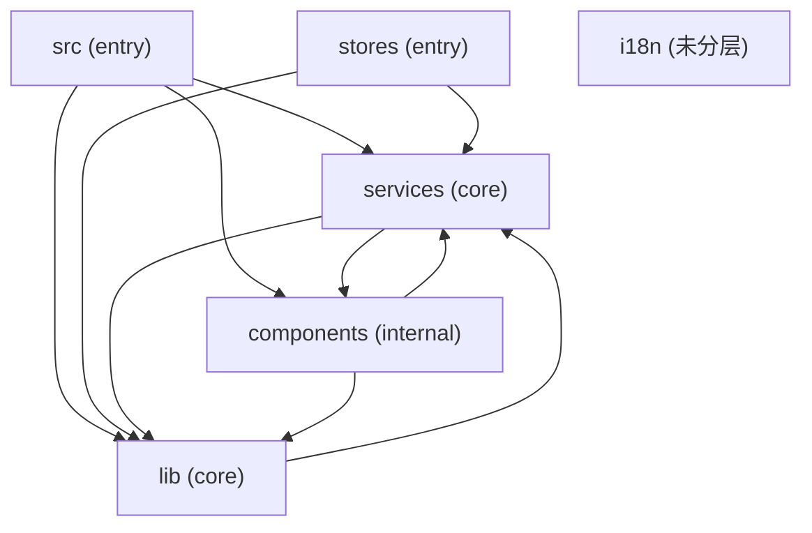
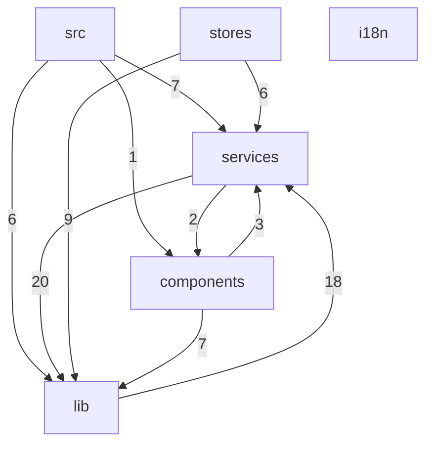

Relevant source files

- src-tauri/src/forward/mod.rs
- src-tauri/src/fsutil.rs
- src-tauri/src/history.rs
- src-tauri/src/secrets/mod.rs
- src-tauri/src/sftp.rs
- src-tauri/src/transfers/mod.rs
- src/components/settings/groupDragSort.ts
- src/components/settings/useGroupNameDialog.ts
- src/components/sftp/usePaneNavigation.ts
- src/components/titlebar/tabGroupLayout.ts
- src/components/titlebar/tabStripLayout.ts
- src/components/titlebar/tabSwitcherModel.ts
- src/i18n/en/panels.ts
- src/i18n/en/settings.ts
- src/i18n/index.ts

## 整体架构设计思路与架构图

### 分层结构与判定依据

数据把 6 个模块中的 5 个显式归入三层：**entry**（`src`、`stores`）、**core**（`lib`、`services`）、**internal**（`components`）；`i18n` 未出现在 `layers` 表中，未分层。分层的判定依据是扇入/扇出特征，而非目录约定（`layers` 表）。

| 模块 | 层 | 文件数（modules） | layers 给出的判定理由 |
|---|---|---|---|
| `src` | entry | 57 | has entry points, only outbound calls |
| `stores` | entry | 10 | only outbound calls |
| `lib` | core | 47 | high fan-in (42 in, 18 out) |
| `services` | core | 25 | high fan-in (34 in, 22 out) |
| `components` | internal | 72 | fan-in=3, fan-out=10 |
| `i18n` | —（无记录） | 7 | layers 表中无此模块 |

从模块级调用边（`relations`，type 均为 `calls`）统计，实际扇入/扇出如下：

| 模块 | 出边数 | 入边数 | 出边指向 |
|---|---|---|---|
| `src` | 3 | 0 | services、lib、components |
| `stores` | 2 | 0 | lib、services |
| `components` | 2 | 2 | lib、services（入边来自 src、services） |
| `lib` | 1 | 4 | services（入边来自 src、stores、components、services） |
| `services` | 2 | 4 | lib、components（入边来自 src、stores、components、lib） |
| `i18n` | 0 | 0 | 无 |

需要区分两套口径：上表是模块级边计数，而 `layers` 中标注的 `lib`（42 in / 18 out）、`services`（34 in / 22 out）、`components`（fan-in=3 / fan-out=10）是符号/文件聚合后的计数，两者数值不同但排序一致——`lib` 与 `services` 是扇入最高的两个模块，这构成它们被划为 core 的直接依据。

### 各层职责与层间协作

**entry 层是单向消费者。**`src`（57 文件）被标注为 "has entry points"，且模块级没有任何入边，出边同时指向 `src → services`、`src → lib`、`src → components`（`relations`），说明它承担进程/应用的装配与启动职责，向三个下层模块同时取用能力。`stores`（10 文件）同样只有出边，指向 `stores → lib` 与 `stores → services`，扮演状态持有与数据请求入口的角色；由于它在 `layers` 中被归入 entry 而非 core，其定位更接近"入口状态的来源"而不是被复用的公共设施。entry 层成员之间没有任何互调边。

**core 层是复用的汇聚点，但不是无环底座。**`lib`（47 文件）与 `services`（25 文件）拥有最高扇入（`layers`：42 in / 34 in），是全部其他模块的共同依赖目标。然而数据中存在一对双向边：`lib → services` 与 `services → lib`（`relations`）。这意味着二者不是"底层库 + 上层服务"的经典上下关系，而是一对互相协作的核心模块——`lib` 既被 `services` 依赖，其自身也需要调用 `services` 的能力。`services` 在此之外还向 `components` 发起调用，是唯一同时跨到 internal 层的核心模块。

**internal 层规模最大、方向最杂。**`components` 有 72 个文件，是文件数最多的模块（`modules`），`layers` 记录其 fan-out=10、fan-in=3，属于"高扇出、低扇入"形态。它被 `src` 与 `services` 调用，同时反向调用 `lib` 与 `services`，因此 `services ↔ components` 构成第二组双向边。`components` 承担了从核心层向外展开的大部分实现细节，其规模与扇出也印证了它作为内部实现层的定位。

**整体架构风格：以 core 为中心的辐射状依赖 + 局部双向耦合。**依赖总体呈 entry → core → internal 的流向，`src`、`stores` 两个入口只出不进，`lib`/`services` 聚合了绝大多数入边，符合"入口薄、核心厚"的组织方式。但 `lib ↔ services` 与 `services ↔ components` 两组双向边表明这不是严格的无环分层架构，而是允许同一协作对内部互相调用的模块化架构；任何试图按"层间单向"来推导变更影响面的结论都会在这两组边上失效。

### 模块依赖关系图

> 说明：`i18n` 在 `relations` 中无任何入边或出边，图中以孤立节点呈现；`lib ↔ services` 与 `services ↔ components` 为双向边，图中以两条反向箭头表示。边方向即依赖方向（`relations.source` → `relations.target`）。

完整的模块级调用边清单（锚点格式为 `relations#调用方→被调用方`）：

| 调用方 | 被调用方 | 类型 | 锚点 |
|---|---|---|---|
| `src` | `services` | calls | relations#src→services |
| `src` | `lib` | calls | relations#src→lib |
| `src` | `components` | calls | relations#src→components |
| `stores` | `lib` | calls | relations#stores→lib |
| `stores` | `services` | calls | relations#stores→services |
| `services` | `lib` | calls | relations#services→lib |
| `services` | `components` | calls | relations#services→components |
| `components` | `lib` | calls | relations#components→lib |
| `components` | `services` | calls | relations#components→services |
| `lib` | `services` | calls | relations#lib→services |

### 聚类视角（与模块划分不完全对齐）

`clusters` 给出了 12 个高内聚分组，只带两种标签：`src-tauri`（8 组）与 `src`（4 组）。

| 聚类标签 | 成员数 | 内聚度 | topNodes（前 3） |
|---|---|---|---|
| `src-tauri` | 105 | 0.850 | execute, lock_conn, load_internal |
| `src-tauri` | 65 | 0.686 | new, push_then_pull_round_trip_via_fake_s3, replace_all |
| `src-tauri` | 45 | 0.764 | push, new, run_task |
| `src-tauri` | 43 | 0.682 | new, s3_get, s3_list, fs_browse_dir_inner |
| `src-tauri` | 36 | 0.855 | format_auth_failure, try_password_like, authenticate |
| `src-tauri` | 35 | 0.750 | session, pty_spawn, monitor_start |
| `src-tauri` | 34 | 0.788 | forward_start, ssh_connect, snapshot |
| `src-tauri` | 29 | 0.833 | open, run, append_raw |
| `src` | 42 | 0.979 | constructor, refreshMirror, encodeUTF8 |
| `src` | 36 | 0.977 | onSilence, evaluate, acceptSelected |
| `src` | 35 | 1.000 | load, flush, migrateLocalGroups |
| `src` | 30 | 0.943 | activate, pathSuggestions, displaySequence |

**推断**：`src-tauri` 标签组的 topNodes 为 `lock_conn`、`pty_spawn`、`ssh_connect`、`forward_start`、`s3_get` 等下划线命名及 `*_round_trip_via_fake_s3` 形式的用例名，`src` 标签组为 `refreshMirror`、`handleKeydown`、`pathSuggestions` 等驼峰命名，据此推断前者对应后端（Rust/Tauri 侧）代码簇、后者对应前端代码簇；推断依据仅为命名风格与聚类标签本身，数据未给出平台/语言元信息。此外 `src` 组的 `members=35, cohesion=1.000` 表明存在一组完全内聚的 `load/flush/migrateLocalGroups` 持久化相关逻辑。

**待确认**：
1. 聚类标签 `src-tauri` / `src` 与 `modules` 中的 `src`/`lib`/`services`/`components`/`stores`/`i18n` 无法对应，无法确定模块的物理目录位置，因此本节的锚点只能落到模块名与字段级（如 `modules#lib`、`relations#src→services`），缺少 `file:line` 级锚点。
2. `i18n` 既无 `layers` 记录也无 `relations` 边，其在分层中的归属与依赖方向无法判定。
3. `relations` 只提供 `calls` 一种类型，是否存在事件、配置或数据层面的依赖无法从数据判断。

## 核心模块详解（第1批）

本节覆盖本批全部 6 个模块：`src`、`lib`、`services`、`components`、`stores`、`i18n`。需要先说明本批数据的一个共同特征：**所有模块的 `symbolCount`（待确认） 均为 0、`topSymbols`（待确认） 均为空**，因此下文不提供符号级签名与逐符号用途，事实来源限定为两类——模块级元数据（文件数、语言分布、依赖关系）与文件头自述（intent，kind=`file-header`，带 `file:line` 锚点）。

---

### 1. src（模块 qualified_name: `src`）

**一句话职责**：应用主源码树，以 Rust 为主体的后端实现层，文件头自述覆盖传输、密钥加密、端口转发、SFTP、文件系统命令、命令历史六条后端子系统。

#### 模块元数据

| 项 | 值 |
|---|---|
| 文件数 | 57 |
| 语言分布 | Rust 52 / TypeScript 3 / other 2 |
| symbolCount / topSymbols | 0 / 空 |
| dependsOn | `services`、`lib`、`components` |
| usedBy | 空 |
| fanIn / fanOut | 0 / 0 |

#### 语言职责域

- **Rust（52 个文件）**：后端主体。本模块全部 6 条 intent 自述锚点均落在 `src-tauri/src/` 下，可确证 Rust 侧承载了后端子系统实现。
- **TypeScript（3 个文件）**：数据仅给出文件数量，未给出任何路径与文件头自述 → 职责域**信息不足**。
- **other（2 个文件）**：同样无路径与自述证据 → 职责域**信息不足**。

#### 由文件头自述给出的后端子系统

| 子系统 | 文件头自述要点（原文摘录） | 锚点（证据） |
|---|---|---|
| SFTP 传输任务中心 | 「上传/下载统一注册进 TransferManager，任务快照经 app 级事件 `sftp-transfers-changed` 全量广播（进度按 ≥1MB 步进节流），支持取消（AtomicBool 标志注入传输循环）与目录递归传输（先 walk 统计总量、单任务聚合进度）；终态任务保留最近 MAX_HISTORY 条历史供传输中心回看。模块拆分：plan（传输计划构建：远/本地递归 walk…」 | `src-tauri/src/transfers/mod.rs:1` |
| 敏感数据加密存储 | 「SQLite（secrets.db）+ AES-256-GCM 字段级加密。主密钥随机生成存 macOS 钥匙串（keyring，service `scx-terminal`/user `master-key`），密文格式 = 12 字节随机 nonce 前置 + 密文（含 GCM tag）。存储范围：SSH 密钥链（私钥/口令加密，元数据明文）、SSH 档案密码（按 profileId）、云端同步配置的…」 | `src-tauri/src/secrets/mod.rs:1` |
| SSH 端口转发后端 | 「本地转发（-L，本地 TcpListener → direct-tcpip channel）、远程转发（-R，tcpip_forward 请求 server 监听 → 入站 channel 回连本地目标）、动态转发（-D，fast-socks5 no-auth CONNECT → direct-tcpip channel）。生命周期与 SFTP 一致：转发绑定 ssh_id，SSH 会话断开后由 exit…」 | `src-tauri/src/forward/mod.rs:1` |
| SFTP 文件面板后端 | 「在同一 russh 连接上开第二 channel 跑 `sftp` subsystem（russh-sftp 3.0），提供目录浏览/文件管理命令；上传/下载经 transfers 模块的 TransferManager 执行（事件广播进度、支持取消与目录递归）。生命周期：SSH 会话断开后所有 SFTP 命令自然报错，前端据此关面板。」 | `src-tauri/src/sftp.rs:1` |
| 文件系统工具命令 | 「路径补全的列目录与 shell history 文件读取，以及 SFTP 本地栏的目录浏览（含大小/修改时间、隐藏文件开关、错误显式传播）。补全命令做 `~` → $HOME 展开（前端不知道 HOME，统一传 ~ 相对路径）；列目录错误（权限/不存在）返回空数组静默降级，读取文件不存在返回 None，浏览命令错误显式返回 Err（UI 呈现 banner）。」 | `src-tauri/src/fsutil.rs:1` |
| 命令历史持久化 | 「SQLite（history.db，独立于 config.db——历史是高频写数据不属于配置语义）。沿用 config.rs 的「Mutex 单连接 + WAL + PRAGMA user_version 迁移」模式。同 source 同命令去重存储（更新 run_at/hit_count）；导入经 meta 表 `imported:{source}` 标记幂等，清空时顺带清除标记以便重新导入。」 | `src-tauri/src/history.rs:1` |

#### 职责与设计意图

从上述自述可以直接读出四条被显式声明的设计决策，均非推断：其一，**传输进度采用「全量广播 + 节流」而非增量 diff**——任务快照经 app 级事件 `sftp-transfers-changed` 广播，进度按 ≥1MB 步进节流（`src-tauri/src/transfers/mod.rs:1`）；其二，**取消语义用 `AtomicBool` 标志注入传输循环**，而非终止线程（同上锚点）；其三，**端口转发与 SFTP 共用「绑定 ssh_id、随 SSH 会话断开而失效」的生命周期约定**——forward 自述「生命周期与 SFTP 一致：转发绑定 ssh_id，SSH 会话断开后由 exit…」（`src-tauri/src/forward/mod.rs:1`），sftp 自述「SSH 会话断开后所有 SFTP 命令自然报错，前端据此关面板」（`src-tauri/src/sftp.rs:1`）；其四，**错误处理策略按命令语义分级**——`fsutil.rs` 中补全列目录错误静默降级为空数组、读取文件不存在返回 `None`，而 SFTP 本地栏浏览命令错误显式返回 `Err` 供 UI 呈现 banner（`src-tauri/src/fsutil.rs:1`）。

持久化层面另有两处被显式记录的取舍：**密钥材料不出本机**——主密钥随机生成后存 macOS 钥匙串（keyring，service `scx-terminal` / user `master-key`），密文格式为 12 字节随机 nonce 前置 + 含 GCM tag 的密文（`src-tauri/src/secrets/mod.rs:1`）；**历史库与配置库物理分离**——`history.db` 独立于 `config.db`，自述给出的理由是「历史是高频写数据不属于配置语义」，并沿用 config.rs 的「Mutex 单连接 + WAL + PRAGMA user_version 迁移」模式，同 source 同命令去重存储、导入经 meta 表 `imported:{source}` 标记幂等（`src-tauri/src/history.rs:1`）。

模块级依赖上，`src` 声明依赖 `services`、`lib`、`components`，且 `usedBy` 为空；而其全部文件头证据均指向 `src-tauri/src/` 下的 Rust 后端实现。该跨层依赖的具体形式在数据中无锚点可证（见文末「待确认」）。

---

### 2. lib（模块 qualified_name: `lib`）

**一句话职责**：前端纯逻辑层——把可单测的业务规则（输入行模型、监控编排、建议聚合、配色解析、起始页视图、转发规则）从 IO 与 UI 中剥离。

| 项 | 值 |
|---|---|
| 文件数 | 47 |
| 语言分布 | TypeScript 46 / other 1 |
| symbolCount / topSymbols | 0 / 空 |
| dependsOn | `services` |
| usedBy | `services`、`stores`、`components`、`src` |
| fanIn / fanOut | 0 / 0 |

- **TypeScript（46 个文件）**：纯逻辑主体，下述 6 条自述锚点文件均为 TS。
- **other（1 个文件）**：无路径与自述证据 → 职责域**信息不足**。

#### 由文件头自述给出的逻辑单元

| 文件 | 文件头自述要点（原文摘录） | 锚点（证据） |
|---|---|---|
| `src/lib/suggestions/promptTracker.ts` | 「输入行模型：从 xterm buffer 现读现算当前逻辑行（soft-wrap 链拼接）、提示符剥离、续行合并、词定位；PromptTracker 在此之上做提示符长度自适应学习与回车命令采集。对 shell 端编辑（Tab 补全/↑ 调历史/Ctrl+R）免疫——永不维护影子副本。」 | `src/lib/suggestions/promptTracker.ts:1` |
| `src/lib/monitorOrchestrator.ts` | 「SSH 监控编排器（纯逻辑，IO 全注入）：管理档案级的卡片/详情两级采样绑定，经注册表消费计数管理连接生命周期；fatal 后按退避序列重连（release → acquire → start），成功即重置退避。」 | `src/lib/monitorOrchestrator.ts:1` |
| `src/lib/suggestions/controller.ts` | 「建议控制器：聚合 PromptTracker（输入行模型 + 提示符学习 + 命令采集）、建议引擎与菜单 UI 状态。菜单键盘语义（↑↓/Tab/Enter/→/Esc）、接受写入（公共前缀保留 + 退格差异）、Esc 抑制自动弹出、历史记录写入。」 | `src/lib/suggestions/controller.ts:1` |
| `src/lib/colorSchemes.ts` | 「内置终端配色方案库：严格复刻 Tabby 候选主题列表——Tabby Default / Tabby Default Light 两套核心默认配色（移植自 tabby-terminal colorSchemes.ts，保留选区增强值）+ Tabby 官方社区配色全集（communityColorSchemes.ts，189 套）。并提供按用户偏好解析配色的工具函数，自定义配色经可选参数参与解析。」 | `src/lib/colorSchemes.ts:1` |
| `src/lib/startPage.ts` | 「连接中心（起始页）纯逻辑：SSH 档案分组视图构建、本地终端分组过滤、全局搜索过滤、最近连接排序与相对时间分桶。UI 无关，便于单测。」 | `src/lib/startPage.ts:1` |
| `src/lib/portForwarding.ts` | 「端口转发纯逻辑层：转发类型与数据模型（档案持久化规则 + 运行态）、规则归一化校验（sanitize，config 加载时清洗）、展示文案、autoStart 规则筛选与规则 → 启动参数映射。IPC 封装见 services/forward.ts。」 | `src/lib/portForwarding.ts:1` |

`lib` 的设计意图在自述中被反复明示为**「纯逻辑、IO 全注入、UI 无关、便于单测」**：`monitorOrchestrator.ts` 自述「纯逻辑，IO 全注入」（`src/lib/monitorOrchestrator.ts:1`），`startPage.ts` 自述「UI 无关，便于单测」（`src/lib/startPage.ts:1`）。这同时解释了它为何 `dependsOn: services`——`portForwarding.ts` 明确交代分层边界：「IPC 封装见 services/forward.ts」，即纯规则留在 lib、IPC 落到 services（`src/lib/portForwarding.ts:1`）。

另有两处由自述记录的**抗干扰设计**：`promptTracker.ts` 声称「对 shell 端编辑（Tab 补全/↑ 调历史/Ctrl+R）免疫——永不维护影子副本」，选择从 xterm buffer 现读现算而非缓存一份输入行状态（`src/lib/suggestions/promptTracker.ts:1`）；`monitorOrchestrator.ts` 的重连采用显式退避序列「release → acquire → start」，成功后重置退避（`src/lib/monitorOrchestrator.ts:1`）。`colorSchemes.ts` 则以「严格复刻 Tabby 候选主题列表」并逐项注明移植来源（`tabby-terminal colorSchemes.ts`、`communityColorSchemes.ts` 189 套）的方式记录了兼容性目标（`src/lib/colorSchemes.ts:1`）。

---

### 3. services（模块 qualified_name: `services`）

**一句话职责**：前端 IO/IPC 接线层——把 Rust 命令、Tauri 事件与前端数据结构对接，并向 store/组件暴露 reactive 镜像。

| 项 | 值 |
|---|---|
| 文件数 | 25 |
| 语言分布 | TypeScript 25（单语言） |
| symbolCount / topSymbols | 0 / 空 |
| dependsOn | `lib`、`components` |
| usedBy | `lib`、`src`、`stores`、`components` |
| fanIn / fanOut | 0 / 0 |

#### 由文件头自述给出的服务单元

| 文件 | 文件头自述要点（原文摘录） | 锚点（证据） |
|---|---|---|

| 文件 | 文件头自述要点（原文摘录） | 锚点（证据） |
|---|---|---|
| `src/services/tabSession.ts` | 「标签恢复快照：形状守卫（库内 JSON 是系统边界，须校验）+ 启动加载 + 变更防抖同步（Task 6）。快照 schema v1：`{ version: 1, entries: [{ groupId, tabs: [{ profileId?, manualTitle?, color? }] }] }`」 | `src/services/tabSession.ts:1` |
| `src/services/ssh.ts` | 「Rust SSH 会话（russh）的前端句柄：连接选项、二进制输出通道（带 ack 背压与订阅前缓冲）、exit/close/hostkey 事件监听与指纹确认应答。结构对照 services/pty.ts 的 TauriPTYProxy（Tauri IPC 数据面约定一致）。支持 kbd-interactive 凭据挑战事件与应答。」 | `src/services/ssh.ts:1` |
| `src/services/sshConnections.ts` | 「SSH 连接注册表服务：SshConnectionRegistry 的 IO 接线——headless 建连走 SshProxy（hostkey 确认经全局 pendingHostKey 供 App 层对话框呈现）、断连走 ssh_kill；并维护档案级连接状态的 reactive 镜像（供 SFTP 标签/隧道管理器展示「复用终端连接 / 后台连接」徽标与断线重连）。registryVersion 在任何连接集合变化时自增，供组件 watch」 | `src/services/sshConnections.ts:1` |
| `src/services/updater.ts` | 「自动更新服务（仅手动检查）：check 的三条路径透传给调用方，安装流程聚合下载进度并在成功后重启应用（失败不重启）。」 | `src/services/updater.ts:1` |
| `src/services/backgroundImage.ts` | 「终端背景图片应用服务：从 Rust 读回图片 bytes 转 blob URL 写入全局 CSS 变量（--term-bg-*），TerminalPane 背景层消费；填充方式纯变量写入。模块级持有 objectURL，替换时 revoke；无图/读失败降级为 none。」 | `src/services/backgroundImage.ts:1` |
| `src/services/notifications.ts` | 「后台标签响铃的系统通知服务：读外观分片开关、按标签节流（BEL 常连续触发）、权限拒绝时静默降级为仅标签未读标记。」 | `src/services/notifications.ts:1` |

`services` 的定位由 `lib` 侧自述反向确证：`lib/portForwarding.ts` 明确「IPC 封装见 services/forward.ts」（`src/lib/portForwarding.ts:1`），即纯规则与 IPC 分层而置。它自身承担两类职责：**命令/事件接线**（`sshConnections.ts` 描述 headless 建连走 SshProxy、断连走 `ssh_kill`，hostkey 确认经全局 `pendingHostKey` 交给 App 层对话框呈现，`src/services/sshConnections.ts:1`；`ssh.ts` 描述连接选项、二进制输出通道、exit/close/hostkey 事件与指纹确认应答，`src/services/ssh.ts:1`）与**给上层的 reactive 投影**（`sshConnections.ts` 维护档案级连接状态镜像，并声明「registryVersion 在任何连接集合变化时自增，供组件 watch」，`src/services/sshConnections.ts:1`）。

若干降级与边界策略在自述中被显式承诺：`updater.ts` 为「仅手动检查」，安装成功后重启、失败不重启（`src/services/updater.ts:1`）；`backgroundImage.ts` 模块级持有 objectURL、替换时 revoke，无图或读失败降级为 `none`，仅供 TerminalPane 背景层消费（`src/services/backgroundImage.ts:1`）；`notifications.ts` 按标签节流（理由是「BEL 常连续触发」），权限拒绝时静默降级为仅标签未读标记（`src/services/notifications.ts:1`）；`tabSession.ts` 把库内 JSON 视为系统边界，故设形状守卫校验，并给出快照 schema v1（`src/services/tabSession.ts:1`）。此外 `ssh.ts` 自述其结构「对照 services/pty.ts 的 TauriPTYProxy」，即主动保持与既有 PTY 代理一致的数据面约定（`src/services/ssh.ts:1`）。

依赖上 `services` 声明 `dependsOn: lib, components`，同时 `usedBy` 列出 `lib`、`src`、`stores`、`components`——与 `lib` 互为依赖项；该环状依赖的具体接触点在数据中无锚点可证（见文末「待确认」）。

---

### 4. components（模块 qualified_name: `components`）

**一句话职责**：UI 组件与视图层，其中相当一部分文件是把交互规则抽成可单测纯函数的辅助模块。

| 项 | 值 |
|---|---|
| 文件数 | 72（本批文件数最多的模块） |
| 语言分布 | TypeScript 65 / other 7 |
| symbolCount / topSymbols | 0 / 空 |
| dependsOn | `lib`、`services` |
| usedBy | `services`、`src` |
| fanIn / fanOut | 0 / 0 |

- **TypeScript（65 个文件）**：自述锚点全部落在 `.ts` 路径上，覆盖标签分组布局、拖拽换算、导航状态机等。
- **other（7 个文件）**：无路径与自述证据；但 `usePaneNavigation.ts` 自述提及「原 SftpBrowserPane.vue 的导航段」被抽出（`src/components/sftp/usePaneNavigation.ts:1`），说明本模块存在 `.vue` 单文件组件这一形态。除此之外的 other 文件职责 → 职责域**信息不足**。

| 文件 | 文件头自述要点（原文摘录） | 锚点（证据） |
|---|---|---|
| `src/components/titlebar/tabGroupLayout.ts` | 「标签分组展示序与拖拽换算的纯函数集：展示序 = 全部分组（定义序，含空组 chip）在前 + 未分组标签（数组序）在后；数组相对顺序只影响「同组内」与「未分组区」的先后。」 | `src/components/titlebar/tabGroupLayout.ts:1` |
| `src/components/settings/groupDragSort.ts` | 「分组指针拖拽的纯计算工具：从指针命中的元素反查分组头，供 Tauri 场景替代会被原生文件拖放拦截的 HTML5 Drag & Drop。」 | `src/components/settings/groupDragSort.ts:1` |
| `src/components/sftp/usePaneNavigation.ts` | 「SFTP 面板导航状态机：路径/前进后退历史/加载（序号防串）/面包屑分段（原 SftpBrowserPane.vue 的导航段；成功加载后回调清理选择态）。」 | `src/components/sftp/usePaneNavigation.ts:1` |
| `src/components/titlebar/tabSwitcherModel.ts` | 「标签页切换器的纯计算模型：统一处理 MRU 排序、分组过滤、模糊搜索与左侧分组过滤栏数据，避免组件内散落交互规则。」 | `src/components/titlebar/tabSwitcherModel.ts:1` |
| `src/components/titlebar/tabStripLayout.ts` | 「标签栏溢出布局的纯计算工具：把滚轮输入转换成横向滚动量，并计算能让活动标签完整可见的最小滚动位置。」 | `src/components/titlebar/tabStripLayout.ts:1` |
| `src/components/settings/useGroupNameDialog.ts` | 「设置域共享的分组名称弹窗（模块级单例）：SSH 分组 / 快捷命令分组 / 本地档案分组共用（均仅名称字段，确认才落库）。各页调用 open* 触发，SettingsView 外壳统一渲染 Dialog 与提交逻辑。」 | `src/components/settings/useGroupNameDialog.ts:1` |

本批给出的 `components` 自述锚点呈现出统一取向：**把可判定的交互规则从组件中抽出为纯函数/纯模型**。`tabSwitcherModel.ts` 直接写明动机——「避免组件内散落交互规则」（`src/components/titlebar/tabSwitcherModel.ts:1`）；`tabGroupLayout.ts` 把展示序规则完全形式化（「全部分组（定义序，含空组 chip）在前 + 未分组标签（数组序）在后」，`src/components/titlebar/tabGroupLayout.ts:1`）；`tabStripLayout.ts` 把滚轮转横向滚动量与最小可见滚动位置定义为可计算量（`src/components/titlebar/tabStripLayout.ts:1`）。

两处设计决策带有明确的环境约束证据，**非推断**：`groupDragSort.ts` 自述用指针命中反查分组头的方式「替代会被原生文件拖放拦截的 HTML5 Drag & Drop」，即为绕开 Tauri/原生文件拖放的拦截而放弃 HTML5 DnD（`src/components/settings/groupDragSort.ts:1`）；`usePaneNavigation.ts` 的加载序号用于「防串」（防止过期响应覆盖新状态），并在成功加载后回调清理选择态，其来源是「原 SftpBrowserPane.vue 的导航段」抽出（`src/components/sftp/usePaneNavigation.ts:1`）。

组件复用策略上也有一条显式记录：分组名称弹窗做成「模块级单例」，由 SSH 分组 / 快捷命令分组 / 本地档案分组三处共用，各页调用 `open*` 触发、由 SettingsView 外壳统一渲染与提交，「仅名称字段，确认才落库」（`src/components/settings/useGroupNameDialog.ts:1`）。

`components` 的依赖方向为 `dependsOn: lib, services`，并被 `services`、`src` 反向引用——与 `services` 构成双向依赖（见文末「待确认」）。

---

### 5. stores（模块 qualified_name: `stores`）

**一句话职责**：全局状态层——响应式配置本体、差异落库引擎，以及监控、端口转发、传输中心三类运行态聚合 store。

| 项 | 值 |
|---|---|
| 文件数 | 10 |
| 语言分布 | TypeScript 10（单语言） |
| symbolCount / topSymbols | 0 / 空 |
| dependsOn | `lib`、`services` |
| usedBy | 空 |
| fanIn / fanOut | 0 / 0 |

#### 由文件头自述给出的状态单元

| 文件 | 文件头自述要点（原文摘录） | 锚点（证据） |
|---|---|---|
| `src/stores/monitor.ts` | 「全局监控 store：订阅 Rust monitor-* 事件维护每档案最新样本与 150 点环形缓冲；errors 用哨兵值（'unsupported' / 'reconnecting'）与原始错误文本，UI 侧按哨兵映射文案。」 | `src/stores/monitor.ts:1` |
| `src/stores/config/defaults.ts` | 「配置默认值与纯函数助手：默认配置/热键、系统 shell 生成本地分组与档案、存量迁移、分组分段视图、最近记录 upsert 与 deepMerge。」 | `src/stores/config/defaults.ts:1` |
| `src/stores/config/store.ts` | 「配置 store 本体：响应式全量配置 + 深度 watch 防抖 flush 落库（调用方保持直接改 store 的用法）；加载时合并库内快照/legacy yaml、清理无效引用、按需生成默认档案与迁移本地分组。」 | `src/stores/config/store.ts:1` |
| `src/stores/forwarding.ts` | 「端口转发运行态聚合 store：`forward_list_all` 全量拉取 + 按连接订阅 `forward:{sshId}:changed` 事件（连接集合来自 sshConnections 注册表，registryVersion 变化时同步增删订阅）。隧道管理器标签页与 TitleBar 隧道指示器的数据源。注意：registryVersion 的 watch 在模块作用域同步创建（WKWebView 下 await 之后创建的 watc…」 | `src/stores/forwarding.ts:1` |
| `src/stores/config/flush.ts` | 「差异 flush 引擎：把本地 store mutation 翻译成 Rust 侧实体级 CRUD 命令。基线 = 各实体键排序的稳定序列化快照；flush 只重试「当前状态与基线」的剩余差异，单条失败即中断且基线不动（部分成功可安全续传）。」 | `src/stores/config/flush.ts:1` |
| `src/stores/transfers.ts` | 「全局传输中心 store：订阅 Rust `sftp-transfers-changed` 事件维护任务快照，前端计算平滑速度（字节增量/时间差 EMA）；version 在每次快照变化时自增，供 SFTP 标签等消费方 watch 后刷新目录。」 | `src/stores/transfers.ts:1` |

`stores` 内部明显分为两组。**配置组**（`config/defaults.ts`、`config/store.ts`、`config/flush.ts`）走的是「响应式全量配置 + 深度 watch 防抖 flush 落库」路线，且自述强调「调用方保持直接改 store 的用法」（`src/stores/config/store.ts:1`）——即对外契约是直接改 store，落库由后台防抖完成。其容错与韧性设计有明确文字依据：`flush.ts` 的基线定义为「各实体键排序的稳定序列化快照」，flush 只重试「当前状态与基线」的剩余差异，且**单条失败即中断、基线不动**，理由是「部分成功可安全续传」（`src/stores/config/flush.ts:1`）；`store.ts` 在加载时合并库内快照与 legacy yaml、清理无效引用、按需生成默认档案并迁移本地分组（`src/stores/config/store.ts:1`）；`defaults.ts` 提供默认配置/热键、系统 shell 生成本地分组与档案、存量迁移、分组分段视图、最近记录 upsert 与 deepMerge 等纯函数助手（`src/stores/config/defaults.ts:1`）。

**运行态组**（`monitor.ts`、`forwarding.ts`、`transfers.ts`）统一采用「订阅 Rust 事件维护快照」的模式，并各自附带消费侧的刷新信号：`monitor.ts` 订阅 Rust `monitor-*` 事件，为每档案维护最新样本与 150 点环形缓冲，errors 用哨兵值 `'unsupported'` / `'reconnecting'` 加原始错误文本、由 UI 按哨兵映射文案（`src/stores/monitor.ts:1`）；`transfers.ts` 订阅 `sftp-transfers-changed` 维护任务快照并在前端以「字节增量/时间差 EMA」计算平滑速度，`version` 每次快照变化自增供 SFTP 标签 watch 后刷新目录（`src/stores/transfers.ts:1`）；`forwarding.ts` 以 `forward_list_all` 全量拉取加按连接订阅 `forward:{sshId}:changed`，订阅集合来自 sshConnections 注册表并在 `registryVersion` 变化时同步增删订阅，作为隧道管理器标签页与 TitleBar 隧道指示器的数据源（`src/stores/forwarding.ts:1`）。

`forwarding.ts` 的文件头还留下一条**平台相关的时序约束**：「registryVersion 的 watch 在模块作用域同步创建（WKWebView 下 await 之后创建的 watc…」——自述在此被截断，完整约束文本在数据中不可得（见文末「待确认」）。可确证的只是：watch 在模块作用域**同步**创建，且理由与 WKWebView 下 `await` 之后创建 watch 的行为有关（`src/stores/forwarding.ts:1`）。

`stores` 的 `dependsOn` 为 `lib`、`services`，`usedBy` 为空。

---

### 6. i18n（模块 qualified_name: `i18n`）

**一句话职责**：vue-i18n 装配与中英双语词条包，按「设置域 / 面板域」分文件。

| 项 | 值 |
|---|---|
| 文件数 | 7 |
| 语言分布 | TypeScript 7（单语言） |
| symbolCount / topSymbols | 0 / 空 |
| dependsOn | 空 |
| usedBy | 空 |
| fanIn / fanOut | 0 / 0 |

#### 由文件头自述给出的词条单元

| 文件 | 文件头自述要点（原文摘录） | 锚点（证据） |
|---|---|---|
| `src/i18n/index.ts` | 「vue-i18n 装配入口：语言包在 zh-CN.ts / en.ts（Messages 类型以 zh-CN 为基准）。」 | `src/i18n/index.ts:1` |
| `src/i18n/zh/panels.ts` | 「简体中文面板域词条（sftp/传输/转发/SSH/命令/面板/搜索/终端/标签/起始页/监控）。」 | `src/i18n/zh/panels.ts:1` |
| `src/i18n/en/panels.ts` | 「English面板域词条（sftp/传输/转发/SSH/命令/面板/搜索/终端/标签/起始页/监控）。」 | `src/i18n/en/panels.ts:1` |
| `src/i18n/en/settings.ts` | 「English设置域词条（settings 子树整体）。」 | `src/i18n/en/settings.ts:1` |
| `src/i18n/zh/settings.ts` | 「简体中文设置域词条（settings 子树整体）。」 | `src/i18n/zh/settings.ts:1` |
| `src/i18n/zh-CN.ts` | 「简体中文语言包装配：设置域（settings）+ 面板域（panels）浅合并；键结构是 en 与类型 Messages 的基准。」 | `src/i18n/zh-CN.ts:1` |

该模块的组织规则有明确自述依据：`index.ts` 是 vue-i18n 装配入口，语言包分别位于 `zh-CN.ts` / `en.ts`，且「Messages 类型以 zh-CN 为基准」（`src/i18n/index.ts:1`）；`zh-CN.ts` 进一步把简体中文包定义为「设置域（settings）+ 面板域（panels）浅合并」，并声明「键结构是 en 与类型 Messages 的基准」（`src/i18n/zh-CN.ts:1`）。两条自述互相印证了同一取向：**以 zh-CN 的键结构作为类型与 en 包的基准**，而非中英各自独立演进。

词条按域分文件：面板域覆盖 sftp / 传输 / 转发 / SSH / 命令 / 面板 / 搜索 / 终端 / 标签 / 起始页 / 监控（中英各一份，`src/i18n/zh/panels.ts:1`、`src/i18n/en/panels.ts:1`），设置域覆盖 settings 子树整体（中英各一份，`src/i18n/zh/settings.ts:1`、`src/i18n/en/settings.ts:1`）。

`i18n` 的 `dependsOn` 与 `usedBy` 均为空（fanIn / fanOut 均为 0）。

---

### 本批模块骨架对照

| 模块 | 文件数 | 语言构成 | dependsOn | usedBy | 自述锚点数 |
|---|---|---|---|---|---|
| `src` | 57 | rust 52 / ts 3 / other 2 | services, lib, components | — | 6 |
| `lib` | 47 | ts 46 / other 1 | services | services, stores, components, src | 6 |
| `services` | 25 | ts 25 | lib, components | lib, src, stores, components | 6 |
| `components` | 72 | ts 65 / other 7 | lib, services | services, src | 6 |
| `stores` | 10 | ts 10 | lib, services | — | 6 |
| `i18n` | 7 | ts 7 | — | — | 6 |

依赖环（据 `dependsOn` / `usedBy` 字段直接读出，无额外推断）：`lib` ⇄ `services`；`services` ⇄ `components`。

### 待确认

1. **`src` 模块内 TypeScript（3 个文件）与 other（2 个文件）的职责域**：数据未给出这些文件的路径与文件头自述，无法确定其内容与归属层。
2. **`src` 对 `services` / `lib` / `components` 的依赖形式**：`src` 的三个依赖目标均为前端目录（依据本批其余模块的语言构成为 TS），而 `src` 自述证据全部落在 `src-tauri/src/` 下；跨层接触点缺锚点。
3. **`lib` 与 `services`、`services` 与 `components` 两处依赖环的具体接触点**：仅能从 `dependsOn` / `usedBy` 字段确认互指，缺调用边或 import 证据定位到具体文件。
4. **`src/stores/forwarding.ts` 关于 WKWebView 的时序约束原文**：`src/stores/forwarding.ts:1` 自述在「WKWebView 下 await 之后创建的 watc…」处被截断，完整约束与影响范围不可得。
5. **`components` 的 other（7 个文件）清单**：除 `usePaneNavigation.ts:1` 提及的 `SftpBrowserPane.vue` 可确证 `.vue` 形态存在外，其余组件文件无锚点。

## 模块依赖分析与横切关注点

> 说明：本页依赖数据为**模块级聚合**（模块名来自 `modules[].name`、边来自 `boundaries[].from/to`），数据中未提供文件级 `file:line`，因此锚点以模块限定名表示（如 `services`、`lib`）。

### 模块依赖全景

图中边与权重全部取自 `boundaries`；`i18n` 在依赖数据中为孤立节点（无入边、无出边）。

### 依赖边明细（调用次数）

| 调用方 → 被调用方 | 调用次数 | 占全部调用边比例 | 锚点 |
|---|---|---|---|
| services → lib | 20 | 25.3% | boundaries(services→lib) |
| lib → services | 18 | 22.8% | boundaries(lib→services) |
| stores → lib | 9 | 11.4% | boundaries(stores→lib) |
| components → lib | 7 | 8.9% | boundaries(components→lib) |
| src → services | 7 | 8.9% | boundaries(src→services) |
| stores → services | 6 | 7.6% | boundaries(stores→services) |
| src → lib | 6 | 7.6% | boundaries(src→lib) |
| components → services | 3 | 3.8% | boundaries(components→services) |
| services → components | 2 | 2.5% | boundaries(services→components) |
| src → components | 1 | 1.3% | boundaries(src→components) |

合计 10 条调用边、79 次调用（`boundaries` 求和）。

### 模块出/入度对照

| 模块 | dependsOn（出边） | usedBy（入边来源） |
|---|---|---|
| src | services, lib, components | （无） |
| lib | services | services, stores, components, src |
| services | lib, components | lib, src, stores, components |
| components | lib, services | services, src |
| stores | lib, services | （无） |
| i18n | （无） | （无） |

（`modules[].dependsOn` / `modules[].usedBy`）

### 关键依赖路径分析

1. **`lib` 是全图聚合中心。** 4 个模块向其发起调用，入边次数合计 20+9+7+6 = 42 次，占全部调用次数的 53.2%。`lib` 自身仅依赖 `services`（1 条出边）。
2. **`services` 是第二层聚合点。** 入边次数 18+7+6+3 = 34 次（43.0%）；出边指向 `lib`(20) 与 `components`(2)。
3. **最强的耦合是一对双向调用环：`services` ↔ `lib`。** 两个方向合计 38 次（48.1%），是所有边中权重最高的一对，构成显式循环依赖。
4. **次强环：`services` ↔ `components`。** `services → components` 2 次、`components → services` 3 次，规模小但方向成环。
5. **`stores` 只有出边、没有入边。** 它向 `lib`(9)、`services`(6) 发起调用，但不在任何模块的 `usedBy` 列表中；`src` 的 `dependsOn` 也不含 `stores`。
6. **`src` 是叶子型调用方。** 其 `usedBy` 为空，仅向下调用 `services`/`lib`/`components`（合计 14 次），且不调用 `stores`。
7. **依赖环汇总**：`services ↔ lib`、`services ↔ components` 两处为双向边；`lib` 与 `services` 处于同一强连通结构中，二者无法单向分层。

### 横切关注点

在提供的依赖与模块数据中，**未出现任何错误处理、日志、配置管理相关的模块节点、依赖边或调用证据**。为避免无依据推断，以下仅列出数据能确认的事实与缺口：

| 横切关注点 | 数据中的证据 | 结论 |
|---|---|---|
| 错误处理 | 无边界边、无模块节点与错误处理相关 | 信息不足，待确认 |
| 日志 | 无边界边、无模块节点与日志相关 | 信息不足，待确认 |
| 配置管理 | 无边界边、无模块节点与配置相关 | 信息不足，待确认 |
| 国际化 | 存在模块 `i18n`（`modules[].name`），其 `dependsOn` 与 `usedBy` 均为空，`boundaries` 中无任何入边/出边 | 仅能确认该模块在依赖图中孤立；其被谁消费、由谁加载，待确认 |

**推断（依据：模块命名 `i18n` 为国际化（internationalization）的通用缩写惯例）**：`i18n` 可能承担文本/多语言资源的横切职责。推断依据仅为命名特征，数据中无调用边、无引用点、无依赖关系可佐证，实际用途待确认。

### 待确认清单

| 编号 | 缺口 | 缺少的证据 |
|---|---|---|
| 1 | 错误处理机制在哪一层实现 | 无错误处理相关模块节点或调用边 |
| 2 | 日志采集位置与实现 | 无日志相关模块节点或调用边 |
| 3 | 配置来源与加载时机 | 无配置相关模块节点或调用边 |
| 4 | `i18n` 的消费方与加载方式 | `usedBy`/`boundaries` 中无任何入边 |
| 5 | `stores` 的调用方 | `usedBy` 为空，且不在 `src` 的 `dependsOn` 中 |
## Related

- 同目录：[modules.md](modules.md)
- 互补职责：[modules.md](../02-architecture/modules.md)
- 共享 3 个源文件、共享 15 个符号：[api.md](../03-interface/api.md)
- 共享 1 个源文件、共享 16 个符号：[overview.md](../01-overview/overview.md)
- 共享 2 个源文件、共享 9 个符号：[troubleshooting.md](../05-guides/troubleshooting.md)
- 总入口：[README](../README.md)
