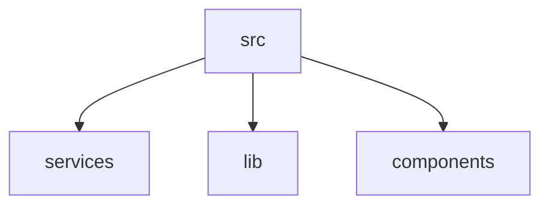
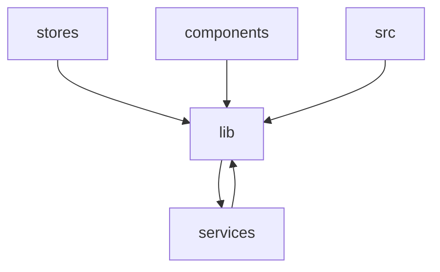

Relevant source files

- src/i18n/en.ts
- src/i18n/en/panels.ts
- src/i18n/en/settings.ts
- src/i18n/index.ts
- src/i18n/zh-CN.ts
- src/i18n/zh/panels.ts
- src/i18n/zh/settings.ts
- src/lib/monitorOrchestrator.ts
- src/lib/portForwarding.ts
- src/lib/startPage.ts
- src/stores/config/defaults.ts
- src/stores/config/flush.ts
- src/stores/config/index.ts
- src/stores/config/store.ts
- src/stores/config/types.ts

## 组织方式概述

本页描述该项目按代码分组（模块）的组织方式。以下事实全部来自数据中给出的模块清单：共 6 个模块，合计 218 个文件。

**模块清单与规模**

| 模块 | 文件数 | 符号数 |
| --- | --- | --- |
| `components` | 72 | 数据未提供（0） |
| `src` | 57 | 数据未提供（0） |
| `lib` | 47 | 数据未提供（0） |
| `services` | 25 | 数据未提供（0） |
| `stores` | 10 | 数据未提供（0） |
| `i18n` | 7 | 数据未提供（0） |

从文件数分布看，代码量集中在 `components`（72）、`src`（57）、`lib`（47）三个分组，三者合计 176 个文件，占全部 218 个文件的约 81%；`services`（25）、`stores`（10）、`i18n`（7）三个分组合计 42 个文件，规模明显更小。**（推断）** 该分布与命名特征（`components`／`services`／`stores`／`i18n` 为独立分组，`src`／`lib` 为通用代码承载分组）一致，推测项目采用"按职责分层拆分分组"的组织方式，而非单一扁平目录；推断依据仅为上表的模块名与文件数，数据中未提供目录层级、模块间依赖或调用关系，无法进一步确认分组之间的实际关系。

**待确认**

- 各模块的职责与边界：数据中所有模块的 `symbolCount`（待确认） 均为 0，未提供符号、导出或文件路径信息，无法说明任一模块承担的具体功能。
- 模块间的依赖与调用关系：数据中未提供依赖边或调用边，无法给出模块依赖图。
- 模块的物理层级（如 `src` 与 `components`、`lib` 是否互为父子目录）：数据中仅给出模块名，未提供完整目录路径。

## 模块详解（第1批）

本批覆盖数据顺序中的前 2 个模块：`src`、`lib`。所有事实均带锚点；标注为「待确认」处表示数据不足。

---

### 模块 `src`

#### 职责

该模块规模为 57 个文件，是本批中最大的模块。其职责由模块内多个文件的头部自述（intent，`kind: file-header`）锚定，按子领域归纳如下：

| 子领域 | 职责（文件头自述原文要点） | 锚点 |
|---|---|---|
| SFTP 传输任务中心 | 上传/下载统一注册进 TransferManager，任务快照经 app 级事件 `sftp-transfers-changed` 全量广播（进度按 ≥1MB 步进节流）；支持取消（AtomicBool 标志注入传输循环）与目录递归传输（先 walk 统计总量、单任务聚合进度）；终态任务保留最近 MAX_HISTORY 条历史供传输中心回看 | src-tauri/src/transfers/mod.rs:1 |
| 敏感数据加密存储 | SQLite（secrets.db）+ AES-256-GCM 字段级加密；主密钥随机生成存 macOS 钥匙串（keyring，service `scx-terminal`/user `master-key`）；密文格式 = 12 字节随机 nonce 前置 + 密文（含 GCM tag）；存储范围含 SSH 密钥链（私钥/口令加密，元数据明文）、SSH 档案密码（按 profileId）、云端同步配置等 | src-tauri/src/secrets/mod.rs:1 |
| SSH 端口转发后端 | 本地转发（-L，本地 TcpListener → direct-tcpip channel）、远程转发（-R，tcpip_forward 请求 server 监听 → 入站 channel 回连本地目标）、动态转发（-D，fast-socks5 no-auth CONNECT → direct-tcpip channel）；生命周期与 SFTP 一致，转发绑定 `ssh_id`，SSH 会话断开后由 exit 收尾 | src-tauri/src/forward/mod.rs:1 |
| SFTP 文件面板后端 | 在同一 russh 连接上开第二 channel 跑 `sftp` subsystem（russh-sftp 3.0），提供目录浏览/文件管理命令；上传/下载经 transfers 模块的 TransferManager 执行（事件广播进度、支持取消与目录递归）；SSH 会话断开后所有 SFTP 命令自然报错，前端据此关面板 | src-tauri/src/sftp.rs:1 |
| 文件系统工具命令 | 路径补全的列目录与 shell history 文件读取，以及 SFTP 本地栏目录浏览（含大小/修改时间、隐藏文件开关）；补全命令做 `~` → $HOME 展开；列目录错误返回空数组静默降级，读取文件不存在返回 None，浏览命令错误显式返回 Err（UI 呈现 banner） | src-tauri/src/fsutil.rs:1 |
| 命令历史持久化 | SQLite（history.db，独立于 config.db——历史是高频写数据不属于配置语义）；沿用 config.rs 的「Mutex 单连接 + WAL + PRAGMA user_version 迁移」模式；同 source 同命令去重存储（更新 run_at/hit_count）；导入经 meta 表 `imported:{source}` 标记幂等，清空时顺带清除标记以便重新导入 | src-tauri/src/history.rs:1 |

#### 设计意图

该模块的自述意图集中在「生命周期一致性」与「数据边界」两类约束上：

- **会话绑定式生命周期**：端口转发「生命周期与 SFTP 一致：转发绑定 `ssh_id`，SSH 会话断开后由 exit 收尾」（src-tauri/src/forward/mod.rs:1）；SFTP 面板「SSH 会话断开后所有 SFTP 命令自然报错，前端据此关面板」（src-tauri/src/sftp.rs:1）。两条自述共同指向以 SSH 会话为唯一生命周期根的设计取向。
- **错误呈现策略分级**：文件系统工具命令对三类调用点刻意采用不同的失败语义——列目录静默降级为空数组、读文件返回 None、浏览命令显式 Err（src-tauri/src/fsutil.rs:1）；其依据是「补全命令做 `~` → $HOME 展开（前端不知道 HOME，统一传 ~ 相对路径）」这一前后端职责划分（src-tauri/src/fsutil.rs:1）。
- **存储语义分离**：命令历史独立于 config.db，理由是「历史是高频写数据不属于配置语义」，并沿用 config.rs 的迁移模式（src-tauri/src/history.rs:1）；密钥材料则由 secrets 模块落地「SQLite + AES-256-GCM 字段级加密 + macOS 钥匙串保管主密钥」（src-tauri/src/secrets/mod.rs:1）。

#### 交互方式

| 方向 | 字段 | 对端模块 | 证据 |
|---|---|---|---|
| 出向 | `dependsOn` | `services`、`lib`、`components` | 模块依赖数据：`src.dependsOn` |
| 入向 | `usedBy` | （空） | 模块依赖数据：`src.usedBy` |

- 入向数据为空，但 `src/lib/**` 的 `usedBy` 中列出 `src`（见模块依赖数据：`lib.usedBy`），即 `src` 与 `lib` 之间存在双向关系。
- 上述模块级边没有 file:line 级证据（数据未提供依赖的 import/调用点）；仅能确认方向，无法列出具体文件对。

#### 文件结构

数据仅列出该模块 10 个文件（fileCount 为 57），且 `fileSymbols[*].symbols` 全为空，故无法给出关键符号。intent 锚点指向的 `src-tauri/src/**` 文件（如 src-tauri/src/transfers/mod.rs:1、src-tauri/src/history.rs:1）不在该 10 个示例文件之列。

| 文件 | 关键符号 | 职责 |
|---|---|---|
| src/App.vue | 数据未提供 | 数据未提供 |
| src/assets/styles/main.css | 数据未提供 | 数据未提供 |
| src/assets/styles/palette.css | 数据未提供 | 数据未提供 |
| src/main.ts | 数据未提供 | 数据未提供 |
| src/vite-env.d.ts | 数据未提供 | 数据未提供 |
| src-tauri/src/background.rs | 数据未提供 | 数据未提供 |
| src-tauri/src/config/groups.rs | 数据未提供 | 数据未提供 |
| src-tauri/src/config/legacy.rs | 数据未提供 | 数据未提供 |
| src-tauri/src/config/load.rs | 数据未提供 | 数据未提供 |
| src-tauri/src/config/mod.rs | 数据未提供 | 数据未提供 |

#### 核心符号

数据中 `topSymbols`（待确认） 为空数组，没有任何 docstring 或 signature 可供引用，因此本模块的核心符号说明**待确认**（缺符号清单与签名证据）。

#### 语言分布与职责域

| 语言 | 文件数 | 可锚定的职责域 |
|---|---|---|
| rust | 52 | 后端命令与持久化实现，示例锚点：src-tauri/src/config/mod.rs、src-tauri/src/config/groups.rs、src-tauri/src/config/legacy.rs、src-tauri/src/config/load.rs、src-tauri/src/background.rs；由 intent 锚定的子域见 src-tauri/src/transfers/mod.rs:1、src-tauri/src/secrets/mod.rs:1、src-tauri/src/forward/mod.rs:1、src-tauri/src/sftp.rs:1、src-tauri/src/fsutil.rs:1、src-tauri/src/history.rs:1 |
| ts | 3 | 前端入口与类型声明，示例：src/main.ts、src/vite-env.d.ts |
| other | 2 | 数据仅给出计数，未给出语言到文件的归属映射，无法定位到具体文件 |

---

### 模块 `lib`

`lib` 是前端侧的纯逻辑 / 模型层，intent 自述反复强调「UI 无关、IO 注入、便于单测」。其职责按自述归纳：

| 子领域 | 职责（文件头自述原文要点） | 锚点 |
|---|---|---|
| 输入行模型 | 从 xterm buffer 现读现算当前逻辑行（soft-wrap 链拼接）、提示符剥离、续行合并、词定位；PromptTracker 在此之上做提示符长度自适应学习与回车命令采集；对 shell 端编辑（Tab 补全/↑ 调历史/Ctrl+R）免疫——永不维护影子副本 | src/lib/suggestions/promptTracker.ts:1 |
| SSH 监控编排器 | 纯逻辑、IO 全注入；管理档案级的卡片/详情两级采样绑定，经注册表消费计数管理连接生命周期；fatal 后按退避序列重连（release → acquire → start），成功即重置退避 | src/lib/monitorOrchestrator.ts:1 |
| 建议控制器 | 聚合 PromptTracker（输入行模型 + 提示符学习 + 命令采集）、建议引擎与菜单 UI 状态；菜单键盘语义（↑↓/Tab/Enter/→/Esc）、接受写入（公共前缀保留 + 退格差异）、Esc 抑制自动弹出、历史记录写入 | src/lib/suggestions/controller.ts:1 |
| 终端配色方案库 | 严格复刻 Tabby 候选主题列表——Tabby Default / Tabby Default Light 两套核心默认配色（移植自 tabby-terminal colorSchemes.ts，保留选区增强值）+ Tabby 官方社区配色全集（communityColorSchemes.ts，189 套）；提供按用户偏好解析配色的工具函数，自定义配色经可选参数参与解析 | src/lib/colorSchemes.ts:1 |
| 连接中心（起始页）纯逻辑 | SSH 档案分组视图构建、本地终端分组过滤、全局搜索过滤、最近连接排序与相对时间分桶；UI 无关，便于单测 | src/lib/startPage.ts:1 |
| 端口转发纯逻辑层 | 转发类型与数据模型（档案持久化规则 + 运行态）、规则归一化校验（sanitize，config 加载时清洗）、展示文案、autoStart 规则筛选与规则 → 启动参数映射；IPC 封装见 services/forward.ts | src/lib/portForwarding.ts:1 |

- **纯逻辑与 IO 解耦**：监控编排器自述为「纯逻辑，IO 全注入」（src/lib/monitorOrchestrator.ts:1）；建议控制器自述「聚合 PromptTracker、建议引擎与菜单 UI 状态」，把键盘语义与接受写入规则从组件中抽离（src/lib/suggestions/controller.ts:1）；起始页逻辑自述「UI 无关，便于单测」（src/lib/startPage.ts:1）。三处自述共同构成该模块的核心取向：把交互规则从 Vue 组件下沉为可测函数。
- **不复制终端状态**：输入行模型明确「从 xterm buffer 现读现算……对 shell 端编辑（Tab 补全/↑ 调历史/Ctrl+R）免疫——永不维护影子副本」（src/lib/suggestions/promptTracker.ts:1）。这是对"影子副本会与 shell 端编辑冲突"这一问题的直接设计回应。
- **IPC 与逻辑分层**：端口转发自述「IPC 封装见 services/forward.ts」，本模块只保留数据模型、sanitize、展示文案与启动参数映射（src/lib/portForwarding.ts:1）。即该文件刻意不触碰 Tauri 调用面。
- **主题移植的可追溯性**：配色库自述「严格复刻 Tabby 候选主题列表……移植自 tabby-terminal colorSchemes.ts，保留选区增强值」，社区配色单独放在 `communityColorSchemes.ts`（189 套）（src/lib/colorSchemes.ts:1）。

| 方向 | 字段 | 对端模块 | 证据 |
|---|---|---|---|
| 出向 | `dependsOn` | `services` | 模块依赖数据：`lib.dependsOn` |
| 入向 | `usedBy` | `services`、`stores`、`components`、`src` | 模块依赖数据：`lib.usedBy` |

- `lib` 与 `services` 互为依赖（模块依赖数据：`lib.dependsOn`、`lib.usedBy`），与 `src/lib/portForwarding.ts:1` 自述的「IPC 封装见 services/forward.ts」一致：逻辑层不直接调用 IPC，IPC 由 services 承担。
- 上述边均为模块级，数据未提供 file:line 级的 import 或调用点，故无法列出具体文件对。

数据列出该模块 10 个文件（fileCount 为 47），且 `fileSymbols[*].symbols` 全为空，无法给出关键符号。intent 锚点指向的 `src/lib/suggestions/**`、`src/lib/monitorOrchestrator.ts`、`src/lib/startPage.ts`、`src/lib/portForwarding.ts` 等文件均不在该 10 个示例文件之列。

| 文件 | 关键符号 | 职责 |
|---|---|---|
| src/lib/backgroundImage.ts | 数据未提供 | 数据未提供 |
| src/lib/colorSchemes.ts | 数据未提供 | 终端配色方案库与按偏好解析配色的工具函数（依据 src/lib/colorSchemes.ts:1） |
| src/lib/communityColorSchemes.ts | 数据未提供 | 收纳 Tabby 官方社区配色全集（189 套）（依据 src/lib/colorSchemes.ts:1 中的引用） |
| src/lib/frontendContext.ts | 数据未提供 | 数据未提供 |
| src/lib/frontends/bufferRows.ts | 数据未提供 | 数据未提供 |
| src/lib/frontends/frontend.ts | 数据未提供 | 数据未提供 |
| src/lib/frontends/xterm/frontend.ts | 数据未提供 | 数据未提供 |
| src/lib/frontends/xterm/keyboard.ts | 数据未提供 | 数据未提供 |
| src/lib/frontends/xterm/lines.ts | 数据未提供 | 数据未提供 |
| src/lib/frontends/xterm/options.ts | 数据未提供 | 数据未提供 |

数据中 `topSymbols`（待确认） 为空数组，`fileSymbols[*].symbols` 亦全为空，没有任何 docstring 或 signature 可供引用，因此本模块的核心符号说明**待确认**（缺符号清单与签名证据）。

| 语言 | 文件数 | 可锚定的职责域 |
|---|---|---|
| ts | 46 | 前端纯逻辑层：输入行模型与建议链路（src/lib/suggestions/promptTracker.ts:1、src/lib/suggestions/controller.ts:1）、监控编排（src/lib/monitorOrchestrator.ts:1）、配色解析（src/lib/colorSchemes.ts:1）、起始页模型（src/lib/startPage.ts:1）、端口转发模型（src/lib/portForwarding.ts:1）；示例文件含 src/lib/frontends/** 终端前端适配族 |
| other | 1 | 数据仅给出计数，未给出语言到文件的归属映射，无法定位到具体文件 |

## 模块详解（第2批）

本批包含 2 个模块：`stores`（10 个文件）与 `i18n`（7 个文件），两者均只含 TypeScript（`stores.languages`、`i18n.languages` 均为 ts 单一语言，无多语言职责域需要区分）。数据中两个模块的 `topSymbols`（待确认） 与 `fileSymbols` 均为空数组，因此本节的职责描述全部来自文件头自述（`intent`，kind = file-header），符号级签名与用途无法提供。

---

### stores

该模块是前端的全局状态层，按领域拆分为若干独立 store，各 store 有明确的文件头自述：

| 文件 | 自述职责（原文要点） | 锚点 |
| --- | --- | --- |
| `src/stores/monitor.ts` | 全局监控 store：订阅 Rust `monitor-*` 事件维护每档案最新样本与 150 点环形缓冲；errors 用哨兵值（`'unsupported'` / `'reconnecting'`）与原始错误文本，UI 侧按哨兵映射文案 | `src/stores/monitor.ts:1` |
| `src/stores/config/store.ts` | 配置 store 本体：响应式全量配置 + 深度 watch 防抖 flush 落库（调用方保持直接改 store 的用法）；加载时合并库内快照/legacy yaml、清理无效引用、按需生成默认档案与迁移本地分组 | `src/stores/config/store.ts:1` |
| `src/stores/config/flush.ts` | 差异 flush 引擎：把本地 store mutation 翻译成 Rust 侧实体级 CRUD 命令。基线 = 各实体键排序的稳定序列化快照；flush 只重试「当前状态与基线」的剩余差异，单条失败即中断且基线不动（部分成功可安全续传） | `src/stores/config/flush.ts:1` |
| `src/stores/config/defaults.ts` | 配置默认值与纯函数助手：默认配置/热键、系统 shell 生成本地分组与档案、存量迁移、分组分段视图、最近记录 upsert 与 deepMerge | `src/stores/config/defaults.ts:1` |
| `src/stores/forwarding.ts` | 端口转发运行态聚合 store：`forward_list_all` 全量拉取 + 按连接订阅 `forward:{sshId}:changed` 事件（连接集合来自 sshConnections 注册表，`registryVersion` 变化时同步增删订阅）。隧道管理器标签页与 TitleBar 隧道指示器的数据源 | `src/stores/forwarding.ts:1` |
| `src/stores/transfers.ts` | 全局传输中心 store：订阅 Rust `sftp-transfers-changed` 事件维护任务快照，前端计算平滑速度（字节增量/时间差 EMA）；version 在每次快照变化时自增，供 SFTP 标签等消费方 watch 后刷新目录 | `src/stores/transfers.ts:1` |

`src/stores/config/index.ts`、`src/stores/config/types.ts`、`src/stores/tabs.ts`、`src/stores/theme.ts` 四个文件在数据中没有文件头自述，也没有符号数据，其职责**信息不足**（见文末待确认）。

模块内四个文件头自述直接给出了设计取舍，属于证据原文：

- **「调用方保持直接改 store 的用法」**——`src/stores/config/store.ts:1`。这说明配置层对外暴露的是可直接变更的响应式对象，而非 setter/action 形式的接口；持久化被下沉到 watch + 防抖的后台链路，调用方无需感知落库。
- **差异 flush 与基线机制**——`src/stores/config/flush.ts:1` 记载「基线 = 各实体键排序的稳定序列化快照」「单条失败即中断且基线不动（部分成功可安全续传）」，即设计目标是**幂等、可续传的部分成功语义**，而不是整体回滚。
- **哨兵值而非抛错**——`src/stores/monitor.ts:1` 明确 errors 使用 `'unsupported'` / `'reconnecting'` 哨兵值与原始错误文本，文案映射交给 UI 侧，说明状态层刻意不承载展示层文案。
- **订阅生命周期管理**——`src/stores/forwarding.ts:1` 记载订阅集合来自 sshConnections 注册表且随 `registryVersion` 变化同步增删，即该 store 是**按连接的动态事件聚合器**；同一处自述还留下一条 WKWebView 相关的注意点，但该句在数据中于「WKWebView 下 await 之后创建的 watc」处被截断，完整约束无法复原。
- **version 自增以驱动下游刷新**——`src/stores/transfers.ts:1` 记载 version 在每次快照变化时自增，供 SFTP 标签等消费方 watch 后刷新目录，说明该 store 同时承担「变更信号源」角色。

`src/stores/tabs.ts` 与 `src/stores/theme.ts` 从命名看分别对应标签页与主题状态（**推断**：依据仅为文件名与该模块其余文件的域划分方式，数据中无文件头、无符号、无调用点可佐证）。

模块级依赖数据如下（`dependsOn` / `usedBy`）：

| 方向 | 对象 | 证据 |
| --- | --- | --- |
| 依赖 | `lib` | `stores.dependsOn` |
| 依赖 | `services` | `stores.dependsOn` |
| 被依赖 | 无记录 | `stores.usedBy` 为空 |

上述是模块粒度数据，未给出具体文件或符号级的调用边（`fanIn` / `fanOut` 均为 0，`supplementalSymbols`（待确认） 为空），因此**无法用调用表格给出函数级调用关系**。可由文件头自述确认的协作关系（属文档陈述，非调用边）如下：

| 协作描述 | 证据 |
| --- | --- |
| forwarding store 的连接集合来自 `sshConnections` 注册表，`registryVersion` 变化时同步增删订阅 | `src/stores/forwarding.ts:1` |
| config store 的落库通过「深度 watch 防抖 flush」完成，即与 flush 引擎衔接 | `src/stores/config/store.ts:1` |
| config store 加载时执行「合并库内快照/legacy yaml、清理无效引用、按需生成默认档案与迁移本地分组」，与 defaults 助手（默认配置/存量迁移/递归合并）职责对应 | `src/stores/config/store.ts:1`、`src/stores/config/defaults.ts:1` |
| transfers store 的 version 被 SFTP 标签等消费方 watch | `src/stores/transfers.ts:1` |

| 文件名 | 关键符号 | 职责 |
| --- | --- | --- |
| `src/stores/monitor.ts` | 信息不足 | 全局监控 store：维护每档案最新样本 + 150 点环形缓冲，订阅 `monitor-*` 事件（`src/stores/monitor.ts:1`） |
| `src/stores/config/store.ts` | 信息不足 | 配置 store 本体：响应式全量配置 + 深度 watch 防抖落库（`src/stores/config/store.ts:1`） |
| `src/stores/config/flush.ts` | 信息不足 | 差异 flush 引擎：本地 mutation → Rust 实体级 CRUD，基线快照 + 剩余差异重试（`src/stores/config/flush.ts:1`） |
| `src/stores/config/defaults.ts` | 信息不足 | 配置默认值与纯函数助手（默认配置/热键、本地分组与档案生成、存量迁移、分组分段视图、最近记录 upsert、deepMerge）（`src/stores/config/defaults.ts:1`） |
| `src/stores/config/index.ts` | 信息不足 | 信息不足（无文件头自述） |
| `src/stores/config/types.ts` | 信息不足 | 信息不足（无文件头自述） |
| `src/stores/forwarding.ts` | 信息不足 | 端口转发运行态聚合 store：`forward_list_all` 全量拉取 + 按连接订阅 `forward:{sshId}:changed`（`src/stores/forwarding.ts:1`） |
| `src/stores/transfers.ts` | 信息不足 | 全局传输中心 store：`sftp-transfers-changed` 事件快照 + EMA 平滑速度 + version 自增（`src/stores/transfers.ts:1`） |
| `src/stores/tabs.ts` | 信息不足 | 信息不足（无文件头自述） |
| `src/stores/theme.ts` | 信息不足 | 信息不足（无文件头自述） |

**信息不足**：`stores` 模块的 `topSymbols`（待确认） 为空数组，`fileSymbols` 中 10 个文件的 `symbols` 也全部为空，因此无法给出任何函数/常量的签名与用途说明。

---

### i18n

该模块是 vue-i18n 的装配与词条资源层，采用「按语言分目录 + 按域分文件」的组织方式：

| 文件 | 自述职责（原文要点） | 锚点 |
| --- | --- | --- |
| `src/i18n/index.ts` | vue-i18n 装配入口：语言包在 `zh-CN.ts` / `en.ts`（Messages 类型以 zh-CN 为基准） | `src/i18n/index.ts:1` |
| `src/i18n/zh-CN.ts` | 简体中文语言包装配：设置域（settings）+ 面板域（panels）浅合并；键结构是 en 与类型 Messages 的基准 | `src/i18n/zh-CN.ts:1` |
| `src/i18n/zh/panels.ts` | 简体中文面板域词条（sftp/传输/转发/SSH/命令/面板/搜索/终端/标签/起始页/监控） | `src/i18n/zh/panels.ts:1` |
| `src/i18n/zh/settings.ts` | 简体中文设置域词条（settings 子树整体） | `src/i18n/zh/settings.ts:1` |
| `src/i18n/en/panels.ts` | English 面板域词条（sftp/传输/转发/SSH/命令/面板/搜索/终端/标签/起始页/监控） | `src/i18n/en/panels.ts:1` |
| `src/i18n/en/settings.ts` | English 设置域词条（settings 子树整体） | `src/i18n/en/settings.ts:1` |
| `src/i18n/en.ts` | 信息不足（无文件头自述；仅在装配入口中被点名，见下） | `src/i18n/index.ts:1` |

`src/i18n/en.ts` 的职责可由装配入口自述间接佐证：`src/i18n/index.ts:1` 写明「语言包在 zh-CN.ts / en.ts」，与 `src/i18n/zh-CN.ts:1`「设置域 + 面板域浅合并」的装配方式对称，故 `en.ts` 承担英文侧的同等装配职责。

- **以中文为类型基准**——`src/i18n/index.ts:1` 明确「Messages 类型以 zh-CN 为基准」，`src/i18n/zh-CN.ts:1` 进一步说明「键结构是 en 与类型 Messages 的基准」。这是一条明确的设计约束：新增词条以中文包为唯一键真源，英文包须与之对齐，从而在编译期发现缺失翻译。
- **域级文件切分**——面板域与设置域各自独立成文件（`src/i18n/zh/panels.ts:1`、`src/i18n/zh/settings.ts:1`、`src/i18n/en/panels.ts:1`、`src/i18n/en/settings.ts:1`），顶层文件仅做「浅合并」装配（`src/i18n/zh-CN.ts:1`）。其用意是让词条文件可按业务域独立演进、装配层保持极薄，这一点由 `zh-CN.ts:1` 对「浅合并」的显式声明支撑。
- **词条域清单固定**——面板域自述列出了完整子域：sftp/传输/转发/SSH/命令/面板/搜索/终端/标签/起始页/监控（`src/i18n/zh/panels.ts:1`、`src/i18n/en/panels.ts:1`），可作为判断某条文案应落在哪个文件的依据。

| 方向 | 对象 | 证据 |
| --- | --- | --- |
| 依赖 | 无记录 | `i18n.dependsOn` 为空 |
| 被依赖 | 无记录 | `i18n.usedBy` 为空 |

模块级 `fanIn` / `fanOut` 均为 0，且无符号与调用边数据，因此 UI 侧对 `t()` 的实际调用点无法在本批数据中给出。

模块内部可确认的装配关系（来自文件头自述，非调用边）：

| 装配关系 | 证据 |
| --- | --- |
| `src/i18n/index.ts` 加载 `zh-CN.ts` 与 `en.ts` 两个语言包 | `src/i18n/index.ts:1` |
| `src/i18n/zh-CN.ts` 由 zh 侧 settings 域与 panels 域浅合并而成 | `src/i18n/zh-CN.ts:1` |

| 文件名 | 关键符号 | 职责 |
| --- | --- | --- |
| `src/i18n/index.ts` | 信息不足 | vue-i18n 装配入口，注册语言包（`src/i18n/index.ts:1`） |
| `src/i18n/zh-CN.ts` | 信息不足 | 简体中文语言包装配：settings + panels 浅合并，键结构基准（`src/i18n/zh-CN.ts:1`） |
| `src/i18n/en.ts` | 信息不足 | 英文语言包装配（依据 `src/i18n/index.ts:1` 点名与 zh-CN 侧对称结构） |
| `src/i18n/zh/panels.ts` | 信息不足 | 简体中文面板域词条（`src/i18n/zh/panels.ts:1`） |
| `src/i18n/zh/settings.ts` | 信息不足 | 简体中文设置域词条（`src/i18n/zh/settings.ts:1`） |
| `src/i18n/en/panels.ts` | 信息不足 | English 面板域词条（`src/i18n/en/panels.ts:1`） |
| `src/i18n/en/settings.ts` | 信息不足 | English 设置域词条（`src/i18n/en/settings.ts:1`） |

**信息不足**：`i18n` 模块的 `topSymbols`（待确认） 为空数组，`fileSymbols` 中 7 个文件的 `symbols` 也全部为空，无法给出导出符号（如 Messages 类型、语言包对象的成员）的签名与用途。

---

#### 待确认

1. `src/stores/config/index.ts`、`src/stores/config/types.ts`、`src/stores/tabs.ts`、`src/stores/theme.ts` 无文件头自述、无符号数据，职责无法确认（缺证据：source 符号表与该 4 个文件的文件头注释）。
2. `src/stores/forwarding.ts:1` 的文件头在「WKWebView 下 await 之后创建的 watc」处被数据截断，该条 WKWebView 约束的完整内容不可复原（缺证据：该文件完整文件头原文）。
3. 两个模块的符号级信息全缺（`topSymbols`（待确认）、`fileSymbols[].symbols` 均为空），无法给出任何函数签名与调用点（缺证据：导出符号表与调用边数据）。
## Related

- 同目录：[architecture.md](architecture.md)
- 互补职责：[architecture.md](../02-architecture/architecture.md)
- 共享 1 个源文件、共享 9 个符号：[overview.md](../01-overview/overview.md)
- 共享 1 个源文件、共享 7 个符号：[onboarding.md](../05-guides/onboarding.md)
- 共享 1 个源文件、共享 7 个符号：[troubleshooting.md](../05-guides/troubleshooting.md)
- 总入口：[README](../README.md)
