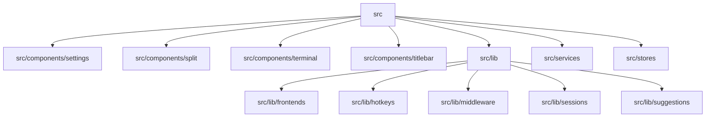

# 测试体系

<details>
<summary>Relevant source files</summary>

- package.json
- src/components/settings/groupDragSort.test.ts
- src/components/split/splitTree.test.ts
- src/components/terminal/searchFocus.test.ts
- src/components/titlebar/tabGroupLayout.test.ts
- src/components/titlebar/tabStripLayout.test.ts
- src/components/titlebar/tabSwitcherModel.test.ts
- src/lib/backgroundImage.test.ts
- src/lib/colorSchemes.test.ts
- src/lib/frontends/bufferRows.test.ts
- src/lib/hotkeys/hotkeys.test.ts
- src/lib/itermColors.test.ts
- src/lib/middleware/oscProcessing.test.ts
- src/lib/monitorOrchestrator.test.ts
- src/lib/portForwarding.test.ts
</details>

本页说明该项目的测试框架、测试文件分布、运行方式与测试专用依赖；所有结论均来自探测数据，未探测到的项如实标注。

## 测试体系概览

| 项目 | 事实 | 证据 |
| --- | --- | --- |
| 测试框架 | `vitest` | testOnlyDeps[0].name |
| 框架版本 | `^5.0.0` | testOnlyDeps[0].version |
| 配置文件 | 未检测到（`configPath` 为 null） | 探测结果 configPath |
| 测试目录 | 12 个：`src/components/settings`、`src/components/split`、`src/components/terminal`、`src/components/titlebar`、`src/lib`、`src/lib/frontends`、`src/lib/hotkeys`、`src/lib/middleware`、`src/lib/sessions`、`src/lib/suggestions`、`src/services`、`src/stores` | 探测结果 testDirs |
| 夹具目录 | 未检测到（`fixturesDir` 为 null） | 探测结果 fixturesDir |
| 覆盖率阈值 | 未检测到（`coverageThreshold` 为 null） | 探测结果 coverageThreshold |
| 生产文件数 | 230 | 探测结果 productionFileCount |
| 测试文件数 | 35 | 探测结果 testFileCount |
| 运行命令 | `vitest run` | 探测结果 runCommand |

测试文件与生产代码位于同一批目录下（`testDirs` 均为 `src/` 下的子路径），测试文件统一采用 `*.test.ts` 命名。



> 图中节点全部取自 `testDirs` 的 12 个已探测目录（为版面清晰，`src/lib` 的 5 个子目录合并展示）。

## 运行方式

**命令**

```bash
vitest run
```

**做了什么**：以非交互（一次性）模式执行全部匹配的测试文件，执行完成后进程退出，不进入文件监听。测试文件按 `*.test.ts` 命名分布在上述 12 个目录中，共 35 个文件。

**预期产出**：终端输出逐文件的测试执行结果与整体汇总（通过/失败计数）；存在失败用例时进程以非零退出码结束。

**框架通用用法（非本次探测结果）**：单文件运行可追加路径参数；按用例名过滤可用名称参数；去掉 `run` 进入监听模式。这些属 vitest 的公共用法，具体参数形式以所装版本的官方文档为准。

**包管理器与脚本别名**：探测数据仅给出 `vitest run` 本身，未提供 `package.json` 中的 script 名称或包管理器信息，调用入口需按仓库实际情况确认。

## 测试专用证据

### 测试专用环境变量

未检测到（`testOnlyEnvVars` 为空数组）。即本次探测未发现仅由测试使用的环境变量。

### 测试专用常量

未检测到（`testOnlyConstants` 为空数组）。即本次探测未发现仅由测试使用的常量。

### 测试专用依赖

测试专用依赖共 1 项，下表列出其被引用的全部测试文件（`importFiles` 共 35 项，与 `testFileCount` 一致）。

| 依赖 | 版本 | 引用测试文件数 |
| --- | --- | --- |
| `vitest` | `^5.0.0` | 35 |

**引用点明细（按目录分组，锚点为测试文件完整相对路径）**

| 目录 | 测试文件 |
| --- | --- |
| `src/components/settings` | `src/components/settings/groupDragSort.test.ts` |
| `src/components/split` | `src/components/split/splitTree.test.ts` |
| `src/components/terminal` | `src/components/terminal/searchFocus.test.ts` |
| `src/components/titlebar` | `src/components/titlebar/tabGroupLayout.test.ts`、`src/components/titlebar/tabStripLayout.test.ts`、`src/components/titlebar/tabSwitcherModel.test.ts` |
| `src/lib` | `src/lib/backgroundImage.test.ts`、`src/lib/colorSchemes.test.ts`、`src/lib/itermColors.test.ts`、`src/lib/monitorOrchestrator.test.ts`、`src/lib/portForwarding.test.ts`、`src/lib/quickCommands.test.ts`、`src/lib/sftpPane.test.ts`、`src/lib/sftpTransferMath.test.ts`、`src/lib/sshConnectionRegistry.test.ts`、`src/lib/startPage.test.ts` |
| `src/lib/frontends` | `src/lib/frontends/bufferRows.test.ts` |
| `src/lib/hotkeys` | `src/lib/hotkeys/hotkeys.test.ts` |
| `src/lib/middleware` | `src/lib/middleware/oscProcessing.test.ts` |
| `src/lib/sessions` | `src/lib/sessions/baseSession.test.ts`、`src/lib/sessions/sshSession.test.ts` |
| `src/lib/suggestions` | `src/lib/suggestions/controller.test.ts`、`src/lib/suggestions/pathWord.test.ts`、`src/lib/suggestions/promptTracker.test.ts`、`src/lib/suggestions/shellHistory.test.ts`、`src/lib/suggestions/suggestionEngine.test.ts` |
| `src/services` | `src/services/backgroundImage.test.ts`、`src/services/notifications.test.ts`、`src/services/tabSession.test.ts`、`src/services/updater.test.ts` |
| `src/stores` | `src/stores/config.flush.test.ts`、`src/stores/config.test.ts`、`src/stores/config.windows.test.ts`、`src/stores/monitor.test.ts`、`src/stores/tabs.test.ts` |

> 以上依赖、文件与版本均属测试环境范畴，不构成生产运行时配置或生产技术栈。

## 测试策略解读

测试投入主要集中在 `src/lib`（10 个测试文件）及其子目录（`frontends`、`hotkeys`、`middleware`、`sessions`、`suggestions` 合计另有 10 个），此外 `src/stores` 与 `src/services` 各 5 个和 4 个，`src/components` 下的四个目录共 6 个。测试文件与生产代码同目录共存，说明组织方式以「就近测试」为主：被测单元与其测试文件位于同一模块目录内（例如 `src/lib/sessions/sshSession.test.ts` 与同目录的会话实现，`src/stores/tabs.test.ts` 与同目录的状态管理代码）。测试覆盖面更偏向纯逻辑与状态层而非 UI 渲染层——`src/lib` 系列覆盖了建议引擎（`src/lib/suggestions/suggestionEngine.test.ts`、`controller.test.ts`、`pathWord.test.ts`、`promptTracker.test.ts`、`shellHistory.test.ts`）、终端中间件（`src/lib/middleware/oscProcessing.test.ts`）、复用前端缓冲（`src/lib/frontends/bufferRows.test.ts`）以及 SFTP 相关计算与面板（`src/lib/sftpTransferMath.test.ts`、`src/lib/sftpPane.test.ts`）、端口转发与连接注册表（`src/lib/portForwarding.test.ts`、`src/lib/sshConnectionRegistry.test.ts`）。

从文件命名还可读出两类针对性拆分：一是按平台差异拆分，存在 `src/stores/config.windows.test.ts` 与 `src/stores/config.test.ts` 并列；二是按具体行为拆分，存在 `src/stores/config.flush.test.ts` 这类以行为后缀命名的文件。这种命名方式表明同一模块的测试会按平台或特定行为分别成文件，便于定位失败范围。以上结论仅基于目录与文件命名结构，未涉及用例数量与覆盖率等未被探测的数据。

## 缺口说明

本次探测未获得以下信息，均不做过往推断：独立测试配置文件的位置与内容（`configPath` 为 null）、测试夹具目录（`fixturesDir` 为 null）、覆盖率阈值与覆盖率统计（`coverageThreshold` 为 null，且测试专用依赖中仅有 `vitest`，未见覆盖率插件）。因此本文不提供任何用例数量或覆盖率数字。
## Related

- 同目录：[onboarding.md](onboarding.md) · [troubleshooting.md](troubleshooting.md)
- 共享 1 个源文件、共享 9 个符号：[tech-stack.md](../01-overview/tech-stack.md)
- 共享 7 个符号：[overview.md](../01-overview/overview.md)
- 共享 1 个源文件、共享 3 个符号：[environment.md](../01-overview/environment.md)
- 总入口：[README](../README.md)
